[TOC]

# CS231n

## Lecture 1: Image Classification

### The image classification task

#### Challenges

- Viewpoint variation
- Background Clutter
- Illumination
- Occlusion
- Deformation 

#### An image classifier

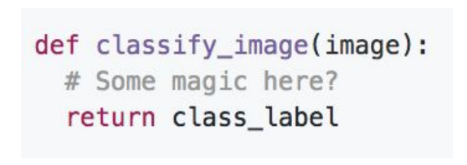

**no obvious way to hard-code** the algorithm for recognizing classes. 即不能显式编码

#### Machine Learning: Data-Driven Approach

1.Collect a dataset of images and labels

2.Use Machine Learning algorithms to train a classifier

3.Evaluate the classifier on new images

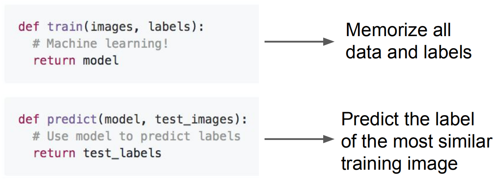

#### First classifier: Nearest Neighbor

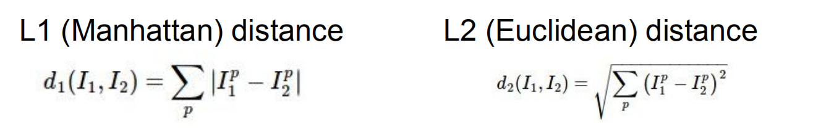

- L1或L2距离衡量两个图片的距离，选择最近的一类
- 效果很差
- L1对坐标轴的旋转比较敏感，L2则不会

**K-Nearest Neighbors：**

take **majority vote** from K closest points（投票）

K是一个需要人工去指定的超参数

### Hyperparameters

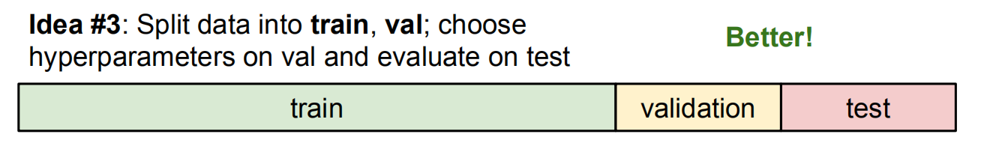

validation验证集用于评估用的

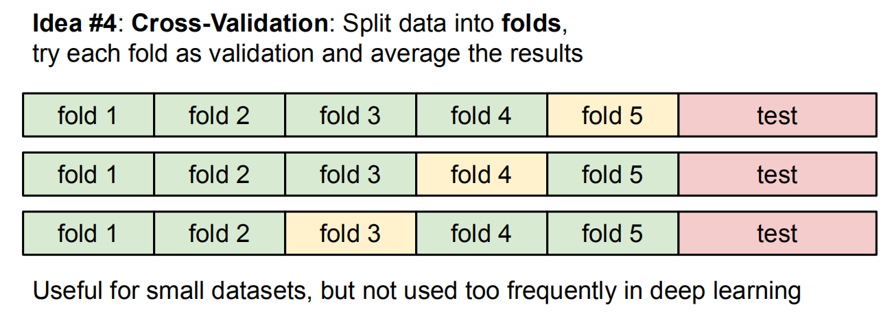

## Lecture 2: Loss Functions and Optimization

### loss function

**A loss function tells how good our current classifier is.**

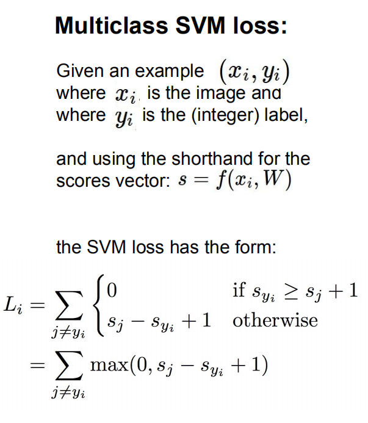

**铰链损失函数（hinge loss）**的思想就是让那些未能正确分类的和正确分类的之间的距离要足够的远，如果相差达到一个阈值 Δ 时，此时这个未正确分类的误差就可以认为是0，否则就要累积计算误差。

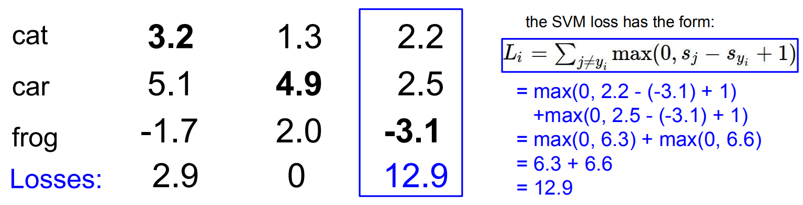

### Regularization

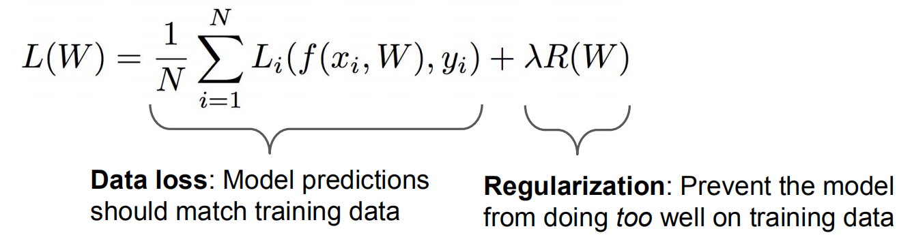

正则化防止过拟合。

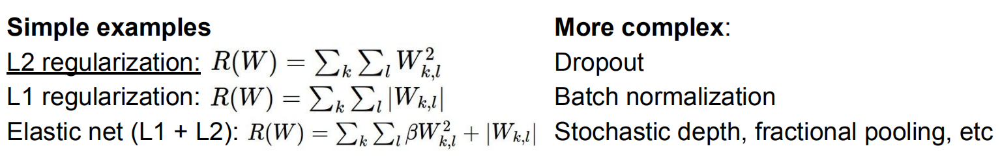

L2正则化较L1更可以将权值分散到各个维度，防止某个权值过大，造成过拟合。

### Softmax classifier (Multinomial Logistic Regression)

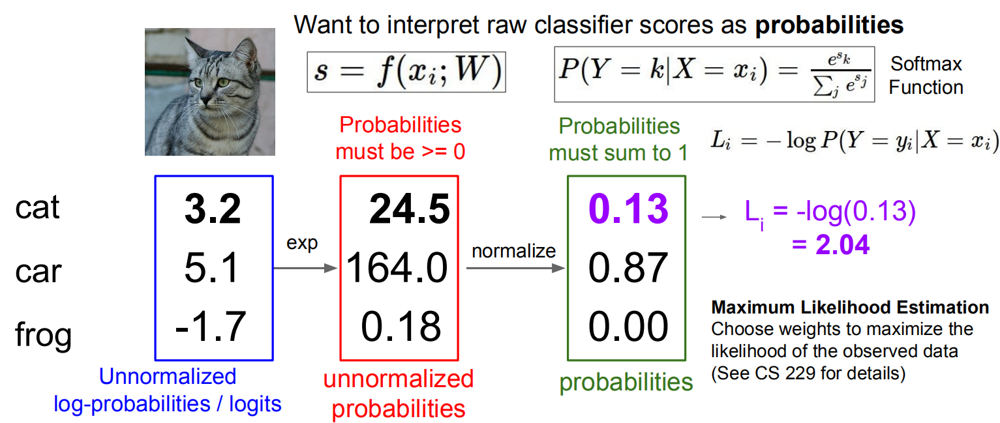

对于多分类问题用 $softmax$ 输出对应的概率，再根据这个概率值用交叉熵损失函数计算loss。

#### 交叉熵(cross-entropy)

其中，L为loss，$y_c$为标签，$p_c$为 $softmax$ 预测的概率分布。

而我们希望在训练数据上模型学到的分布（$p_c$）和真实数据的分布（$y_c$）越接近越好

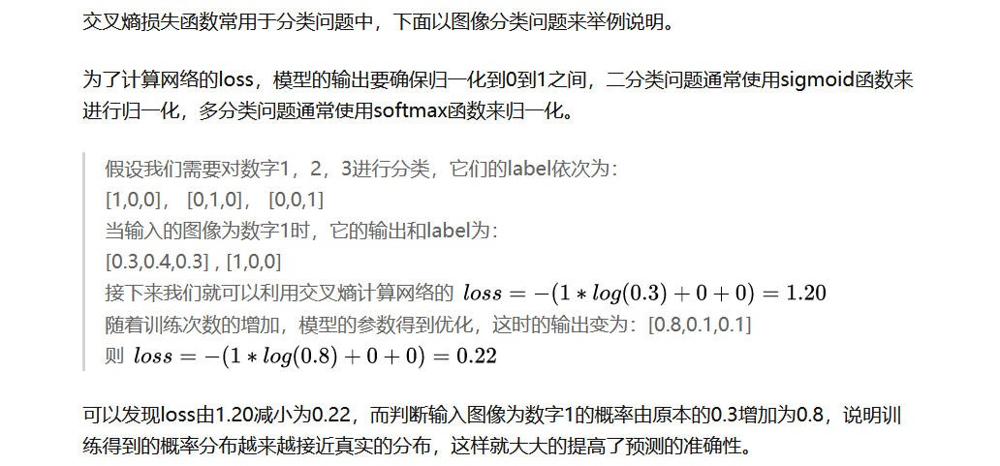

#### K-L散度（相对熵）= 信息熵 - 交叉熵

### Optimization

In multiple dimensions, the **gradient** is the vector of (partial derivatives) along each dimension.

- **Numerical gradient(数值解):** approximate, slow, easy to write
- **Analytic gradient(解析解):** exact, fast, error-prone

#### Stochastic Gradient Descent (SGD)

- 所有数据一次全都扔进去，根据损失函数的和求梯度更新一次（计算成本太高）
- 一个个数据扔进去，每一次都求一次梯度更新权重（但是可能更新会振荡）
- 折中：选择mini-batch，每次投入一个batch的数据（加快了收敛速度，同时节省了内存）

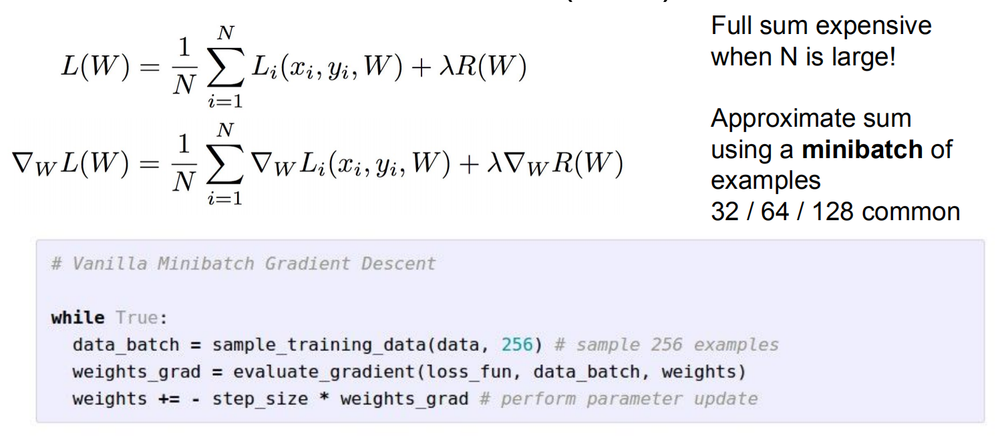

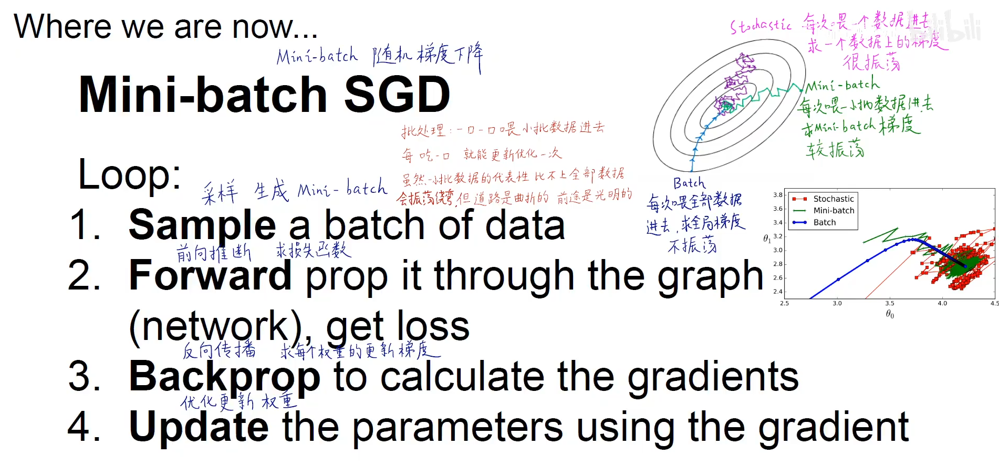

## Lecture 3: Neural Networks

### Activation function

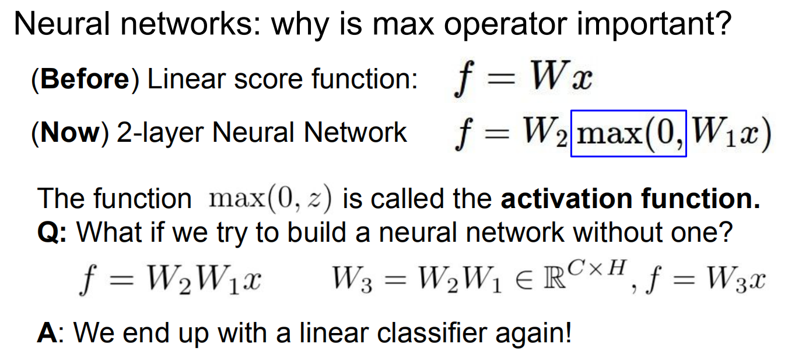

**激活函数的作用：**非线性激活函数是用来加入非线性因素的，因为线性模型的表达能力不够。线性的表达能力太有限了，无论叠加多少层最后仍然是线性的，与单层网络无异

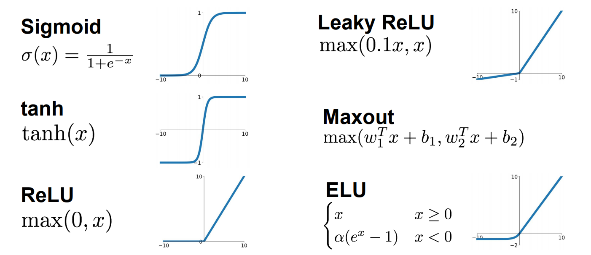

### Backpropagation

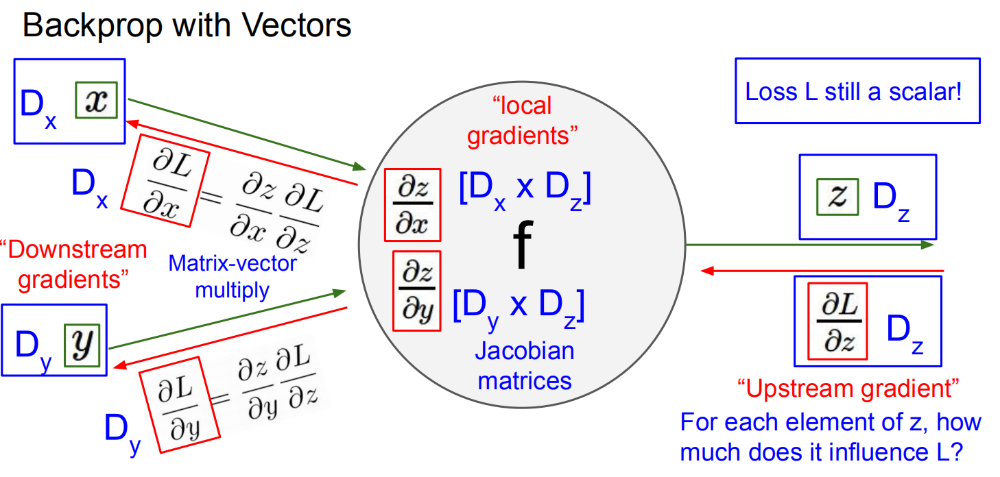

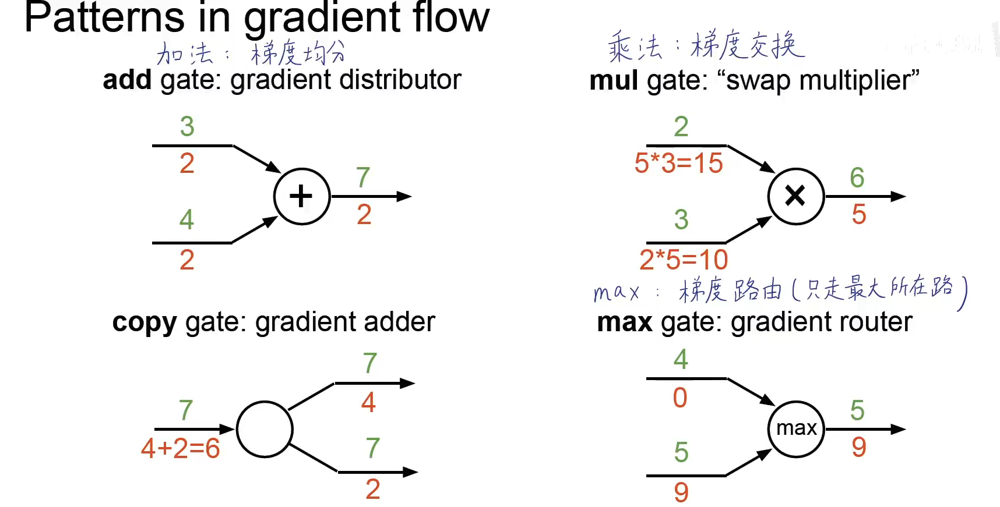

## Lecture 4: Convolutional Neural Networks

### Convolution Layer

#### convolutional kernel

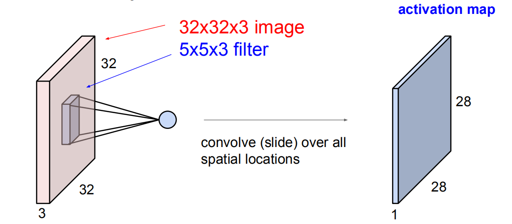

**Feature Map** (activation map)是输入图像经过神经网络卷积产生的结果

主要选取的是卷积核的权重，大小（3x3、5x5等），滑动的步长stride。

上图中卷积核大小5x5x3，步长为1，因此宽度 32-5+1=28

Feature Map的大小 = **(N - F) / stride + 1**

如果padding一圈（补0）： Feature Map的大小 = **(N+2P-F) / stride + 1**

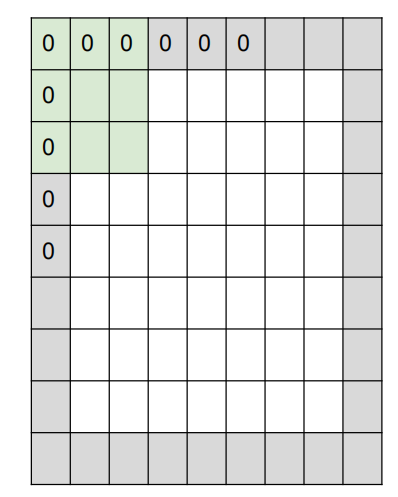

即使输入时3通道，但是经过模板计算以后，每个模板卷积计算得到的是“一个”数。

**下一层的通道数由上一层所用的卷积核的个数决定。**

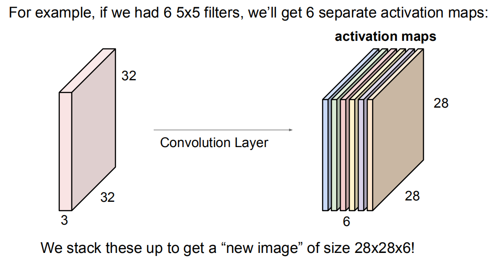

使用不同的卷积核得到多通道的activation map，而每个卷积核的权重矩阵一般是随机初始化的，，因此不同的卷积核可以提取到不同的特征。

#### 1x1 conv kernel

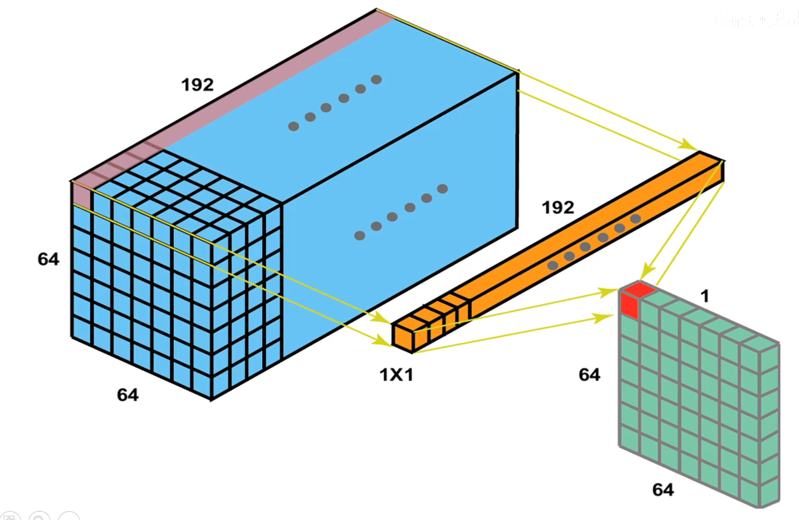

- 降维或升维
- 跨通道信息交融（因为把原图多个通道的值相加）
- 减少参数数量
- 增加模型深度，提高非线性表示能力
- 利用1x1卷积进行非线性压缩通常不会损失信息（原向量一般是非常稀疏向量，很多位置的响应都是0）

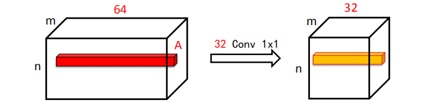

压缩的尺度与选择的1x1卷积核的个数有关。

### Pooling layer

- makes the representations smaller and more manageable 
- operates over each activation map independently
- 是一种下采样

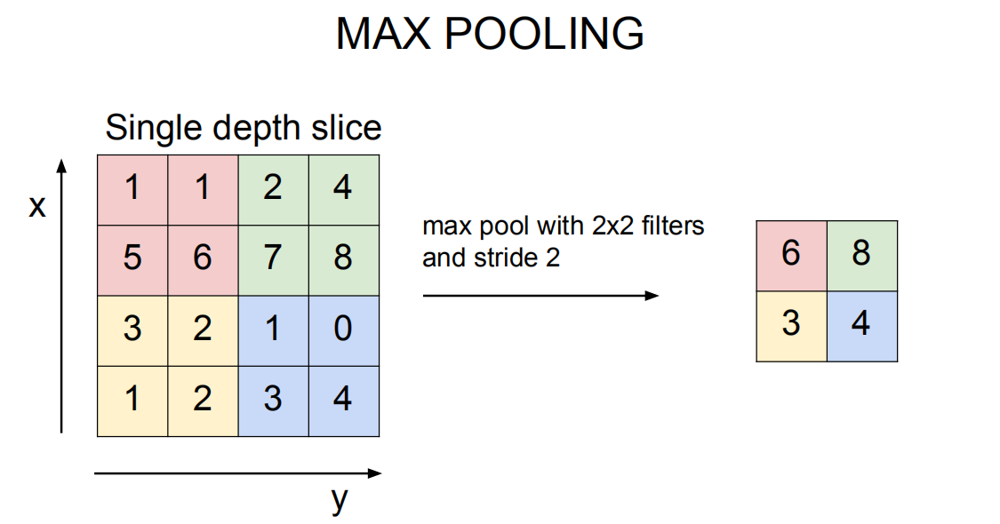

max pooling 用的比较多，相当于选出激活最大，最显著的。

### FC layers

其实就是之前用过的MLP，不过特别注意一点是，将最后一个pooling完的layer拉成一维向量，然后作为全连接层的输入层。

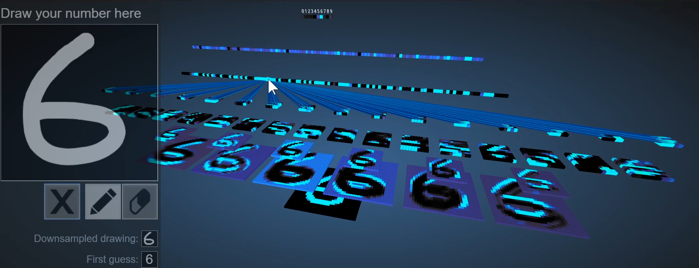

（FC的隐藏层与最后一个layer的每个元素都有连接）

### Summary

- Trend towards smaller filters and deeper architectures.

- Trend towards getting rid of POOL/FC layers (just CONV) (不用pool和fc)

## Lecture 5: Training Neural Networks

### Activation function

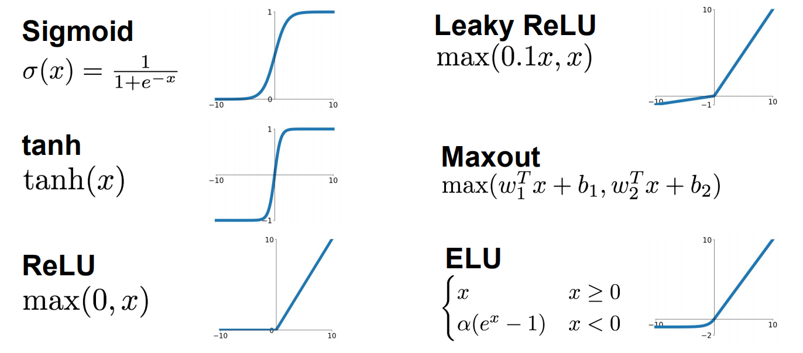

Sigmoid和tanh激活函数都有饱和和梯度消失的问题。

Leaky Relu和ELU都是为了改进ReLU中x小于0的数会无法激活的情况

#### Sigmoid() and tanh()

$$
\sigma(x) = \frac{1}{1+e^{-x}} \\
\sigma '(x) =\sigma(x)(1-\sigma(x))
$$

This function squashes numbers to range [0,1].

Three probelms:

- **1、**Saturated neurons “kill” the  gradients（x过大或过小造成函数饱和，使得梯度接近0）

  If all the gradients flowing back will be zero and weights will never change.

- **2、**Sigmoid outputs are all positive and not zero-centered.

  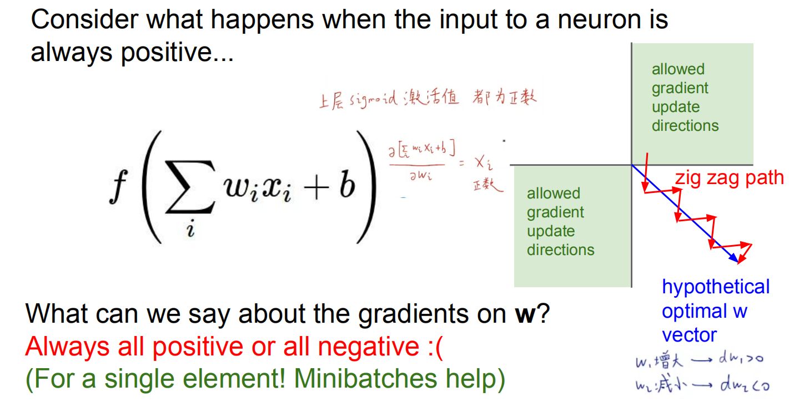

  如果上一层的输出全正（或全负），则对$w_i$的偏导数符号相同，根据更新的法则所有的权重会同时增大或减小，会出现上图所示的z型优化路径。

- **3、**exp() is a bit compute expensive

tanh() 相较Sigmoid()解决了问题2，但依然存在梯度消失。

#### ReLU()

$$
f(x)= max(0,x)
$$

- 一定不会发生饱和以及梯度消失，不消耗什么计算资源，收敛很快。
- 输出不关于0对称，x<0时梯度为0，相当于有一些神经元永远不会被更新。
  - 初始化不良
  - 学习率太大

#### Leaky ReLu() and ELU()

$$
f(x)= max(\alpha x,x)
$$

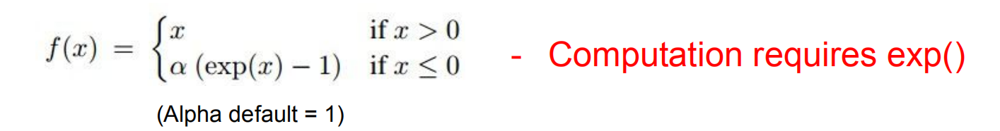

ELU()改善了Leaky ReLu()关于零点不对称的问题。

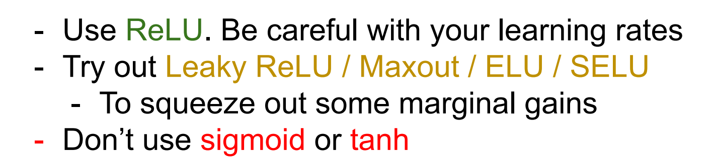

### Data Preprocessing

#### standardization

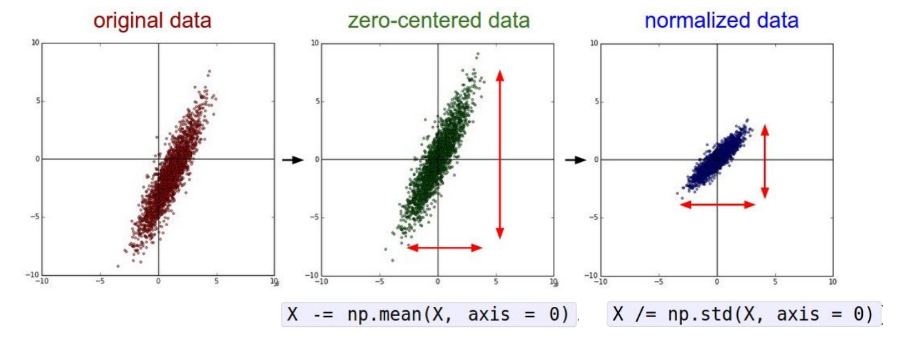

处理后的值将近似服从标准正态分布

#### PCA主成分分析

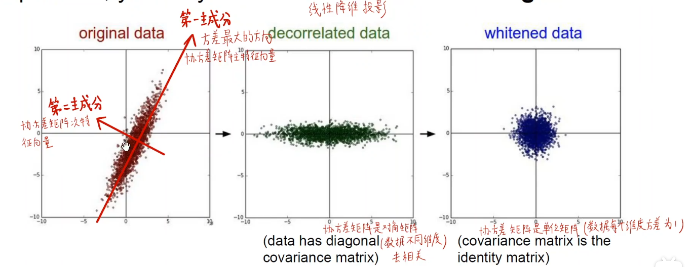

- 第一主成分对应方差变化最大的方向，即协方差矩阵主特征向量的方向；

  第二主成分对应方差变化第二大的方向，即协方差矩阵次特征向量的方向；

- 线性降维以后协方差矩阵是对角矩阵，去相关。

- 在主成分上除以标准差，转换成白化数据，协方差矩阵是单位矩阵（每个维度方差为1）

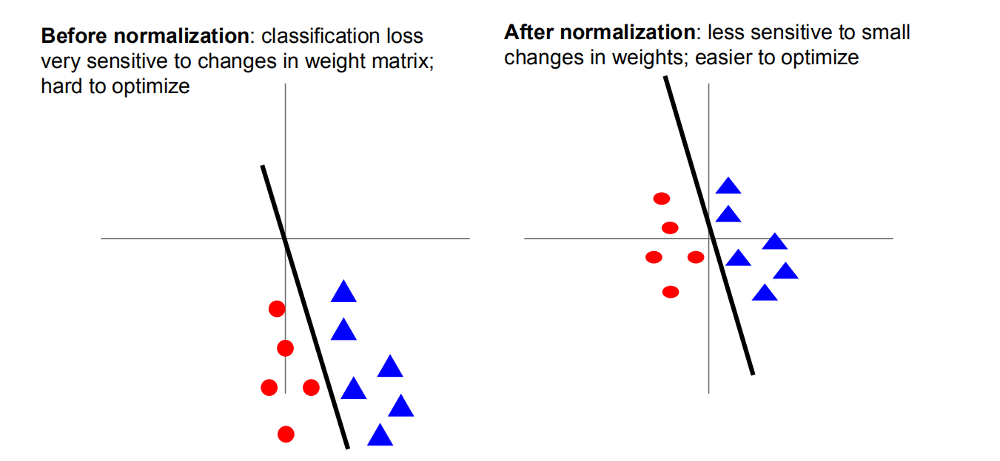

标准化处理后，损失函数对w的微小改变不那么敏感，更容易优化。

PCA和白化用的其实没有标准化多。

### Weight Initialization

- 多层神经网络不能将权重初始化为同一个数，否则无法打破“对称性”（symmetry）
- 权重应该选大还是选小？

a.g. 取6层，4096个神经元，**tanh()**为激活函数，有：
$$
\frac{\partial f}{\partial \omega_i} = f'\times x_i
$$
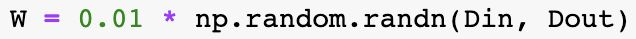

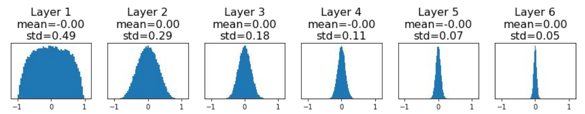

到后面层输入$x_i$的值过小（集中在0），$\frac{\partial f}{\partial \omega_i}=0$，会造成梯度消失

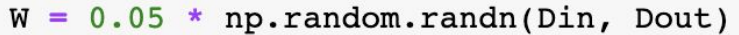

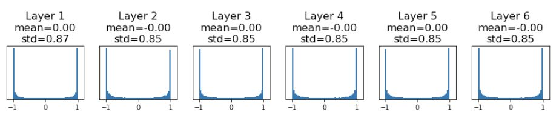

每一层的输出都集中在饱和区，$f'=0$，$\frac{\partial f}{\partial \omega_i}=0$，会造成梯度消失

#### Xavier Initialization

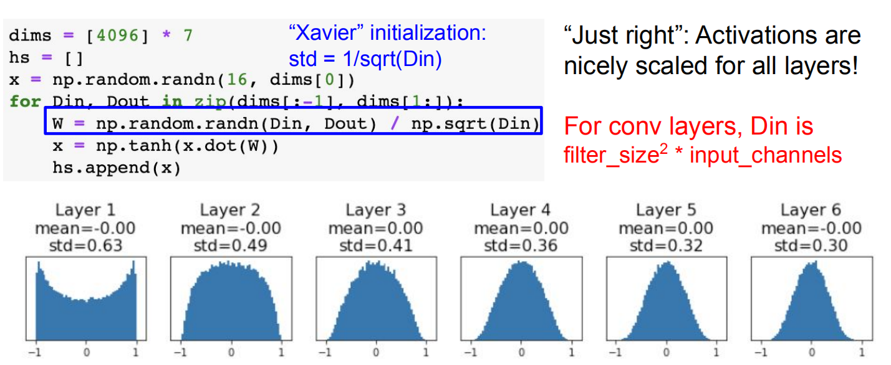

根据输入和输出的维度，可以自适应的调整权重的初始化幅度。

输入维度越多，权重初始化时的幅度应该越小。（对于CNN，Din = 卷积核大小）

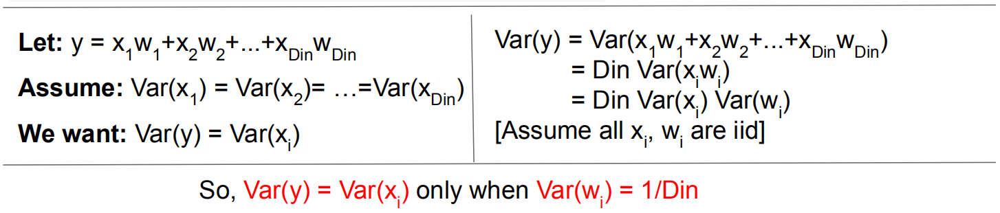

#### Kaiming / MSRA Initialization

但是如果用**ReLU()**激活函数，也可能或出现梯度消失的问题。（后面层$x_i$集中在0）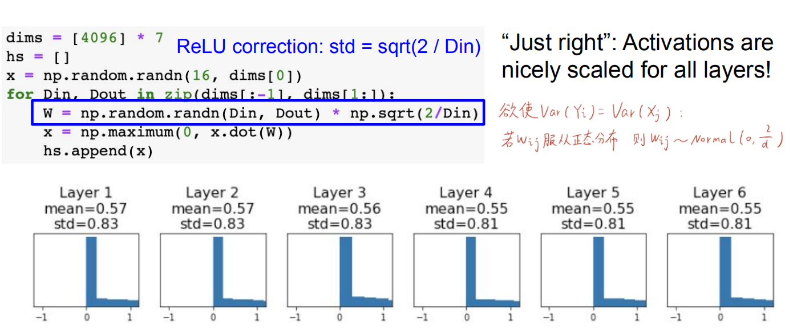

### Batch Normalization

#### Train

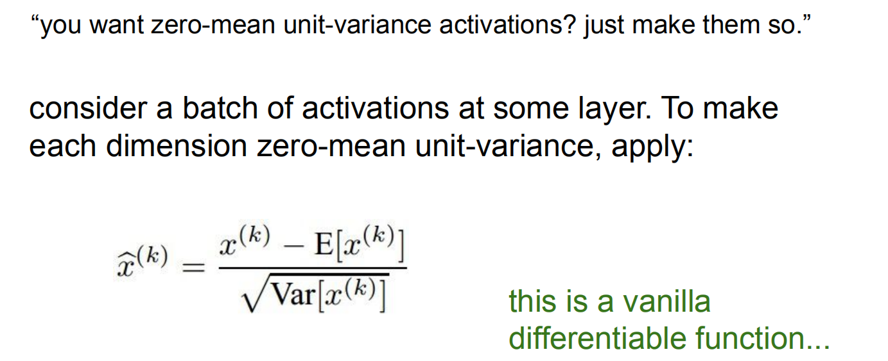

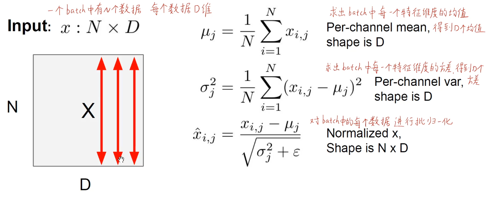

这三步就是normalization 工序

Problem: What if zero-mean, unit variance is too hard of a constraint? 

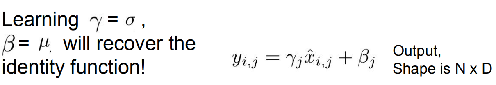

但是公式的后面还有一个反向操作, 将 normalize 后的数据再扩展和平移. 原来这是为了让神经网络自己去学着使用和修改这个扩展参数 gamma, 和 平移参数 β, 这样神经网络就能自己慢慢琢磨出前面的 normalization 操作到底有没有起到优化的作用, 如果没有起到作用, 我就使用 gamma 和 belt 来抵消一些 normalization 的操作.

我们需要将训练阶段的总均值和总方差保存下来。

#### Test

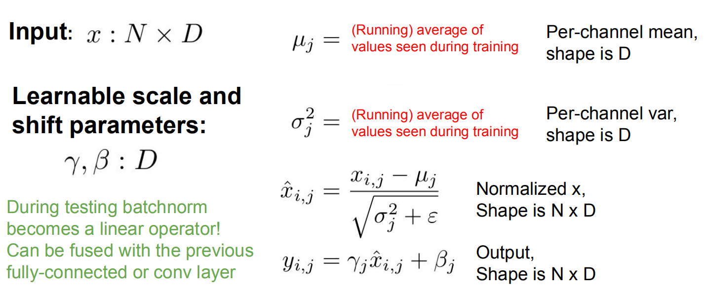

用训练时的总均值代替mini-batch的均值，训练时的总方差代替mini-batch的方差。

Usually inserted after Fully Connected or Convolutional layers, and **before nonlinearity.**

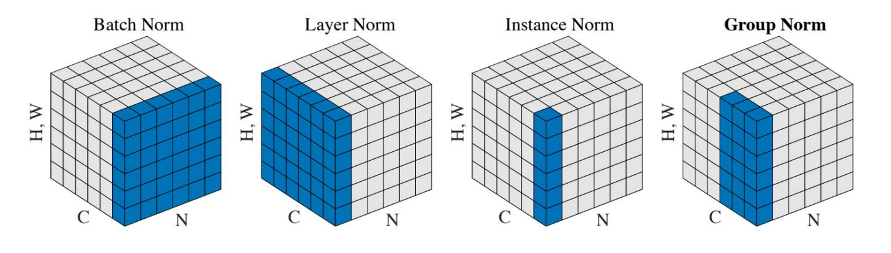

### Optimization

#### SGD

Problems：

- 在梯度较大的方向上产生振荡，且不能单纯通过减小学习率解决。

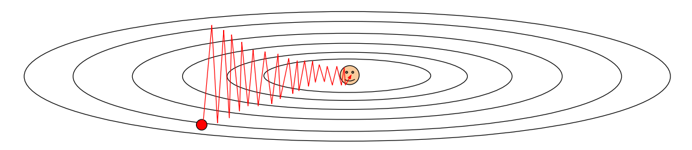

- 容易陷入局部最优点或鞍点（Saddle points，在高维空间中更普遍）

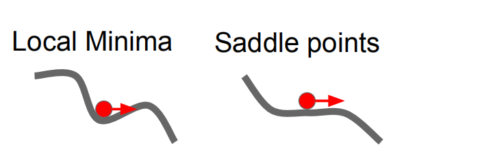

- 因为梯度计算来源于mini-batch，所以可能会包含很多噪声

#### SGD + Momentum

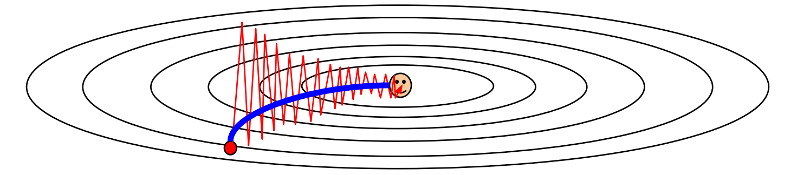

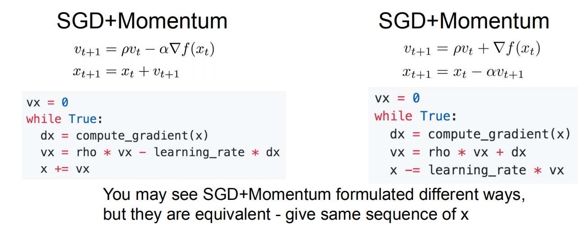

直观理解就是，下一次优化的方向不仅与当前时刻的梯度有关，还与之前的优化方向和速度有关。

$\rho$ 类似于提供了摩擦力，使得之前的速度得到衰减。一般$\rho=0$ 取0.9或0.99。

$\rho=0$，与SGD相同；$\rho=1$，过去的速度完全不衰减。

但是Momentum方法如果动量过大容易冲过头。

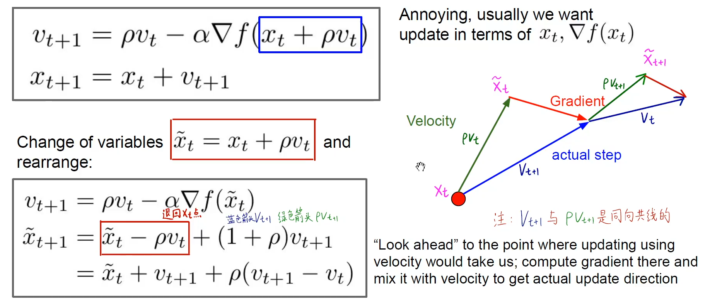

（对于上图，$\tilde{x}_t$是之后更新的基准点，从公式也可以看出。之后的迭代与$x_t$本身无关）

（先根据前一时刻 $t$ 的速度计算梯度，然后退回到 $x_t$，从 $x_t$ 开始更新）

Nesterov Momentum 相当于不是计算的当前速度的梯度再与前一时刻的速度进行矢量和，而是直接根据前一时刻的速度计算梯度进行矢量和，得到最终的优化方向。相当于提前看一步，提早感知坡底。

#### AdaGrad and RMSProp

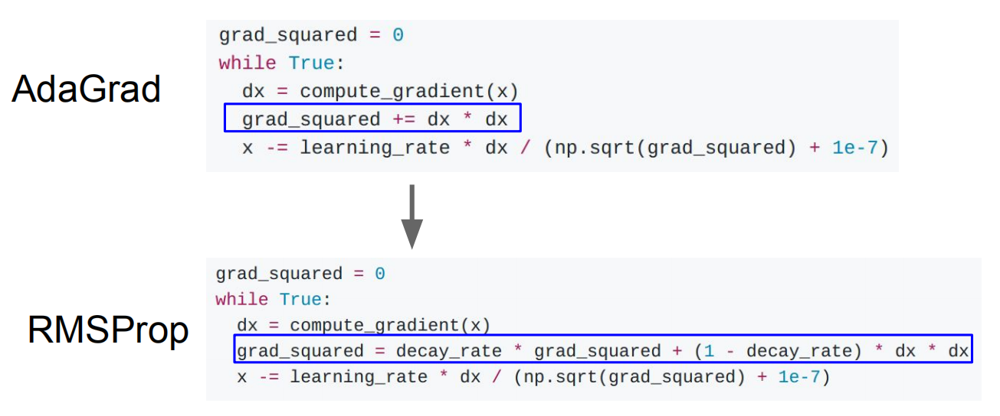

AdaGrad 增加惩罚项，沿“陡峭”方向前进减弱，沿“平坦”方向前进加速；随着训练的进行分母越来越大，后续更新几乎停止。

RMSProp 在AdaGrad的基础上 增加了一个衰减因子，考虑保留之前多久的累积项，防止更新停止。

#### Adam

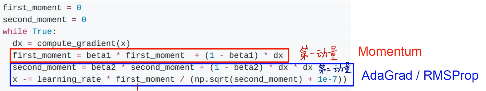

Adam同时结合了两种动量方式的优势，但是刚开始的几轮中一次和二次动量值都比较小。进行修正

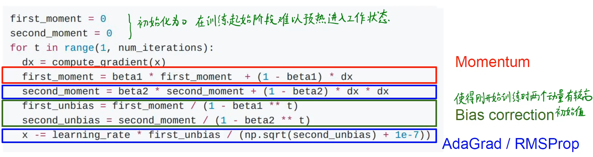

#### First-Order and Second-Order Optimization

以上提到的所有用梯度下降优化的方法都是一阶方法。

对于二阶方法：（二阶方法不需要设置学习率）

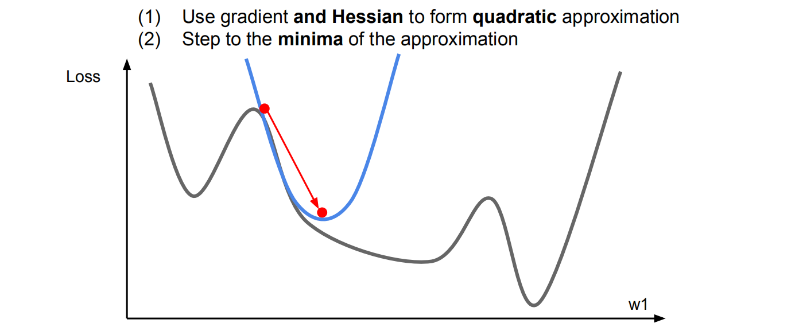

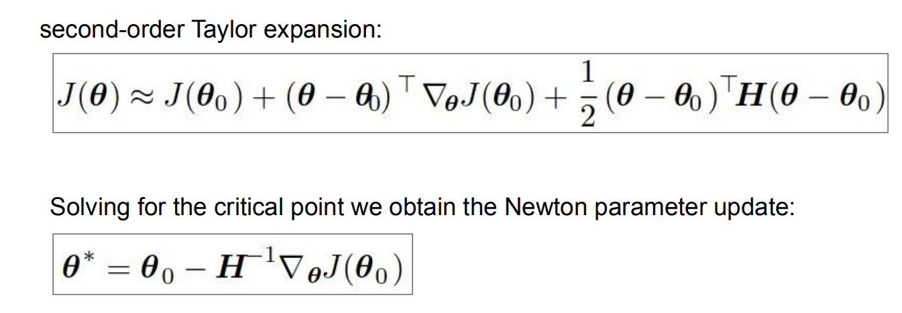

梯度下降是一阶收敛，只考虑了当前坡度最大的方向；

牛顿法考虑走了一步之后坡度是否会变得更大。

但是Hessian矩阵要计算二阶导，还要计算逆矩阵，计算量太大。

另外有高斯牛顿法，用 Jacobian 矩阵$J^TJ$代替Hessian矩阵。

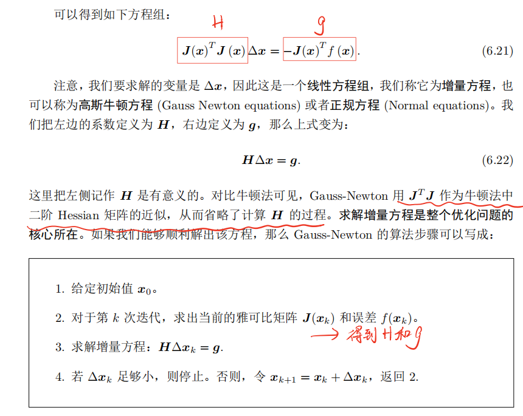

### Learning rate schedules

训练初期学习率应比较大，训练后期学习率应比较小。学习率衰减相当于一种二阶参数的方式。

一般的方式是先不用学习率衰减，看看loss曲线的变化情况，判断在哪里开始衰减比较合适。

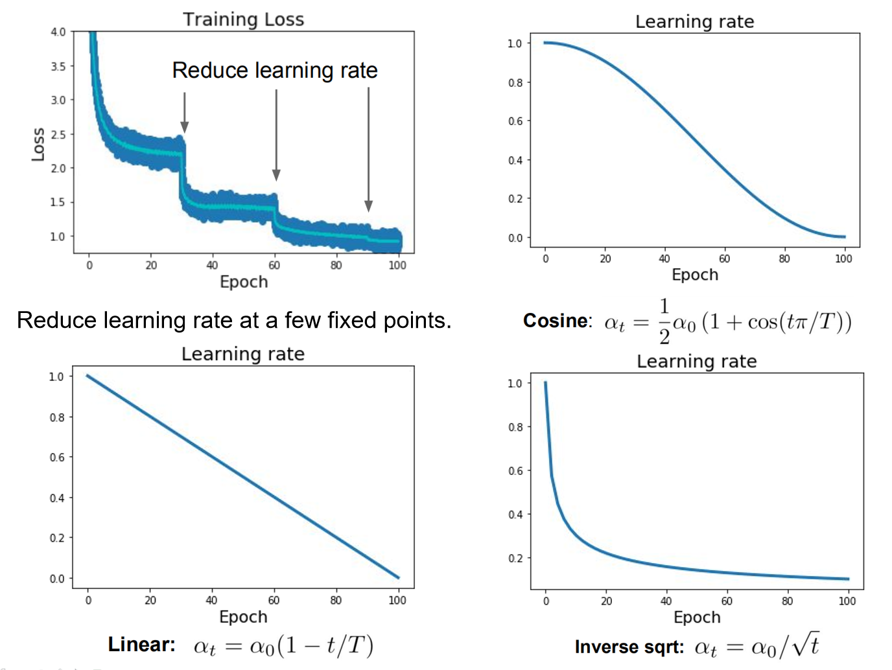

### Overfitting 

在训练集上有比较好的效果（即loss曲线下降比较合适），但验证集准确率很低。

#### Early Stopping

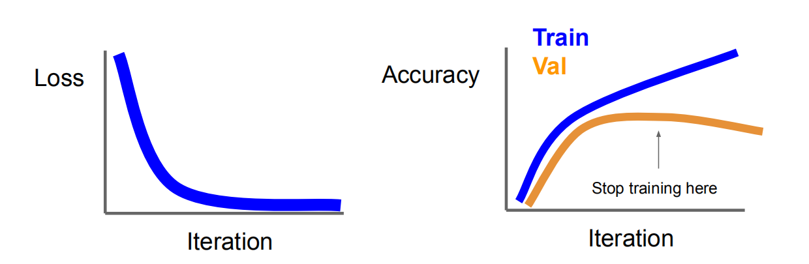

#### Model Ensembles

- Train multiple independent models
- At test time average their results
- 其实就是Adaboost的思想

#### Regularization

**Add term to loss**：(之前讲过，这里不展开)

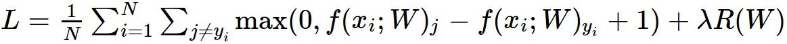

**Drop out**：

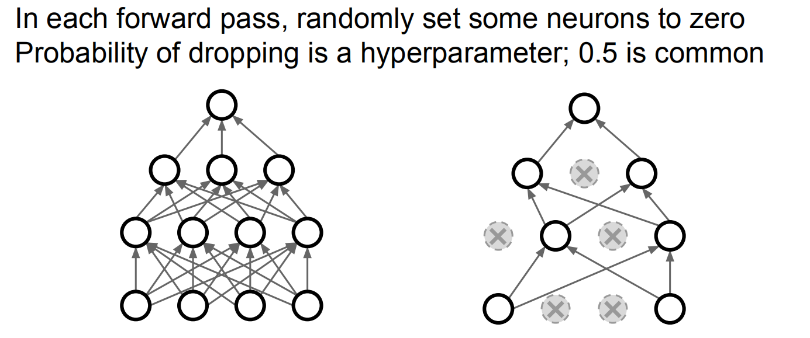

- 打破了特征之间的联合适应性，使得每个特征都能够独当一面
- Dropout每次删去不同神经元都相当于构建一个新的模型，起到了模型集成的作用

通过mask的方式实现神经元的删除（权重置0）

而在test阶段，因为在训练时删去神经元，导致神经元的输出的期望值下降，需要在test时补偿。

a.g. 两个神经元，在dropout中一共4种情况。

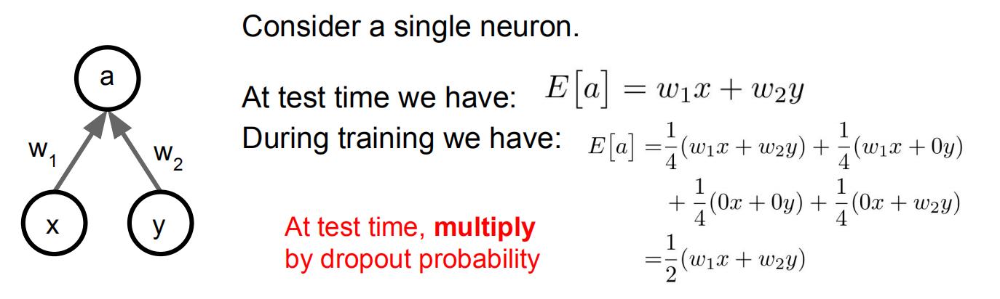

但是更common的方法时，我们在训练时提前补偿，训练阶段就不需要进行改变。

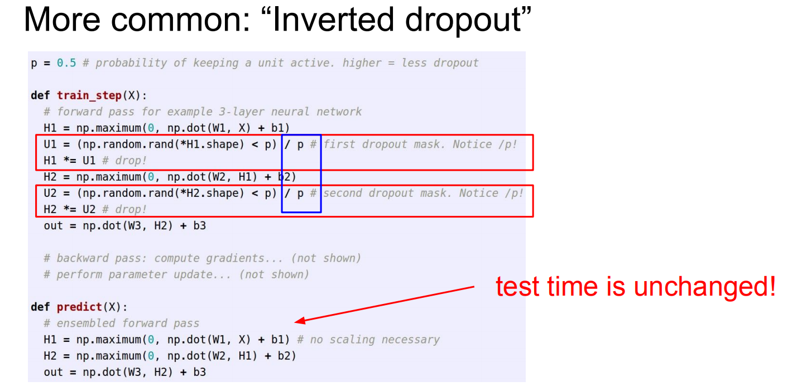

#### Drop Connnect

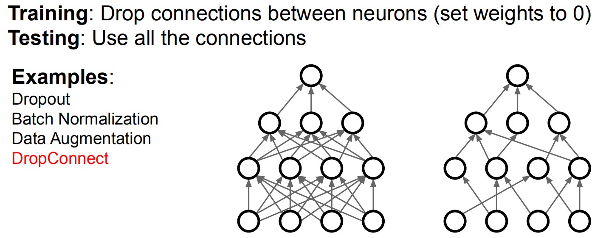

#### Data Augmentation

**通过对原始数据融入先验知识，加工出更多数据的表示，有助于模型判别数据中统计噪声**，加强本体特征的学习，**减少模型过拟合**，提升泛化能力。

单(图像)样本增强主要有翻转、旋转、缩放、裁剪、平移、添加噪声等。

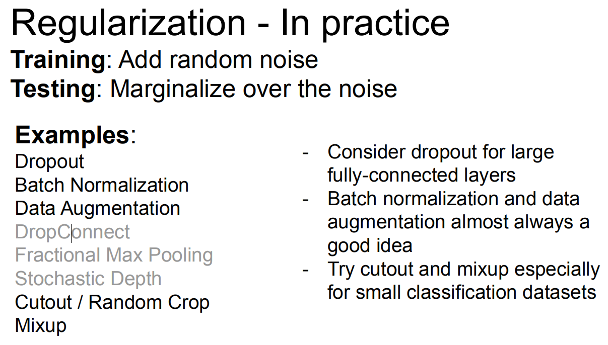

### Choosing Hyperparameters

- **Step 1**: Check initial loss
  - Turn off weight decay, sanity check loss at initialization
- **Step 2**: Overfit a small sample
  - Try to train to 100% training accuracy on a small sample of training data; 

- **Step 3**: Find LR that makes loss go down
  - Use the architecture from the previous step, use all training data, turn on small weight decay, find a learning rate that makes the loss drop significantly within ~100 iterations

- **Step 4**: Coarse grid, train for ~1-5 epochs
  - Choose a few values of learning rate and weight decay around what worked from Step 3, train a few models for ~1-5 epochs.

- **Step 5**: Refine grid, train longer
  - Pick best models from Step 4, train them for longer (~10-20 epochs) without learning rate decay
- **Step 6**: Look at loss and accuracy curves
- **Step 7**: GOTO step 5

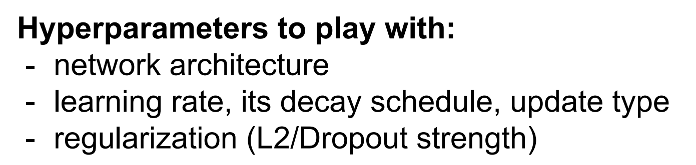

### Transfer learning

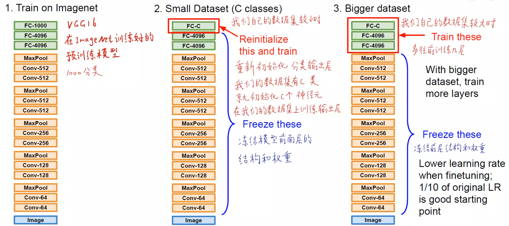

根据自己数据集的体量决定需要对哪一部分网络结构进行重新训练（一般最多重新训练FC层）

其余部分的结构和权重均保持不变。

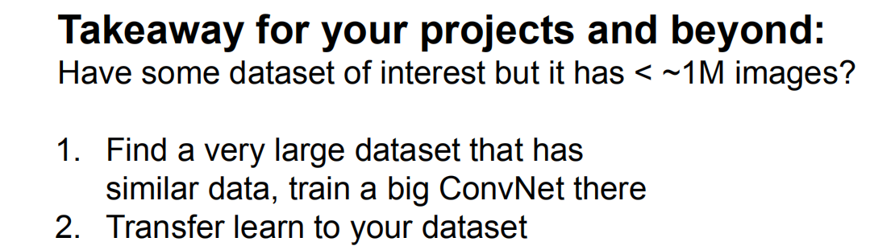

迁移学习的思想认为，对于FC线性层之前的conv、pool等层，均起到了提取特征等作用，能提取到普适信息。对于各种计算机问题应该是普适的，因此大多数问题不需要重新训练前面的内容，只需要重新训练FC层。

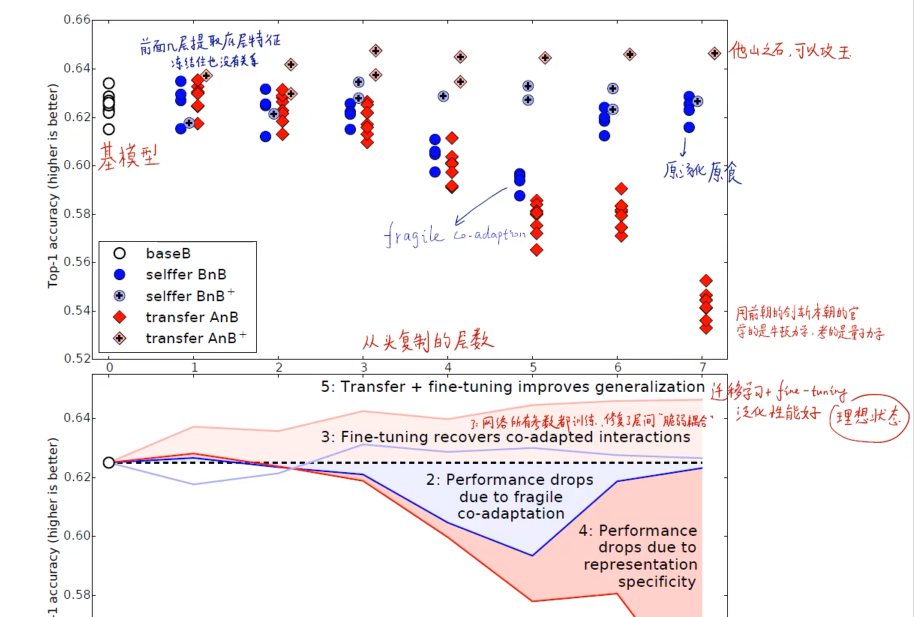

不能随便打破conv之间的联系（保留前面的conv而重新训练后面的conv），不然可能和上图蓝线一样发生性能的下降。

## Lecture 6: CNNs in Practice

### How to stack them（The power of small filters）

- 可以用两个3x3的卷积核替代5x5的卷积核，**减少计算量**，且计算结果不变。

  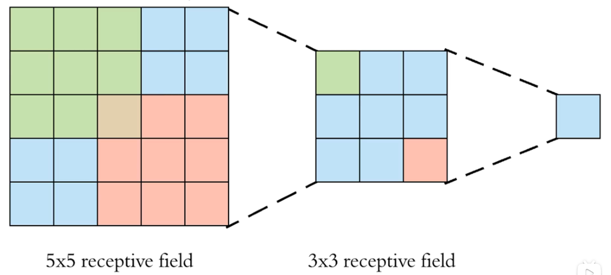

  根据计算公式 $(n+2*p-f)/stride + 1$:

  **一个5*5卷积**：(32-5)/1+1=28

  **两个3*3卷积核**：(32-3)/1+1=30；(30-3)/1+1=28

  堆叠含有小尺寸卷积核的卷积层来代替具有大尺寸的卷积核的卷积层，有更少的参数量，并且能够使得感受野大小不变，而且多个3x3的卷积核比一个大尺寸卷积核有更多的非线性（每个堆叠的卷积层中都包含激活函数)，使得decision function更加具有判别性。

- 同理，可以用三个3x3的卷积核替代一个7x7的卷积核

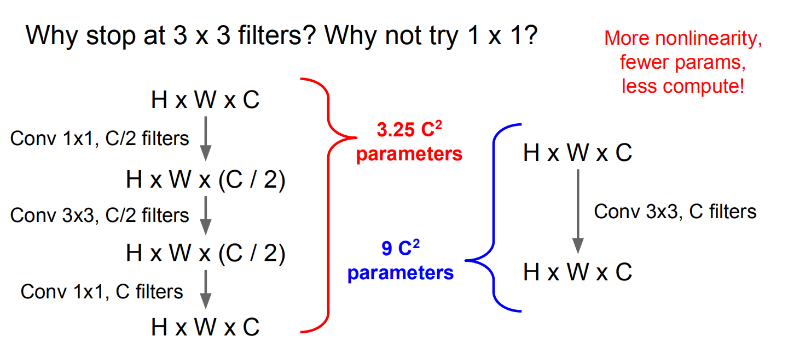
$$
1\times1\times C\times C/2+3\times3\times C/2\times C/2+1\times1\times C/2\times C=3.25C^2
$$

$$
kernal\hspace{0.2cm} size \times kernal\hspace{0.2cm} size \times input\hspace{0.2cm} channels \times filter\hspace{0.2cm} nums
$$

### How to compute them

将卷积运算变为矩阵运算，利用现成的矩阵加速运算工具包进行高速计算。

Can we turn convolution into matrix multiplication?

#### im2col

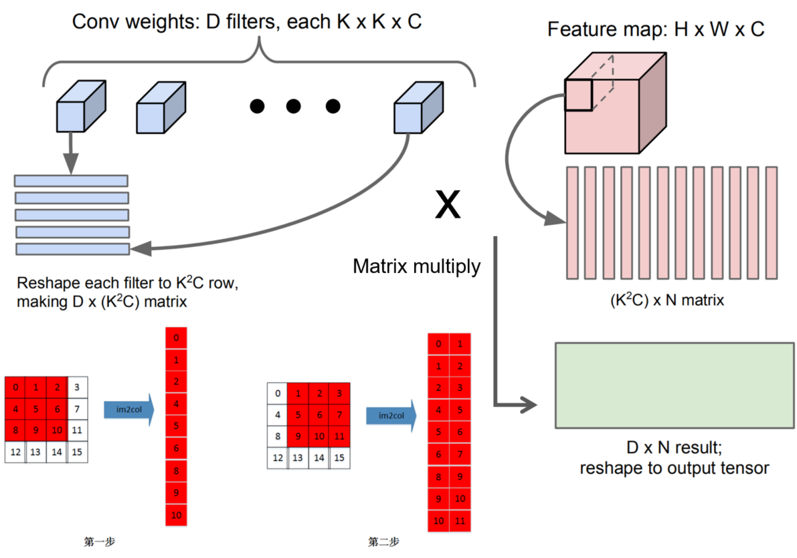

- K表示卷积核的大小
- N表示一个feature map中元素的个数
- D表示卷积核的个数
- 最后矩阵乘法得到一个D x N 的结果，相当于每一行表示一个卷积核生成的feature map拉平得到的N个元素。

a .g . 32x32x3，kernel_size=5，slide = 1，padding = 0，feature map的通道数为6

则f = K= 5，D = 6，(n+2p-f)/slide+1 = 32-5+1 = 28，N = 28x28

最后得到D x N = 6 x 28 x 28的结果，将N重新reshape成 28 x 28 即可完成这一次的卷积操作。

#### FFT

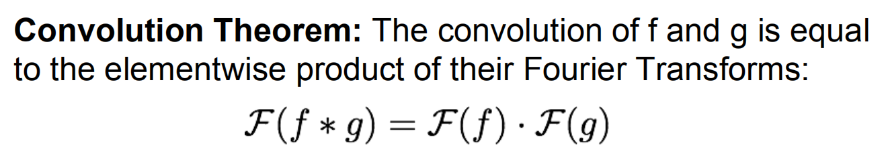

**FFT steps:**

- Compute FFT of weights: $F(W)$
- Compute FFT of image: $F(X)$
- Compute elementwise product: $F(W)$ ○ $ F(X)$
- Compute inverse FFT: $Y = F^{-1}(F(W)$○ $F(X))$

对于大卷积核有比较好的效果，对于小卷积核没有明显优势。

## Lecture 7: CNN Architectures and Recurrent Neural Networks

### CNN Architectures

**AlexNet ：**开山鼻祖

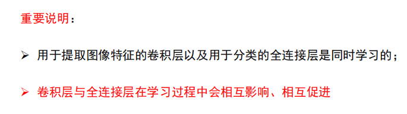

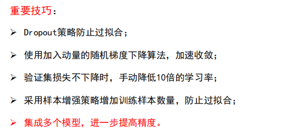

**ZFNet ：**轻微改动

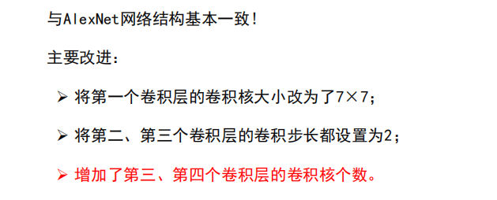

**VGGNet ：**提出用多个small 卷积核替代big 卷积核

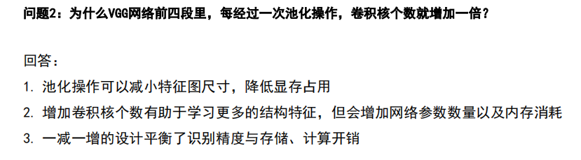

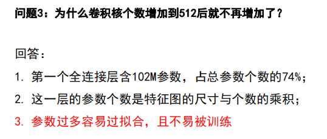

**GoogLeNet ：**提出Inception module，网络由多个Inception module组成，取消了FC层。

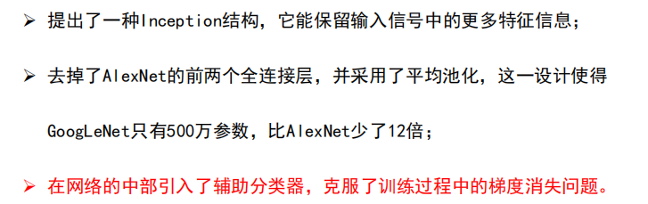

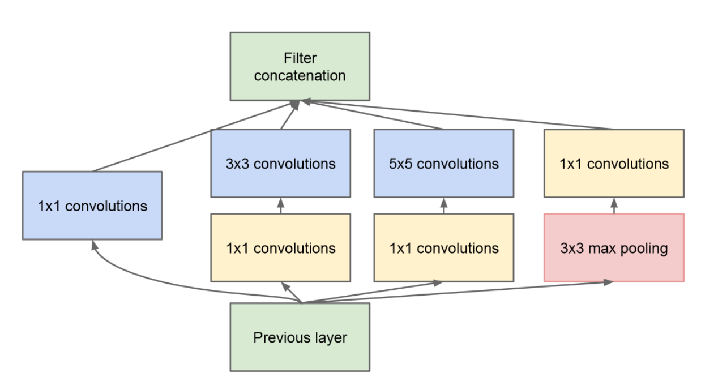

针对不同图像中同类物体尺度不同的问题，采用不同尺度的卷积核来解决这个问题。

1x1起到了数据压缩的作用，3x3和5x5起到了提取不同尺度特征的作用，3x3 max pooling起到了将响应大的像素进行扩张（即3x3邻域的像素值都变为与最大的中心点相同）。在最后concatenation时要保证每条分支拼接时的H和W相同，channel数直接叠加。如：96+96+96+48个通道

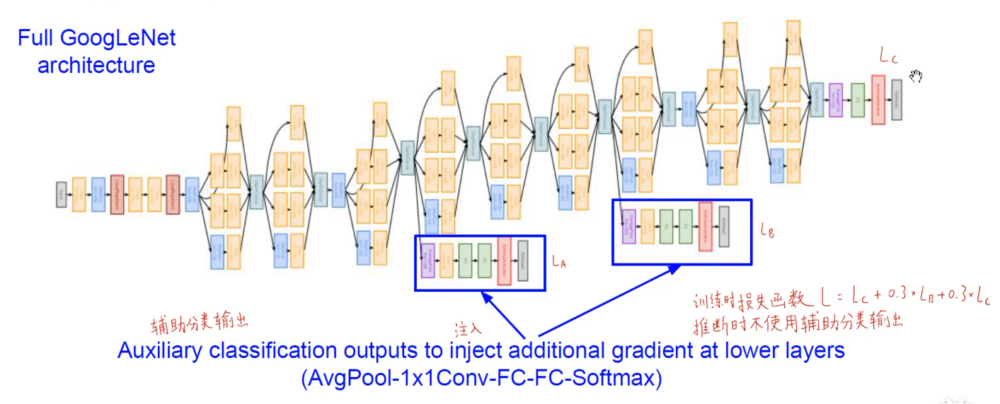

增加了两个提前分类项，可以提前进行反向传播，相当于增加了正则项。

对输出feature map平均池化，每个feature map取一个平均值，取消前两层FC，参数大大下降。

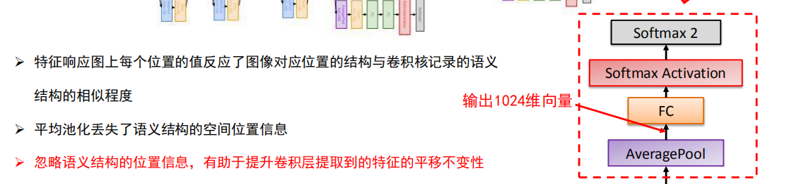

**ResNet：**

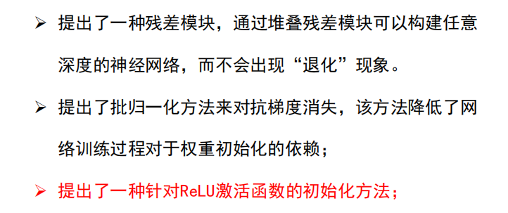

“越深的网络准确率越高”这一观点是错误的，该现象被称为“退化（Degradation）”。同时，太深网络容易出现梯度消失或梯度爆炸。

在ResNet论文中说通过数据的预处理以及在网络中使用BN（Batch Normalization）层能够解决梯度消失或者梯度爆炸问题。

退化现象让我们对非线性转换进行反思，非线性转换极大的提高了数据分类能力，但是，随着网络的深度不断的加大，我们在非线性转换方面已经走的太远，竟然无法实现线性转换。

在 ResNet 提出的**residual**残差结构中增加了Shortcut Connection分支，在线性转换和非线性转换之间寻求一个平衡。

将堆叠的几层layer称之为一个block，对于某个block，其可以拟合的函数为$F(x)$，如果期望的潜在映射为$H(x)$，$F(x)$直接学习潜在的映射，不如去学习残差 $H(x)-x$，即 $F(x) = H(x)-x$，这样原本的前向路径上就变成了 $H(x)=F(x)+x$，来拟合$H(x)$。因为**相比于让 $F(x)$ 学习成恒等映射，让 $F(x)$ 学习成0要更加容易**。这样，对于冗余的block，只需$F(x)→0$就可以得到恒等映射，性能不减。

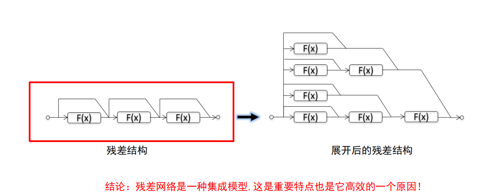

残差的效果其实就类似这种图像增强。

**SENet**：

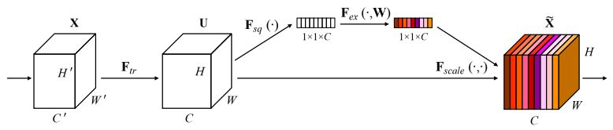

可以自适应学习得到每个channel的权重。

### Recurrent Neural Networks

RNN适用于序列数据，广泛应用于NLP领域。

用于图像分类领域，就要将处理序列数据的方法用于非序列数据。

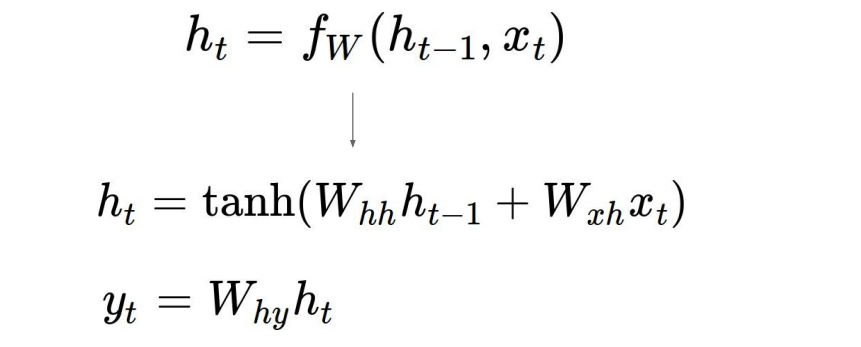

$W$ 权重是共享的（$W_{hh}$ $W_{xh}$ $W_{hy}$ 均相同）。

## Lecture 8: Semantic Segmentation

语义分割给每个像素分配类别标签，但是不区分实例，只区分类别。

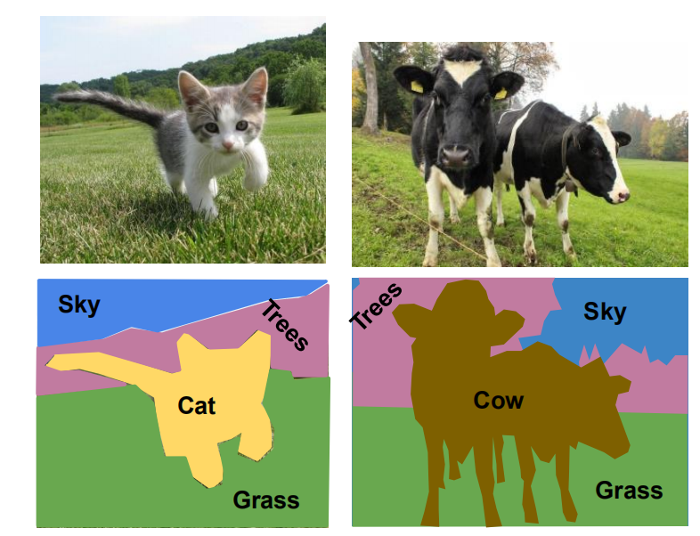

### Sliding Window

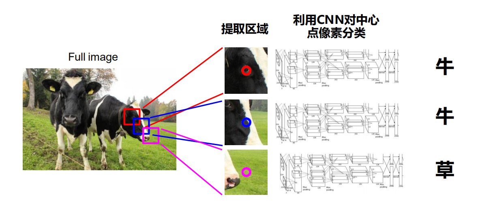

- 取中心点周围的某个区域，对该区域进行分类任务。

- 但是效率太低！重叠区域的特征反复被计算

### Fully Convolution Network （FCN）

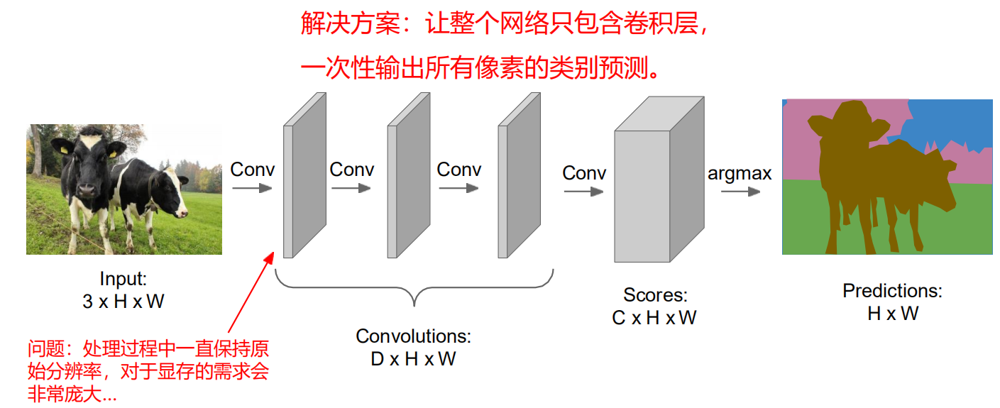

让最后的输出为C个通道，与分类的类别数目相同。对于每一个特定的位置，对应一个C X 1的向量。将标签设为[1 0 0 0 ... 0]$_{1\times c}$，表示该像素本应该属于第一类，然后用 softmax 的思路训练网络。

问题：处理过程中一直保持原始分辨率，对于显存的需求会非常庞大

解决方案：让整个网络只包含卷积层，并在网络中嵌入**下采样**与**上采样**过程。

#### 下采样

可以用：pooling、sliding > 1等方法

#### 上采样

**Unpooling（反池化操作）**

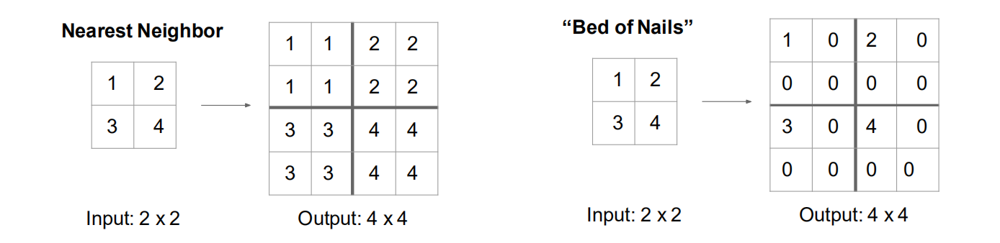

这两种都不太好。更常用的是下面这种 

**Max Unpooling**

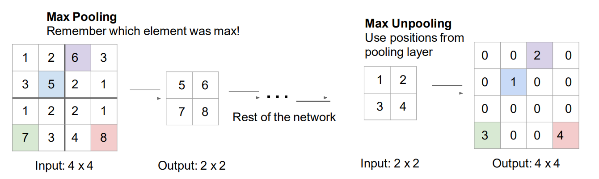

即需要在max pooling时记下保留的是哪个位置的值，然后在上采样的时候放到对应位置。

**Transpose Convolution**

转置卷积是一种**可学习的上采样**

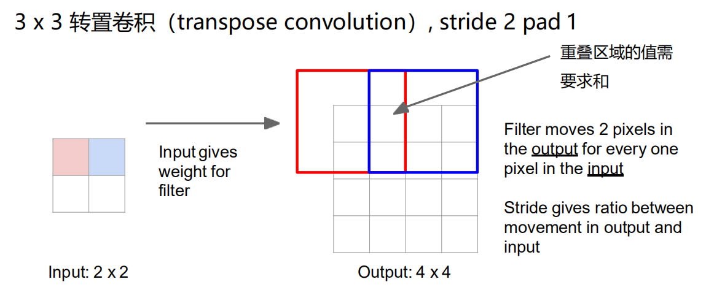

即重叠区域由两个input的像素共同决定，需要学习这两个分配的权重。举一个一维的例子：

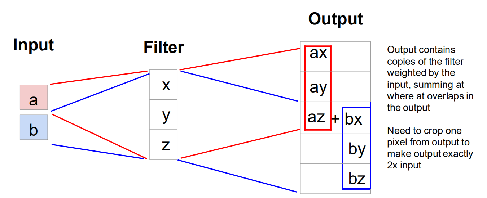

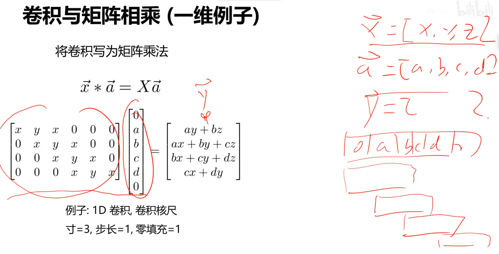

将向量x写成X矩阵的形式，相当于得到了移动卷积核在不同位置与增广（即增加padding）后的待卷积向量进行卷积的结果。可以用一次矩阵运算得到。 由此，可得逆运算的上采样结果：

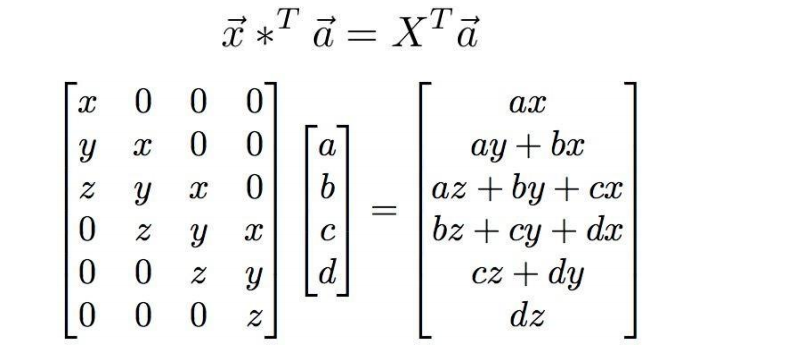

## Lecture 9: Object Detection

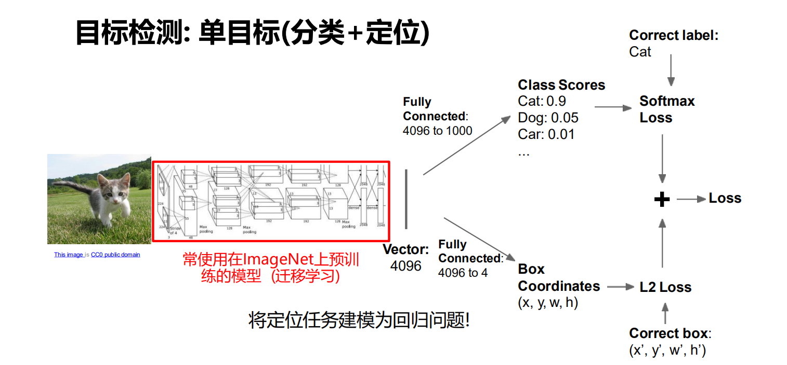

最后输出一个1004维的向量。前1000维对应softmax输出的概率值，用来判断锚框中的物体属于哪个类别；最后四维表示锚框的位置，一般是锚框左上角的坐标（opencv中好像是锚框中心的坐标）以及锚框的长宽。分类问题得到一个交叉熵loss，定位问题得到一个L2loss，用两个loss加个权值配比得到最终的loss，即任务转化为一个多目标损失问题。

但是这种处理方法必须提前确定有多少个目标，才能确定输出向量的维度。因此该方法不适用于多目标问题。

### 多目标检测总体方法

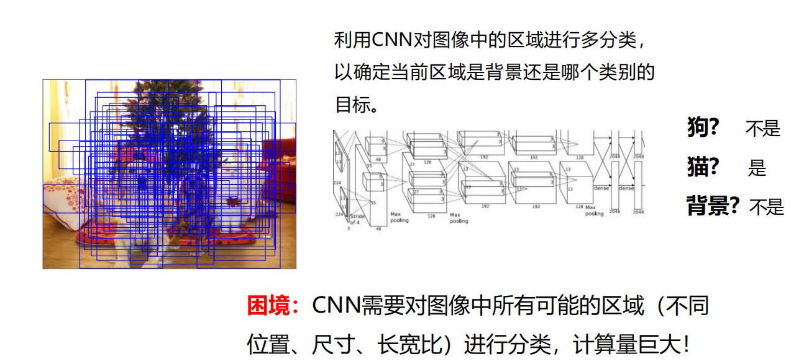

即利用sliding windows的方法，选择不同尺度的区域，对该区域进行分类。（增加了背景类）

但是计算量过大：需要Selective Search，事先找出所有潜在可能包含目标的区域，仅对这些区域进行操作。

### Two-stage object detector

#### RCNN

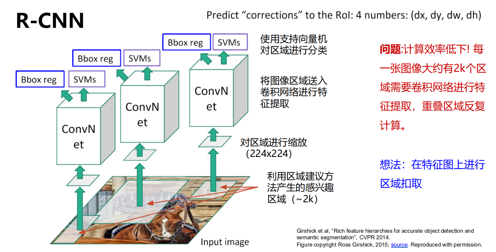

仅用CNN进行特征提取，取消了最后的两层用于分类的FC层，改用SVM

#### Fast R-CNN

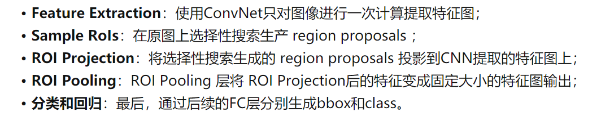

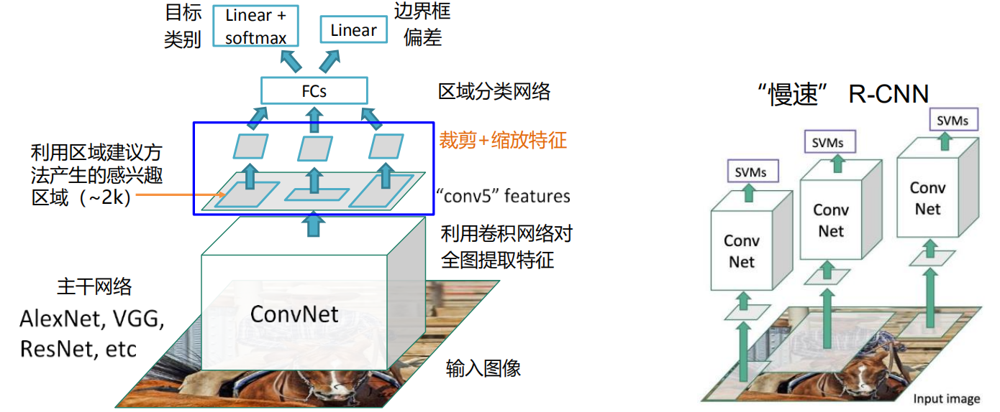

- Selective Search的结果直接投影到经过CNN的特征图上，这样做的好处是，原来建议框重合部分非常多，卷积重复计算严重，而这里每个位置都只计算了一次卷积，大大减少了计算量。
- 由于建议框大小不一，得到的特征框需要转化为相同大小，需要对建议框区域进行裁剪和缩放。这一步是通过ROI池化层来实现的（ROI表示region of interest即目标）

**ROI Pooling**

候选区域投影过来的时候要对齐到区域顶点（比如将2.5对齐到2）

划分时也尽可能等划分（比如5划分成2和3）

**ROI Align**

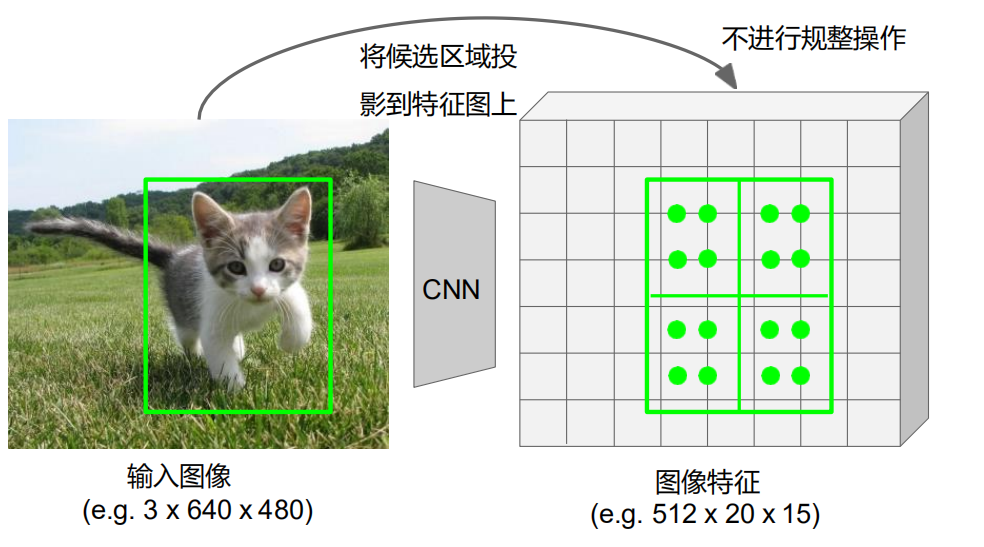

直接进行投影，不对齐到整点，并且在区域内选择几个等间隔的点。

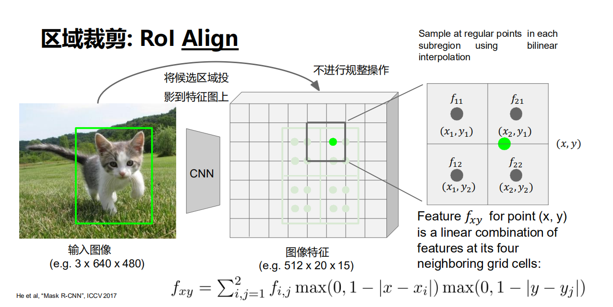

利用标准网格上的4个点通过双线性插值得到自己取的绿色点的坐标。

然后利用4个绿色点，对每个区域进行max pooling，相较 Rol pooling更加准确。

#### Faster R-CNN

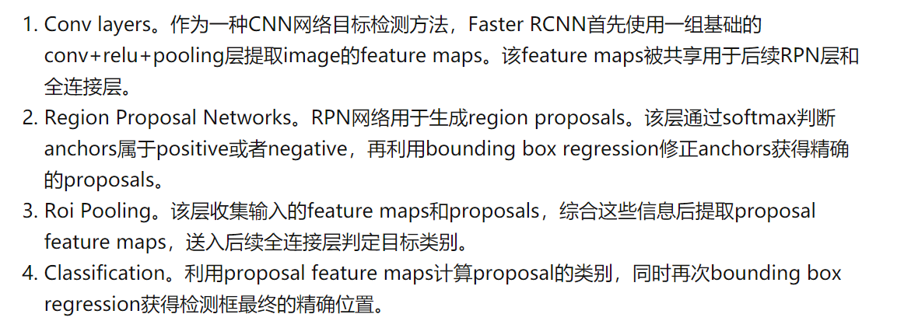

相较 Fast R-CNN ，改成在特征图上直接找感兴趣区域。在特征图上用RPN网络**选择合适的锚点**（Anchor）（**？？**），以锚点为中心，用固定大小的框来框图，对该区域直接进行分类。

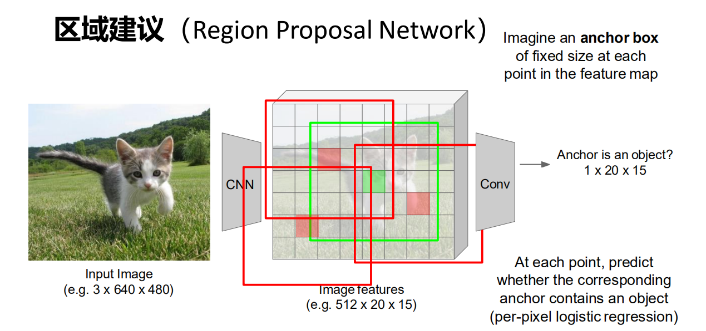

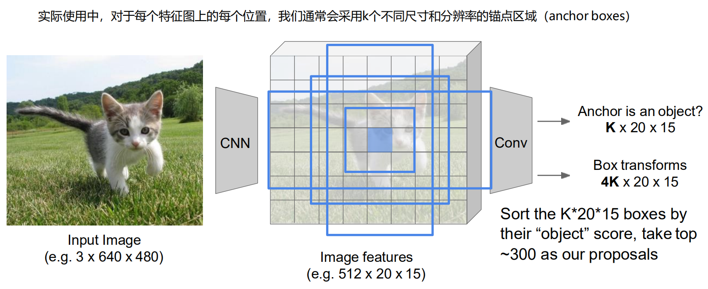

每个anchor处都框出4个不同尺度的anchor box，然后分别分类，看对应K个类别中的哪一类。即每一个锚框对应一个K维向量（0-1编码表示属于哪个类别），所以每个anchor是4K（4个框），整张feature map对应4K x H x W。而另外一个输出是一个值0或者1来判断该区域是不是我们的目标，所以这部分对应K x H x W。

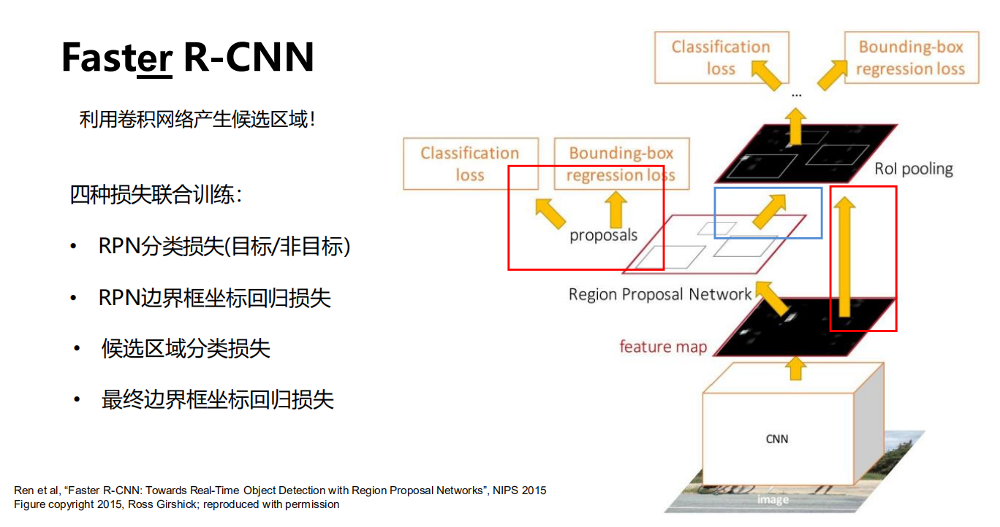

注意在红色框的地方有梯度传回来，但是在蓝色框的地方没有，这是 Rol pooling的缺陷。

以上都属于两阶段的方法：第一阶段特征提取，得到候选区域；第二阶段进行类别和边界框的预测

### Single-Stage Object Detectors

#### YOLO

#### SSD 
