[TOC]

# Faster-rcnn

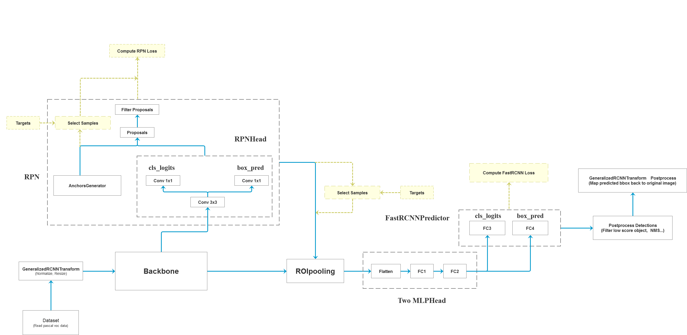

## 数据集Dataset

主要还是定义两个方法：`__len__`和`__getitem__`

数据集下有5个文件夹：Annotations, images, ImageSets, JPEGImages, labels。

> - images 和 JPEGImages 存放的是原始的图片数据集
>
> - Annotations 存放的是标记后生成的 xml 文件
>
> - labels 存放的是保存标记内容的 txt 文件
>
> - ImageSets 存放的是训练数据集和测试数据集的分类情况

## 图像预处理tranform

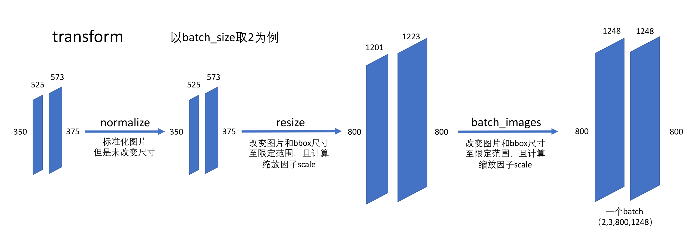

### normalize

$$
image = \frac{image-mean}{std}
$$


归一化处理，改变了像素值，但是图片尺寸未改变。

### resize

将图片尺寸调整到设定的上下限内。

- 设定两个参数，允许的最大尺寸*self_max_size*和允许的最小尺寸*self_min_size*

- 得到待处理图片较大的边长*max_size*和较小的边长*min_size*

- 缩放因子*scale_factor* = *self_min_size* / min_size

- ```python
  if max_size * scale_factor > self_max_size:
  	scale_factor = self_max_size / max_size  
      # 将缩放比例设为指定最大边长和图片最大边长之比
  ```

- 根据scale_factor对原图进行双线性插值，得到resize后的图片

- bbox 也要根据scale_factor进行缩放

### batch_images

将处理完的图片打包成一个batch

- 先得到 batch 中所有图片最大的一个尺寸（宽的最大值，高的最大值），设为batch_shape
- 设定stride=32（一般是用于加速计算，而且保证了生成的特征图的边长为整数（32是2的倍数，比如缩放16倍的话一定是整数边长））
- 将每个图片的尺寸向上取整到stride的整数倍
- 根据batch_shape生成全0的矩阵，将待处理图片复制到矩阵左上角

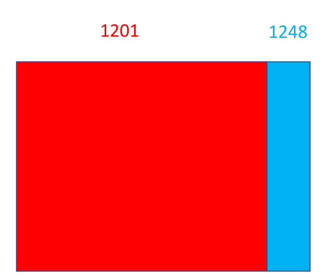

- 这样保证了一个batch中的所有图片的尺寸相同，但是不同batch的输入尺寸不同

至此图片预处理完成，可以传入backbone网络。

## 特征提取网络 backbone

backbone主要是提取特征图，同时输出通道的维度要保持一定。

```python
vgg_feature = vgg(model_name="vgg16", weights_path="./backbone/vgg16.pth").features
backbone = torch.nn.Sequential(*list(vgg_feature._modules.values())[:-1])  # 删除features中最后一个Maxpool层
backbone.out_channels = 512
```

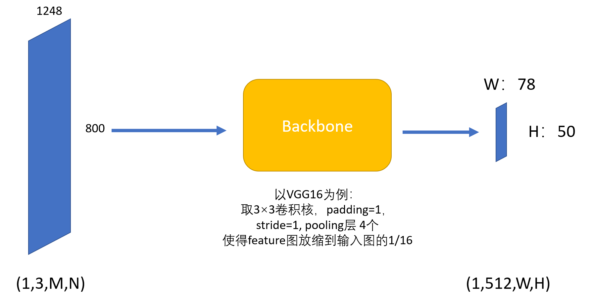

## Region Proposal NetWork（RPN）

```python
class RegionProposalNetwork(torch.nn.Module):
    """
    Implements Region Proposal Network (RPN).

    Arguments:
        anchor_generator (AnchorGenerator): module that generates the anchors for a set of feature
            maps.
        head (nn.Module): module that computes the objectness and regression deltas
        fg_iou_thresh (float): minimum IoU between the anchor and the GT box so that they can be
            considered as positive during training of the RPN.
        bg_iou_thresh (float): maximum IoU between the anchor and the GT box so that they can be
            considered as negative during training of the RPN.
        batch_size_per_image (int): number of anchors that are sampled during training of the RPN
            for computing the loss
        positive_fraction (float): proportion of positive anchors in a mini-batch during training
            of the RPN
        pre_nms_top_n (Dict[str]): number of proposals to keep before applying NMS. It should
            contain two fields: training and testing, to allow for different values depending
            on training or evaluation
        post_nms_top_n (Dict[str]): number of proposals to keep after applying NMS. It should
            contain two fields: training and testing, to allow for different values depending
            on training or evaluation
        nms_thresh (float): NMS threshold used for postprocessing the RPN proposals

    """

    def __init__(self, anchor_generator, head,
                 fg_iou_thresh, bg_iou_thresh,
                 batch_size_per_image, positive_fraction,
                 pre_nms_top_n, post_nms_top_n, nms_thresh, score_thresh=0.0):
        super(RegionProposalNetwork, self).__init__()
		# ...
        
    def forward(self,
                images,        # type: ImageList
                features,      # type: Dict[str, Tensor]
                targets=None   # type: Optional[List[Dict[str, Tensor]]]
                ):
        # type: (...) -> Tuple[List[Tensor], Dict[str, Tensor]]
        """
        Arguments:
            images (ImageList): images for which we want to compute the predictions
            features (Dict[Tensor]): features computed from the images that are
                used for computing the predictions. Each tensor in the list
                correspond to different feature levels
            targets (List[Dict[Tensor]): ground-truth boxes present in the image (optional).
                If provided, each element in the dict should contain a field `boxes`,
                with the locations of the ground-truth boxes.

        Returns:
            boxes (List[Tensor]): the predicted boxes from the RPN, one Tensor per
                image.
            losses (Dict[Tensor]): the losses for the model during training. During
                testing, it is an empty dict.
        """
        # RPN uses all feature maps that are available
        # features是所有预测特征层(对于resnet50可能有5张特征图)组成的OrderedDict
        features = list(features.values())

        # 计算每个预测特征层上的预测目标概率objectness和bboxes regression参数pred_bbox_deltas
        # objectness和pred_bbox_deltas都是list
        # 这部分是传入feature根据RPN网络直接生成的预测值
        objectness, pred_bbox_deltas = self.head(features)

        # 生成一个batch图像的所有anchors信息,list(tensor)元素个数等于batch_size
        anchors = self.anchor_generator(images, features)

        # batch_size
        num_images = len(anchors)

        # numel() Returns the total number of elements in the input tensor.
        # 计算每个预测特征层上的对应的anchors数量
        num_anchors_per_level_shape_tensors = [o[0].shape for o in objectness]
        num_anchors_per_level = [s[0] * s[1] * s[2] for s in num_anchors_per_level_shape_tensors]

        # 调整内部tensor格式以及shape
        objectness, pred_bbox_deltas = concat_box_prediction_layers(objectness,
                                                                    pred_bbox_deltas)

        # apply pred_bbox_deltas to anchors to obtain the decoded proposals
        # note that we detach the deltas because Faster R-CNN do not backprop through
        # the proposals
        # 将预测的bbox regression参数应用到anchors上得到最终预测bbox坐标
        proposals = self.box_coder.decode(pred_bbox_deltas.detach(), anchors)
        proposals = proposals.view(num_images, -1, 4)

        # 筛除小boxes框，nms处理，根据预测概率获取前post_nms_top_n个目标
        boxes, scores = self.filter_proposals(proposals, objectness, images.image_sizes, num_anchors_per_level)

        losses = {}
        if self.training:
            assert targets is not None #targets同时包含了gt的位置信息（gt_num,4）和分类label信息（gt_num,1）
            # 计算每个anchors最匹配的gt，并将anchors进行分类，前景，背景以及废弃的anchors
            # labels 前景1，背景0，舍弃-1，这里的标签仅是用来挑选出参与训练的样本
            labels, matched_gt_boxes = self.assign_targets_to_anchors(anchors, targets) 
            # 结合anchors以及对应的gt，计算regression参数
            regression_targets = self.box_coder.encode(matched_gt_boxes, anchors)
            loss_objectness, loss_rpn_box_reg = self.compute_loss(
                objectness, pred_bbox_deltas, labels, regression_targets
            )
            losses = {
                "loss_objectness": loss_objectness,
                "loss_rpn_box_reg": loss_rpn_box_reg
            }
        return boxes, losses
```

### RPN Head

```python
 objectness, pred_bbox_deltas = self.head(features)
```

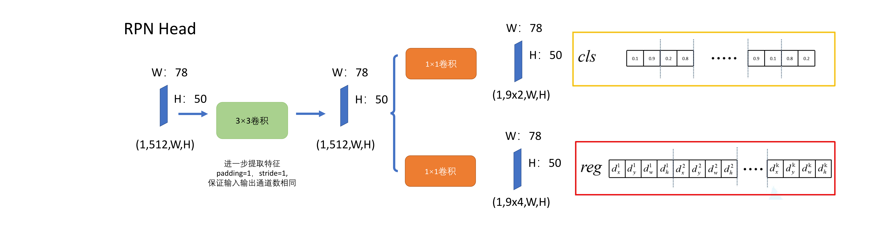

- 1×1卷积用来改变通道数
- 上路每个anchor分配两个值分别表示前景和背景对应的概率`objectness`
  - 特别注意：论文里**采用两个值来表示前景后景分类概率**，也可以采用一个值，通过大于小于0.5划分前后景。
- 下路每个anchor分配4个值(dx,dy,dh,dw)用于表示回归参数，即proposal相对anchor(x,y,h,w)的偏移量`pred_bbox_deltas`
- 注意在RPNhead里已经分配给了anchor的信息存储空间，后面的`Anchor Generator`才是生成anchor。

### Anchor Generator

```python
anchors = self.anchor_generator(images, features)
```

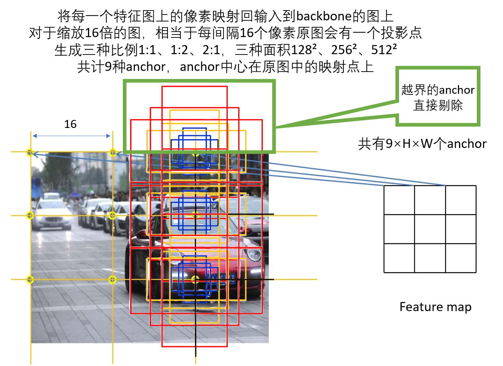

### 生成proposals

```python
        # 将预测的bbox regression参数应用到anchors上得到最终预测bbox坐标
       	proposals = self.box_coder.decode(pred_bbox_deltas.detach(), anchors)
        proposals = proposals.view(num_images, -1, 4)
        # 筛除小boxes框，nms处理，根据预测概率获取前post_nms_top_n个目标
        boxes, scores = self.filter_proposals(proposals, objectness, images.image_sizes, num_anchors_per_level)
```

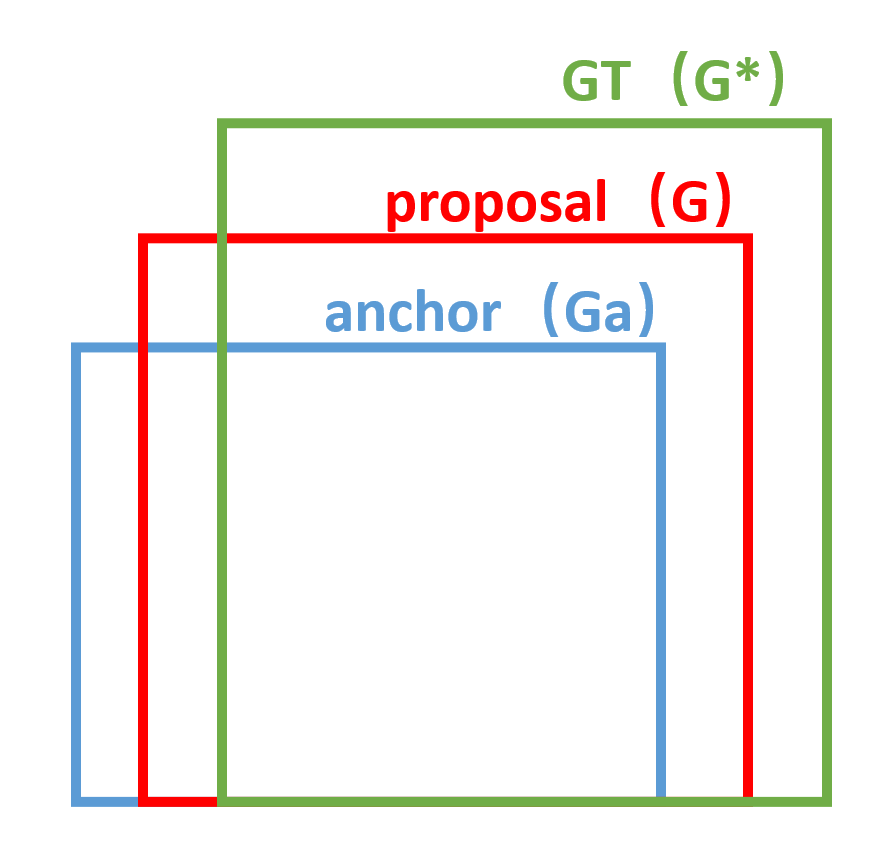

根据回归参数pred_bbox_deltas：$[d_x,d_y,d_w,d_h]$，调整anchor的坐标$[x_a,y_a,h_a,w_a]$，生成proposal $[x,y,h,w]$：
$$
x = x_a+w_a*d_x \\
y = y_a+h_a*d_y \\
w = w_a*exp(d_w) \\
h = h_a*exp(d_h)
$$
$w_a$和$h_a$是权重，一般取1

每一个anchor生成了一个proposal，对生成proposal进行过滤，标准如下：

> - 根据预测的前景概率` objectness`由高到低对每个proposal进行排序，只保留靠前的若干proposals
> - 用NMS对proposals进行剔除
> - NMS之后再次根据预测的前景概率` objectness`由高到低对每个proposal进行排序，只保留靠前的若干proposals，**此时大概剩余2000个proposal**

将这2000个proposals传到后续的fast-rcnn网络中。

### 样本选择

> - 超出原图边界的anchor‘不参加训练，优先舍弃（我认为一开始就舍弃比较好）
> - 计算每个anchor与所有GT之间的IOU，**选出正样本**：
>   - 1.与每个GT的IOU最大的anchor
>   - 2.与任一GT的IOU大于0.7的anchor（只用2的话可能出现某个GT与所有anchor的iou都小于0.7的情况，则需要1生成正样本） 
>
> 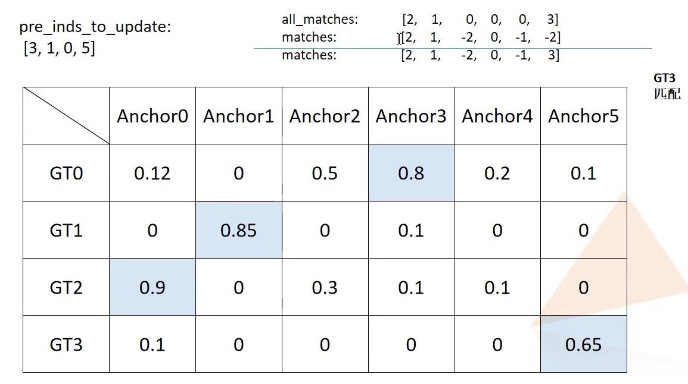
>
> - **选出负样本**：与所有GT的IOU都小于0.3的anchor
> - 其余所有样本不参加训练（包括IOU在0.3和0.7之间的）
> - 在正样本中随机选出128个样本，如果不足128则所有正样本都选用，设为pos_n
> - 在负样本中随机选出neg_n = 256-pos_n个负样本
> - 在正常情况下，正样本数量远远小于负样本数，引入样本均衡性的问题
> - **需要记录下与每个正样本的anchor匹配最好的GT（即IOU最大的GT），给后面bbox回归使用**
> - **正样本标记为1，负样本标记为0，不参加训练的样本标记为-1**
> - RPN训练时只有两类，目标1（正样本）和背景0（负样本）

### RPN loss function

```python
            # 计算每个anchors最匹配的gt，并将anchors进行分类，前景，背景以及废弃的anchors
            # labels 前景1，背景0，舍弃-1，这里的标签仅是用来挑选出参与训练的样本
            labels, matched_gt_boxes = self.assign_targets_to_anchors(anchors, targets) 
            # 结合anchors以及对应的gt，计算regression参数
            regression_targets = self.box_coder.encode(matched_gt_boxes, anchors)
            loss_objectness, loss_rpn_box_reg = self.compute_loss(
                objectness, pred_bbox_deltas, labels, regression_targets
            )
            losses = {
                "loss_objectness": loss_objectness,
                "loss_rpn_box_reg": loss_rpn_box_reg
            }
            
```

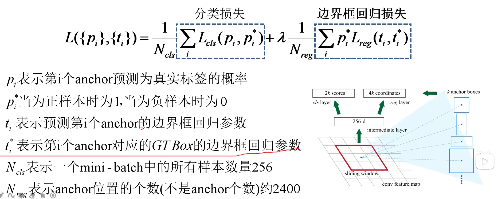

$L_{cls}$​是分类损失，$L_{reg}$​是bbox回归损失。

$\lambda$是平衡参数，一般$\lambda = N_{reg}/N_{cls}$  ($\lambda = 2400/256 ≈ 10$)

### classification

如果对每个anchor预测两个值，用`softmax-cross-entropy`：

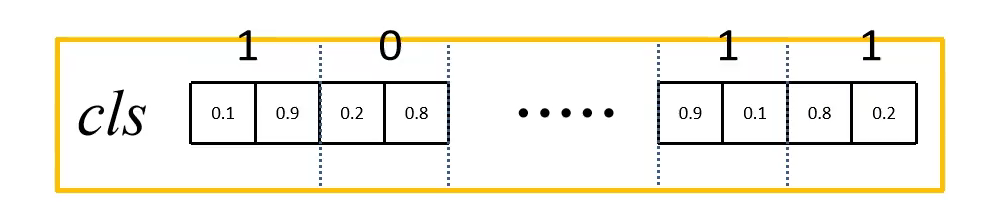
$$
L_{cls} = -ln[p_i^*p_i+(1-p_i^*)(1-p_i)]
$$
如果对每个anchor预测一个值，用`binary-cross-entropy`：


$$
L_{cls} = -[p^*lnp_i+(1-p_i^*)ln(1-p_i)]
$$

### regression

$$
L_{reg} = smooth_{L_1}(t_i-t_i^*)
$$

`t`与前面生成proposal提到的`d`一样，都是回归参数，表示偏移量。


我们再看一下这张图：


由RPN网络预测选出的**正样本anchor**得到的回归参数pred_bbox_deltas：$[t_x,t_y,t_w,t_h]$

由正样本anchor到与其匹配最好的GT（挑选样本的时候已经记录）的偏移量作为回归标签：
$$
t_x^* = (x^*-x_a)/w_a \\
t_y^* = (y^*-y_a)/h_a \\
t_w^* = ln(w^*/w_a) \\
t_h^* = ln(h^*/h_a) \\
$$
代入$L_{reg}$的公式计算即可。


## 样本划分

在前面得到了2000个proposals以后，需要进行进一步筛选，对每个proposal打标签，并且划分出正负样本。

> - 计算每个proposal与所有GT之间的IOU
>
>   - **选出正样本**：与任意GT的IOU大于等于**0.5**的proposal
>
>   - **选出负样本**：与所有GT的IOU都小于**0.5**的anchor
>
> - 从这2000个样本中随机选出**512个样本**(可设定)，且**正样本数：负样本数 = 1：3**
>
> - 正样本的标签需要修改为类别标签。与RPN的训练不同，fast-rcnn训练时一共有 cls_num+1类（cls_num个待分类别和1个背景类），比如标签可能为：[0,0,0,0,0,10,0,0,15,0,0,7...]，其中10，15，7分别为类别标签，对于20分类的问题，0为背景，1-20为类别标签。
>
> - **需要记录下与每个正样本的anchor匹配最好的GT（即IOU最大的GT），给后面bbox回归使用**

## ROI (Region of interest) Pooling

将选出来的512个proposa传入ROI Pooling

对于传统的CNN（如AlexNet和VGG），当网络训练好后输入的图像尺寸必须是固定值，同时网络输出也是固定大小的vector or matrix，因为最后的FC层需要固定大小的输入。有2种解决办法：

1. 从图像中crop一部分传入网络
2. 将图像warp成需要的大小后传入网络


可以看到无论采取那种办法都不好，要么crop后破坏了图像的完整结构，要么warp破坏了图像原始形状信息。

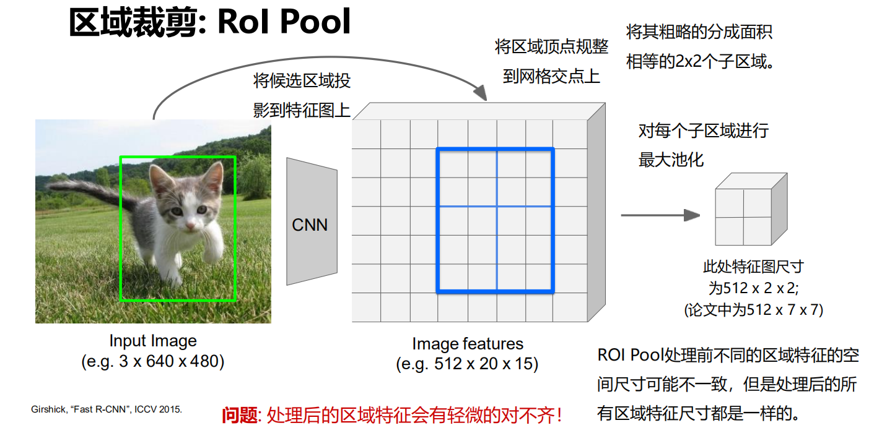

候选区域投影过来的时候要对齐到区域顶点（比如将2.5对齐到2）

划分时也尽可能等划分（比如5划分成2和3）

**改进：ROI Align**

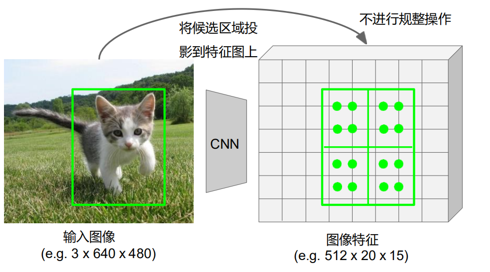

直接进行投影，不对齐到整点，并且在区域内选择几个等间隔的点。


利用标准网格上的4个点通过双线性插值得到自己取的绿色点的取值。然后利用4个绿色点，对每个区域进行max pooling，相较 Rol pooling更加准确。

> 对于本文，ROI Pooling不改变通道数，将输入的proposal的尺寸全部调整为7*7

