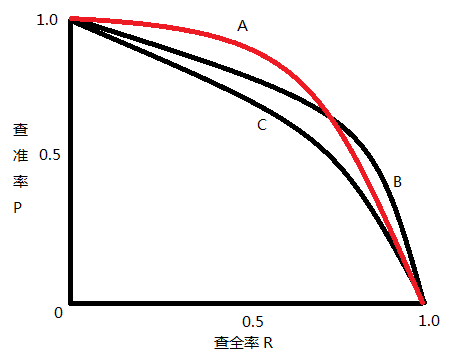
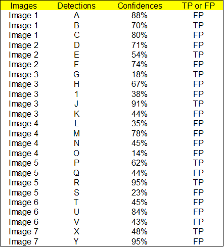
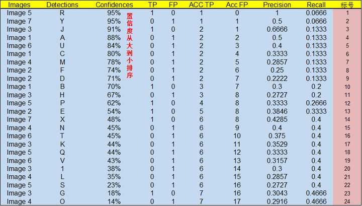
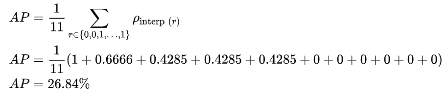
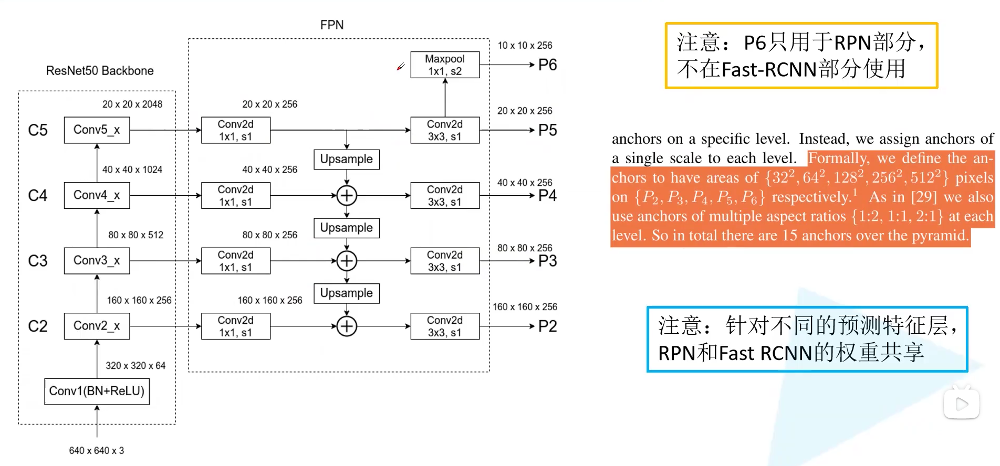
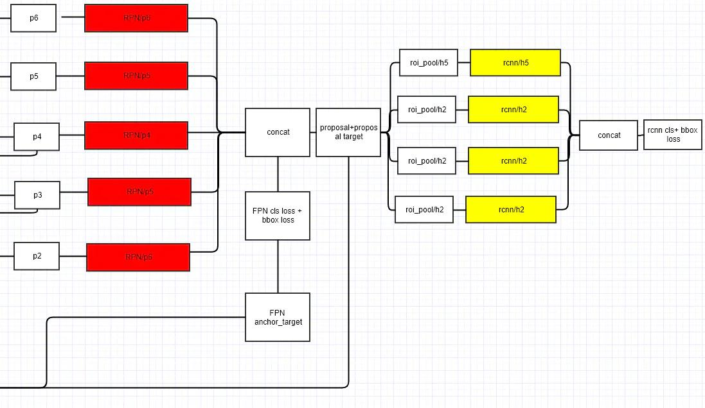
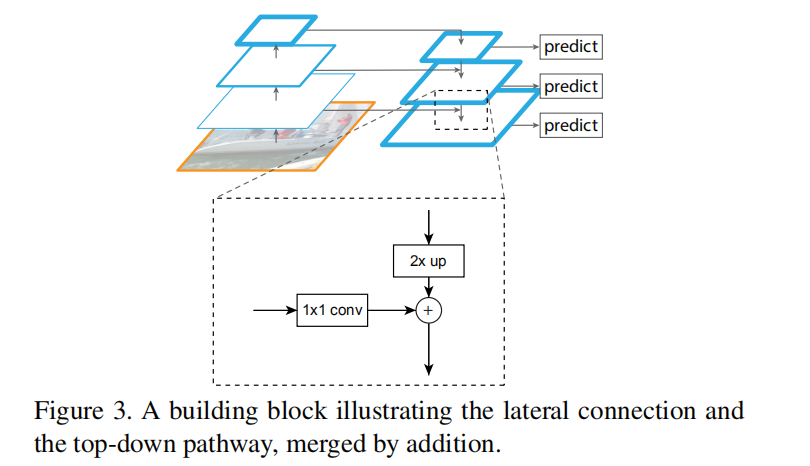

[TOC]

# 2021.7.21

理顺整个faster-rcnn的流程

# 2021.7.22

## `argparse`--- 命令行选项

### 创建一个解析器

使用 [`argparse`](https://docs.python.org/zh-cn/3/library/argparse.html#module-argparse) 的第一步是创建一个 [`ArgumentParser`](https://docs.python.org/zh-cn/3/library/argparse.html#argparse.ArgumentParser) 对象：

```python
    parser = argparse.ArgumentParser( description=__doc__ )
    
```

[`ArgumentParser`](https://docs.python.org/zh-cn/3/library/argparse.html#argparse.ArgumentParser) 对象包含将命令行解析成 Python 数据类型所需的全部信息。

### 添加参数

给一个 [`ArgumentParser`](https://docs.python.org/zh-cn/3/library/argparse.html#argparse.ArgumentParser) 添加程序参数信息是通过调用 [`add_argument()`](https://docs.python.org/zh-cn/3/library/argparse.html#argparse.ArgumentParser.add_argument) 方法完成的。通常，这些调用指定 [`ArgumentParser`](https://docs.python.org/zh-cn/3/library/argparse.html#argparse.ArgumentParser) 如何获取命令行字符串并将其转换为对象。这些信息在 [`parse_args()`](https://docs.python.org/zh-cn/3/library/argparse.html#argparse.ArgumentParser.parse_args) 调用时被存储和使用。例如：

```python
# 训练设备类型
parser.add_argument('--device', default='cuda:0', help='device')
# 训练数据集的根目录(VOCdevkit)
    parser.add_argument('--data-path', default='./', help='dataset')
    
```

### 解析参数

[`ArgumentParser`](https://docs.python.org/zh-cn/3/library/argparse.html#argparse.ArgumentParser) 通过 [`parse_args()`](https://docs.python.org/zh-cn/3/library/argparse.html#argparse.ArgumentParser.parse_args) 方法解析参数。它将检查命令行，把每个参数转换为适当的类型然后调用相应的操作。

```python
args = parser.parse_args()
device = torch.device(args.device if torch.cuda.is_available() else "cpu")

```

## `os.path`--- 常用路径操作

```python
>>>import os

>>>path = '/root/runoob.txt'
>>>print( os.path.basename(path) ) # 返回文件名
runoob.txt
>>>print( os.path.dirname(path) )    # 返回目录路径
/root
>>>print( os.path.split(path) )      # 分割文件名与路径
('/root', 'runoob.txt')
>>>print( os.path.join('root','test','runoob.txt') )  # 将目录和文件名合成一个路径
root/test/runoob.txt
>>>print(os.path.exists(path) )
True

```

## 读取txt每一行的内容

```python
#以读取train.txt得到xml_list为例子
with open(txt_path) as read:
	self.xml_list = [os.path.join(self.annotations_root, line.strip() + ".xml")
                             		for line in read.readlines()] 
    # line得到每行，最后带一个换行符，line.strip()去掉换行符
    # str.strip() ,在 string 上执行 lstrip()和 rstrip()
    
```

## zip()

`zip()` 函数用于将可迭代的对象作为参数，将对象中对应的元素打包成一个个元组，然后返回由这些元组组成的列表。

```python
>>>a = [1,2,3]
>>> b = [4,5,6]
>>> zipped = zip(a,b)     # 打包为元组的列表
[(1, 4), (2, 5), (3, 6)]

```

## enumerate()

`enumerate()` 函数用于将一个可遍历的数据对象(如列表、元组或字符串)组合为一个索引序列，同时列出数据和数据下标，一般用在 for 循环当中。

```python
>>>seq = ['one', 'two', 'three']
>>> for i, element in enumerate(seq):
...     print i, element
... 
0 one
1 two
2 three

```

## Python 函数装饰器

装饰器(Decorators)是修改其他函数的功能的函数。

- 首先，在python中我们可以定义另一个函数

```python
def hi(name="yasoob"):
    def greet():
        return "now you are in the greet() function"
    def welcome():
        return "now you are in the welcome() function"
hi()

```

​	调用hi(), greet()和welcome()将会同时被调用，且greet()和welcome()函数在hi()函数之外是不能访问的

- 假设用 funA() 函数装饰器去装饰 funB() 函数：

```python
#funA 作为装饰器函数
def funA(fn):
    #...
    fn() # 执行传入的fn参数
    #...
    return '...'

@funA
def funB():
    #...
    
```

等价于：

```python
def funA(fn):
    #...
    fn() # 执行传入的fn参数
    #...
    return '...'

def funB():
    #...

funB = funA(funB)

```

使用函数装饰器 A() 去装饰另一个函数 B()，其底层执行了如下 2 步操作：

1. 将 B 作为参数传给 A() 函数；
2. 将 A() 函数执行完成的返回值反馈回 B。

举个例子：

```python
#funA 作为装饰器函数
def funA(fn):
    print("C语言中文网")
    fn() # 执行传入的fn参数
    print("http://c.biancheng.net")
    return "装饰器函数的返回值"

@funA
def funB():
    print("学习 Python")
    
print(funB)

```

输出结果：

```
C语言中文网
学习 Python
http://c.biancheng.net
装饰器函数的返回值

```

可以观察到funB的返回值变了

实际上，所谓函数装饰器，就是通过装饰器函数，在不修改原函数的前提下，来对函数的功能进行合理的扩充。

如果funB带参数，可以在funA内部设计一个嵌套函数：

```python
def funA(fn):
    # 定义一个嵌套函数
    def say(arc):
        print("Python教程:",arc)
    return say

@funA
def funB(arc):
    print("funB():", a)
funB("http://c.biancheng.net/python")

```


# 2021.7.23

## 关于GPU

- CUDA out of memory —— 超GPU的内存了，应该减小`batch_size`的大小。
- `torch.cuda.is_available()` ：GPU是否可用
- `torch.cuda.device_count()`：返回gpu数量；
- `torch.cuda.get_device_name(0)`：返回gpu名字，设备索引默认从0开始；

## OrderedDict

python中的字典一般是无序的，因为它是按照hash来存储的，但是python中有个模块collections(英文，收集、集合)，里面自带了一个子类OrderedDict，实现了对字典对象中元素的排序。

```python
import collections
print("Regular dictionary")
d={}
d['a']='A'
d['b']='B'
d['c']='C'
for k,v in d.items():
    print(k,v)
print("Order dictionary")
d1 = collections.OrderedDict()
d1['a'] = 'A'
d1['b'] = 'B'
d1['c'] = 'C'
d1['1'] = '1'
d1['2'] = '2'
for k,v in d1.items():
    print(k,v)

输出：
Regular dictionary
a A
c C
b B

Order dictionary
a A
b B
c C
1 1
2 2

```

可以看到，同样是保存了ABC等几个元素，**但是使用OrderedDict会根据放入元素的先后顺序进行排序。**所以输出的值是排好序的。

OrderedDict对象的字典对象，**如果其顺序不同那么Python也会把他们当做是两个不同的对象**。

## Python项目文件引用问题

项目目录示意：

```
└── project
  ├── __init__.py
  ├── main.py
  └── modules
      ├── __init__.py
      └── module1.py
      └── module2.py
  └── ui
      ├── __init__.py
      └── view.py
      └── item.py
      
```

1. 首先，在顶层目录下，创建`__init__.py`文件，在各级包文件夹下也同时创建`__init__.py`文件；
2. `view.py`引用`item.py`内的函数或类，需采用如下方式：`from ui.item import test`。引用`modules`包下文件内的函数或类，需采用如下方式：

```python
from modules.module1 import crawl
from modules import module2

```

3. 项目目录下的`main.py`文件引用各个包下文件内的函数或类，需采用下面的方式：

```python
from ui.item import test
from modules.module1 import crawl
from modules import module2

```

可以发现，上述引用方式均为绝对引用，而不是下述相对引用方式


## `__init__.py`

`__init__.py` 文件的作用是将文件夹变为一个Python模块,Python 中的每个模块的包中，都有`__init__.py` 文件。


通常`__init__.py` 文件为空，但是我们还可以为它增加其他的功能。我们在导入一个包时，实际上是导入了它的`__init__.py`文件。这样我们可以在`__init__.py`文件中批量导入我们所需要的模块，而不再需要一个一个的导入。

```python
# package
# __init__.py
import re
import urllib
import sys
import os

# a.py
import package 
print(package.re, package.urllib, package.sys, package.os)

```

## torch.jit.is_scripting():


## 问题遗留：faster_rcnn_framework.py 255行


## torchvision.ops.MultiScaleRoIAlign


## isinstance() 

isinstance() 函数来判断一个对象是否是一个已知的类型。isinstance() 会认为子类是一种父类类型，考虑继承关系。

```python
isinstance(object, classinfo)

```

> - object -- 实例对象。
> - classinfo -- 可以是直接或间接类名、基本类型或者由它们组成的元组。

```python
isinstance(min_size, (list, tuple)) #是list和tuple中的一个就返回True

```

## torch.as_tensor()

```python
mean = torch.as_tensor(self.image_mean, dtype=dtype, device=device)

```

> - 如果data已经是一个tensor并且与返回的tensor具有相同的类型和相同的设备，那么不会发生复制，返回的tensor就是data，否则进行复制并返回一个新的tensor。且如果具有requires_grad=True，并保留计算图。
>
> - 相似的，如果data是一个相应dtype的ndarray，并且设备是cpu（numpy中的ndarray只能存在于cpu中），那么也不会进行任何复制，但是返回的是tensor，只是使用的内存相同。

## torch.nn.functional.interpolate

```python
    # interpolate利用插值的方法缩放图片
    # image[None]操作是在最前面添加batch维度[C, H, W] -> [1, C, H, W]
    # bilinear只支持4D Tensor
image = torch.nn.functional.interpolate(
            image[None], scale_factor=scale_factor, mode="bilinear", recompute_scale_factor=True)[0]

```

> - input (Tensor) – 输入张量
>
> - scale_factor (float or Tuple[float]) – 指定输出为输入的多少倍数。如果输入为tuple，其也要制定为tuple类型
>
> - mode (str) – 可使用的上采样算法，有’nearest’, ‘linear’, ‘bilinear’, ‘bicubic’ , ‘trilinear’和’area’. 默认使用’nearest’

## list拼接

> python合并list有几种方法：

# 2021.7.24

## tensor的某种计算

```python
>>> import torch
>>> a = torch.tensor([1,2,3])
>>> b = torch.tensor([4,5,6])
>>> a[:,None]
tensor([[1],
        [2],
        [3]])
# [r1, r2, r3]' * [s1, s2, s3]
>>> a[:,None]*b[None,:] # 扩展维度
tensor([[ 4,  5,  6],
        [ 8, 10, 12],
        [12, 15, 18]])

```

## torch.range() 和 torch.arange() 的区别

```python
>>> y=torch.range(1,6)
>>> y
tensor([1., 2., 3., 4., 5., 6.])
>>> y.dtype
torch.float32

>>> z=torch.arange(1,6)
>>> z
tensor([1, 2, 3, 4, 5])
>>> z.dtype
torch.int64

```

> 1. `torch.range(start=1, end=6)` 的结果是会包含`end`的，
>    而`torch.arange(start=1, end=6)`的结果并不包含`end`。
> 2. 两者创建的`tensor`的类型也不一样。

## torch.ops.torchvision.nms

> `torchvision.ops.``nms`(*boxes: torch.Tensor*, *scores: torch.Tensor*, *iou_threshold: float*) → torch.Tensor

> Parameters
>
> - **boxes** (*Tensor**[**N*,*4**]**)*) – boxes to perform NMS on. They are expected to be in `(x1, y1, x2, y2)` format with `0 <= x1 < x2` and `0 <= y1 < y2`.
> - **scores** (*Tensor**[**N,4**]**)*) – scores for each one of the boxes
> - **iou_threshold** ([*float*](https://docs.python.org/3/library/functions.html#float)) – 丢弃所有 IoU > iou_threshold 的重叠框

# 2021.7.25

有事外出，暂停一天

# 2021.7.26

## torch.randperm()

> 返回一个0~n-1的数组，随机打散的

```python
>>> t = torch.randperm(8)
tensor([5, 4, 2, 6, 7, 3, 1, 0])

```

## torch.unsqueeze() 和 torch.squeeze()

```python
torch.unsqueeze(input, dim, out=None)

```

> - 扩展维度，返回一个新的张量，对输入的既定位置插入维度 1

```python
torch.squeeze(input, dim=None, out=None)

```

> 将输入张量形状中的1 去除并返回。 如果输入是形如(A×1×B×1×C×1×D)，那么输出形状就为： (A×B×C×D)

# 2021.7.27

专注写faster-rcnn的笔记

# 2021.7.28

## 召回率 & 准确率

精度和错误率虽然常用，但还是不能满足所有的需求。举个例子：

信息检索中，我们经常会关系“检索出的信息有多少比例是用户感兴趣的”以及“用户感兴趣的信息中有多少被检索出来了”，用精度和错误率就描述出来了，这就需要引入准确率（precision，亦称查准）和召回率（recall，亦称查全）。

​													表1 测试样本分类说明（分4类）

|  真实情况  |        预测为正        |  预测为反  |         召回率          |
| :--------: | :--------------------: | :--------: | :---------------------: |
|     正     |       TP（真正）       | FN（假反） | $R = \frac{TP}{TP+FN} $ |
|     反     |       FP（假正）       | TN（真反） |                         |
| **准确率** | $P = \frac{TP}{TP+FP}$ |            |                         |

**准确率：**预测结果中，究竟有多少是真的正？（找出来的对的比例）

**召回率：**所有正样本中，究竟预测对了多少？（找回来了几个）

两者绘制的曲线称为PR曲线：



## mAP定义及相关概念

- TP: IoU>0.5的检测框数量（同一Ground Truth只取最大的）
- FP: IoU<=0.5的检测框，或者是检测到同一个GT的多余检测框的数量
- FN: 没有检测到的GT的数量（也可能是与该GT匹配的所有检测框都被判为负例）

**AP 是计算某一类 P-R 曲线下的面积，mAP 则是计算所有类别 P-R 曲线下面积的平均值。**

下面用一个例子说明 AP 和 mAP  的计算

先规定两个公式，一个是 Precision，一个是 Recall，这两个公式同上面的一样，我们把它们扩展开来，用另外一种形式进行展示，其中 `all detctions` 代表所有预测框的数量， `all ground truths` 代表所有 GT 的数量。


AP 是计算某一类 P-R 曲线下的面积，mAP 则是计算所有类别 P-R 曲线下面积的平均值。

假设我们有 7 张图片（Images1-Image7），这些图片有 15 个目标（绿色的框，GT 的数量，上文提及的 `all ground truths`）以及 24 个预测边框（红色的框，A-Y 编号表示，并且有一个置信度值），这15个目标属于同一类别。


根据上图以及说明，我们可以列出以下表格，其中 Images 代表图片的编号，Detections 代表预测边框的编号，Confidences 代表预测边框的置信度，TP or FP 代表预测的边框是标记为 TP 还是 FP。

选择与GT的IOU大于阈值0.5，且在所有预测框中与该GT的IOU最大的预测框作为TP，其余均为FP。



通过上表，我们可以绘制出 P-R 曲线（因为 AP 就是 P-R 曲线下面的面积），但是在此之前我们需要计算出 P-R 曲线上各个点的坐标，根据置信度从大到小排序所有的预测框，然后就可以计算 Precision 和 Recall 的值，见下表。（需要记住一个叫**累加的概念，就是下图的 ACC TP 和 ACC FP**）



- 标号为 1 的 Precision 和 Recall 的计算方式：Precision=TP/(TP+FP)=1/(1+0)=1，Recall=TP/(TP+FN)=TP/(`all ground truths`)=1/15=0.0666 （`all ground truths 上面有定义过了`）
- 标号 2：Precision=TP/(TP+FP)=1/(1+1)=0.5，Recall=TP/(TP+FN)=TP/(`all ground truths`)=1/15=0.0666
-  标号 3：Precision=TP/(TP+FP)=2/(2+1)=0.6666，Recall=TP/(TP+FN)=TP/(`all ground truths`)=2/15=0.1333
-  其他的依次类推

然后就可以绘制出 P-R 曲线 


得到 P-R 曲线就可以计算 AP（P-R 曲线下的面积），要计算 P-R 下方的面积，一般使用的是插值的方法，取 11 个点 **[0, 0.1, 0.2, 0.3, 0.4, 0.5, 0.6, 0.7, 0.8, 0.9, 1]** 的插值所得


 得到一个类别的 AP 结果如下：



要计算 mAP，就把**所有类别的 AP** 计算出来，然后求取平均即可。mAP50就是阈值取TP的阈值设为0.5。

# 2021.7.29

看object detection综述

# 2021.7.30

## FPN

参考：[从代码细节理解 FPN ](https://zhuanlan.zhihu.com/p/35854548)

作者提出的多尺度的object detection算法：**FPN（feature pyramid networks）**。原来多数的object detection算法都是**只采用顶层特征**做预测，但我们知道**低层的特征语义信息比较少，但是目标位置准确；高层的特征语义信息比较丰富，但是目标位置比较粗略。**另外虽然也有些算法采用多尺度特征融合的方式，但是一般是采用融合后的特征做预测，而本文不一样的地方在于预测是在不同特征层独立进行的。





- conv1的图像还是层次太浅，特征信息太少，因此从p2开始构建FP
- P6是由P5 Max-pooling得到的。
- 通过1×1卷积将通道数都调整到256，p2-p6的通道数都是256，这样才能和同level的特征图的1×1卷积结果进行相加。
- 另外 P2-P5最后又做了一次3*3的卷积，作用是消除上采样带来的混叠效应。

```python
# 先从 resnet 抽取四个不同阶段的特征图 C2-C5。
_, C2, C3, C4, C5 =
resnet_graph(input_image, config.BACKBONE,stage5=True, train_bn=config.TRAIN_BN)

# Top-down Layers 构建自上而下的网络结构
# 从 C5开始处理，先卷积来转换特征图尺寸
P5 = KL.Conv2D(256, (1, 1), name='fpn_c5p5')(C5)
# 上采样之后的P5和卷积之后的 C4像素相加得到 P4，后续的过程就类似了
P4 = KL.Add(name="fpn_p4add")([
            KL.UpSampling2D(size=(2, 2), name="fpn_p5upsampled")(P5),
            KL.Conv2D(256, (1, 1),name='fpn_c4p4')(C4)])
P3 = KL.Add(name="fpn_p3add")([
            KL.UpSampling2D(size=(2, 2), name="fpn_p4upsampled")(P4),
            KL.Conv2D(256, (1, 1), name='fpn_c3p3')(C3)])
P2 = KL.Add(name="fpn_p2add")([
            KL.UpSampling2D(size=(2, 2),name="fpn_p3upsampled")(P3),
            KL.Conv2D(256, (1, 1), name='fpn_c2p2')(C2)])

# P2-P5最后又做了一次3*3的卷积，作用是消除上采样带来的混叠效应
# Attach 3x3 conv to all P layers to get the final feature maps.
P2 = KL.Conv2D(256, (3, 3), padding="SAME", name="fpn_p2")(P2)
P3 = KL.Conv2D(256, (3, 3), padding="SAME",name="fpn_p3")(P3)
P4 = KL.Conv2D(256, (3, 3), padding="SAME",name="fpn_p4")(P4)
P5 = KL.Conv2D(256, (3, 3), padding="SAME",name="fpn_p5")(P5)
# P6 is used for the 5th anchor scale in RPN. Generated by
# subsampling from P5 with stride of 2.
P6 = KL.MaxPooling2D(pool_size=(1, 1), strides=2,name="fpn_p6")(P5)

# 注意 P6是用在 RPN 目标区域提取网络里面的，而不是用在 FPN 网络
# Note that P6 is used in RPN, but not in the classifier heads.
rpn_feature_maps = [P2, P3, P4, P5, P6] 
# 最后得到了5个融合了不同层级特征的特征图列表；
```



### FPN for RPN

在FPN中我们同样用了一个3×3和两个并行的1×1，但是是在每个级上都进行了RPN这种操作。既然FPN已经有不同大小的特征scale了，那么我们就没必要像Faster R-CNN一样采用3种scale大小的anchor了，我们只要采用3种比率的框就行了。所以每个级`level`的anchor都是相同的scale。所以我们在上分别定义anchor的scale为，在每级`level`的上有{1:1，1:2，2:1}三种宽高比率`ratio`的框。所以我们在特征金字塔上总共有15个anchor。

### FPN for Fast R-CNN

RPN抽取到特征后，Fast R-CNN用RoI-pooling抽取出RoI后进行分类。

为了使用FPN，需要把各个scale的RoI赋给金字塔级level。Fast rcnn中的ROI Pooling层使用region proposal的结果和特征图作为输入。经过特征金字塔，我们得到了许多特征图，作者认为，不同层次的特征图上包含的物体大小也不同，因此，不同尺度的ROI，使用不同特征层作为ROI pooling层的输入。

> - 大尺度物体ROI就用**深层**的特征金字塔层，特征丰富但分辨率低，比如P5；
>
> - 小尺度物体ROI就用**浅层**的特征金字塔层，特征相对匮乏但分辨率高，比如P4。

对于原图上w×h 的RoI，需要选择一层的feature map来对他RoIpooling，选择的feature map的层数$P_k$的选择依据是:


> 224是ImageNet预训练的大小，k0是基准值，设置为5或4，代表P5层的输出（原图大小就用P5层），w和h是ROI区域的长和宽，假设ROI是112 * 112的大小，那么k = k0-1 = 5-1 = 4，意味着该ROI应该使用P4的特征层。k值做取整处理。这意味着如果RoI的尺度变小（比如224的1/2），那么它应该被映射到一个精细的分辨率水平。

