[TOC]

# 2021.7.31

## SSD

参考：[【SSD算法】史上最全代码解析-核心篇](https://zhuanlan.zhihu.com/p/79854543)     [SSD论文与代码详解](https://zhuanlan.zhihu.com/p/142630197)

针对Faster-RCNN存在的问题

> - 对小目标检测的效果很差（**较浅**层的特征图上，每个cell的**感受野**不是很大，所以适合检测**较小**的物体，而在**较深**的特征图上，每个cell的**感受野**就**比较大**了，适合检测**较大**的物体。）
> - 模型大，检测速度慢

该SSD网络由三部分组成，分别为：

> - 用于**图片特征提取**的网络：VGG base
>
> - 用于**引出多尺度特征图**的网络：Extra
>
> - 用于**框位置检测和分类**的网络：loc_layers和conf_layers

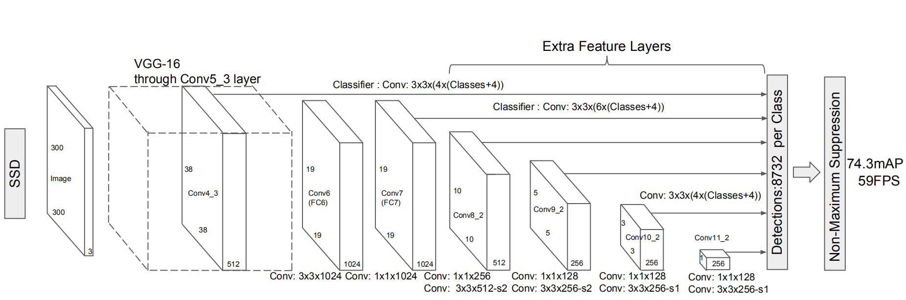

### Backbone（VGG base）

根据SSD的论文描述，作者采用了vgg16的部分网络作为基础网络，在5层网络后，将FC6和FC7替换为conv6和conv7，分别为：1024x3x3、1024x1x1。

>  **值得注意：**
>
> 1. 与VGG-16一样，输入图像的大小恒为300×300；
> 2. conv4-1前面一层的maxpooling的ceil_mode=True,即向上取整，使得输出由37×37变为38x38；
> 3. Conv4-3网络是需要输出多尺度的网络层；
> 4. Conv5-3后面的一层maxpooling参数为(kernel_size=3, stride=1, padding=1)，不进行下采样。

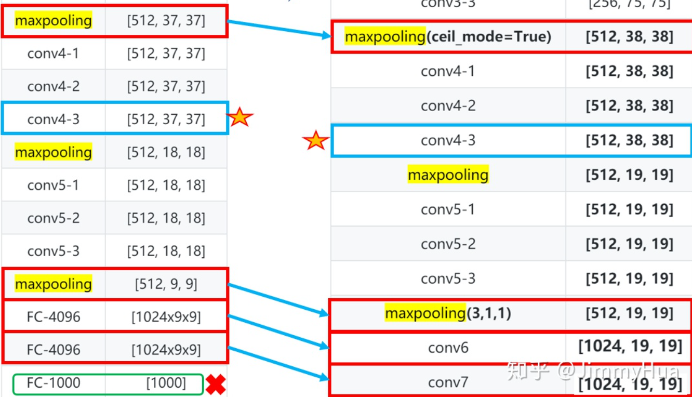

```python
def vgg(cfg, i, batch_norm=False):
    """根据cfg，生成类似VGG16的backbone"""
    layers = []
    in_channels = i
    for v in cfg:
        if v == 'M':
            layers += [nn.MaxPool2d(kernel_size=2, stride=2)]
        elif v == 'C':
            # ceil模式就是会把不足square_size的边给保留下来，单独另算，或者也可以理解为在原来的数据上补充了值为-NAN的边
            layers += [nn.MaxPool2d(kernel_size=2, stride=2, ceil_mode=True)]
        else:
            conv2d = nn.Conv2d(in_channels, v, kernel_size=3, padding=1)
            if batch_norm:
                layers += [conv2d, nn.BatchNorm2d(v), nn.ReLU(inplace=True)]
            else:
                layers += [conv2d, nn.ReLU(inplace=True)]
            in_channels = v
    pool5 = nn.MaxPool2d(kernel_size=3, stride=1, padding=1)
    conv6 = nn.Conv2d(512, 1024, kernel_size=3, padding=6, dilation=6)
    conv7 = nn.Conv2d(1024, 1024, kernel_size=1)
    layers += [pool5, conv6,
               nn.ReLU(inplace=True), conv7, nn.ReLU(inplace=True)]
    return layers
```

### Extra Layers

而为了后续的多尺度提取，在VGG Backbone后面添加了conv8、conv9、conv10、conv11。

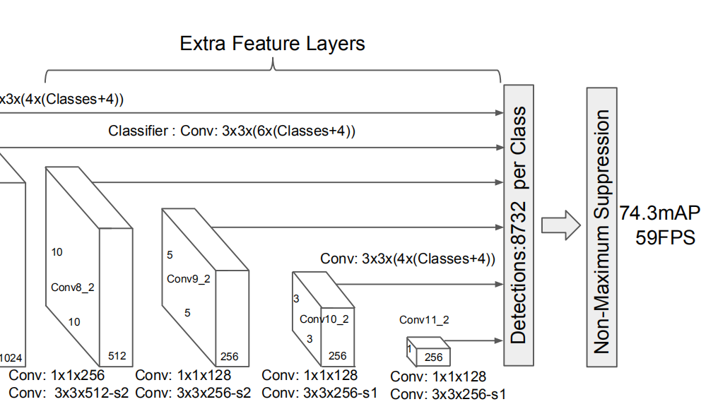

### Multi-box Layers

SSD选择了**6个特征图**作为**框位置检测和分类网络**的输入，其中**2个**来自**VGG base**,**4个**来自**Extra**。


**loc_layers** 和 **conf_layers** 是定义在函数 **multibox** 中的，用于**框位置检测和分类** 。在提取的**6个特征图**上的基础上引入**简单的一层3x3卷积层**进行位置信息和分类信息的提取，定义如下：

```python
def multibox(vgg, extra_layers, cfg, num_classes):
    '''
    Args:
        vgg: 修改fc后的vgg网络
        extra_layers: 加在vgg后面的4层网络
        cfg: 网络参数，eg:[4, 6, 6, 6, 4, 4]，对应在不同的fp上cell为中心设定的待回归boxes的数量
        num_classes: 类别，VOC为 20+背景=21
    Return:
        vgg, extra_layers
        loc_layers: 多尺度分支的回归网络
        conf_layers: 多尺度分支的分类网络
    '''
    loc_layers = []
    conf_layers = []
    vgg_source = [21, -2] #在vgg上提取的两个特征图的位置
    # 在vgg backbone上引出两个分支，做位置回归和分类
    # 这里记录这两个分支的卷积网络
    for k, v in enumerate(vgg_source): #一共2个特征图
        loc_layers += [nn.Conv2d(vgg[v].out_channels,
                                    cfg[k] * 4, kernel_size=3, padding=1)]
        conf_layers += [nn.Conv2d(vgg[v].out_channels,
                                    cfg[k] * num_classes, kernel_size=3, padding=1)]
    # 在extra layer上引出四个分支，做位置回归和分类
    # 这里记录这四个分支的卷积网络
    for k, v in enumerate(extra_layers[1::2], 2): #一共4个特征图
        loc_layers += [nn.Conv2d(v.out_channels, cfg[k]
                                 * 4, kernel_size=3, padding=1)]
        conf_layers += [nn.Conv2d(v.out_channels, cfg[k]
                                  * num_classes, kernel_size=3, padding=1)]
    return vgg, extra_layers, (loc_layers, conf_layers)
```

Anchor是目标检测领域非常常见的一种技巧，在SSD原论文中，作者称之为**默认框**（default bounding boxes），在代码中，称之为**先验框**（prior)。在SSD中不同尺度的特征图上的cell，内置的**默认框/anchor**尺度是不同的，也就是**浅**的特征图负责检测**小**物体，所以较**浅**特征图的cell的**anchor尺寸较小**。

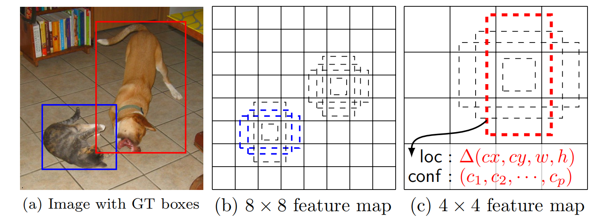

SSD中共有**不同大小，不同位置**的anchor**8732个**

> 38×38×4+19×19×6+10×10×6+5×5×6+3×3×4+1×1×4=8732

先验框的设置，包括尺度（或者说大小）和长宽比两个方面。

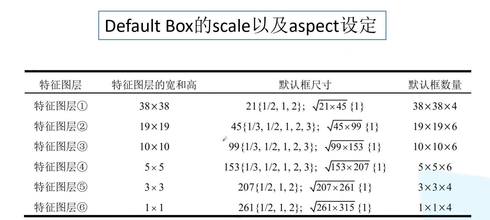

> 默认情况下，每个特征图会有一个 $a_r = 1$，且尺度为 $s_k$ 的先验框，除此之外，还会设置一个尺度为 $s_k^` = \sqrt{s_ks_{k+1}}$且 $a_r = 1$ 的先验框，这样每个特征图都设置了两个长宽比为1但大小不同的正方形先验框;

然后根据**面积和长宽比可得先验框的宽度和高度**:

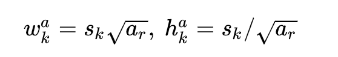

然后将特征图上的点映射回原图上，生成anchor。

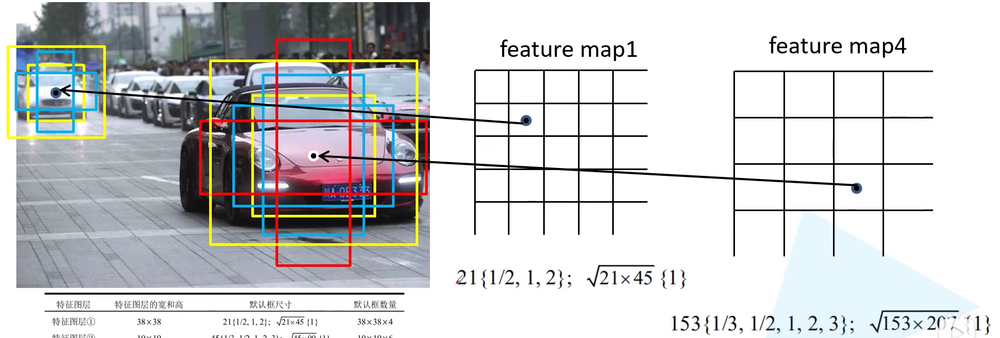

可以看到，对于比较浅层的fp1，映射回原图中生成的实际的anchor的尺度小，而较深层的fp4对应的anchor的尺度比较大。印证了浅层特征图检测小目标，深层特征图检测大目标。

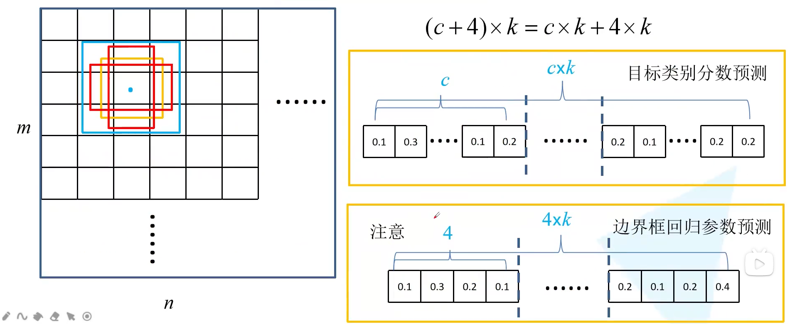

每个位置有k个anchor（k为4 or 6），将每个anchor对应的feature map上的proposal经过3×3×((c+4)k)卷积，生成c个class score和4个offset。

> faster-rcnn是4×k×c个边界框回归参数，SDD是4×k个

### 样本提取

正样本：与任意GT的IOU大于0.5

负样本：**Hard negetive mining**，与所有GT都低于0.5为负样本，且每个负样本计算confidence loss，按照confidence loss由高到低排序，仅保留前面的负样本，使正样本：负样本=1: 3。（越容易被判断为object的负样本，confidence loss越大，即越难判断正确，保留这些样本做为负样本来训练）

### 损失函数

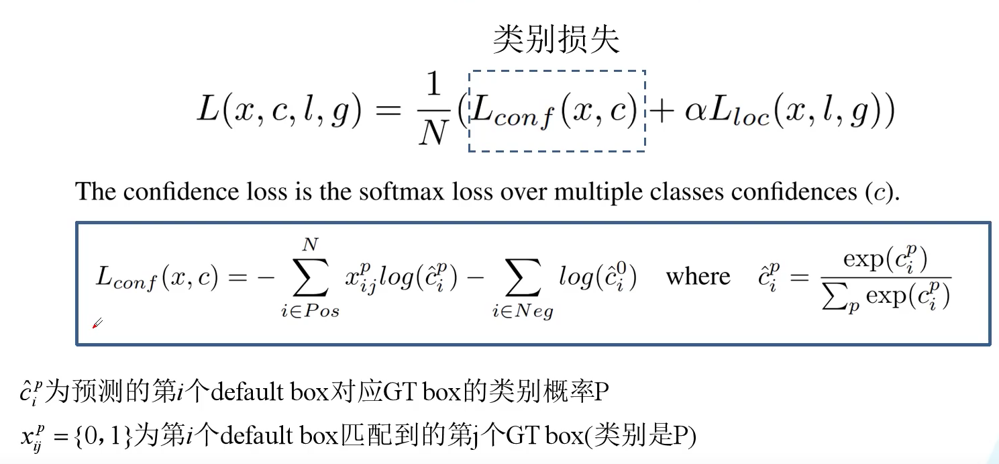

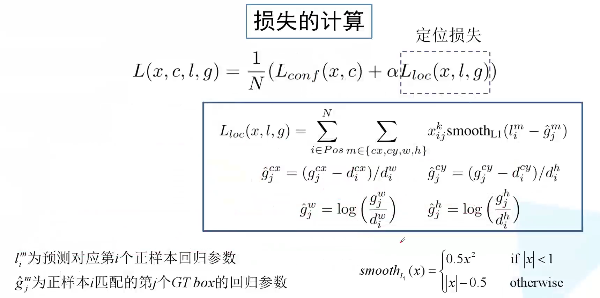

# 2021.8.1-8.2

回老家了，要忙着走亲戚，这两天暂时没有办法学习。

# 2021.8.3

## yolov1

参考：[yolov1算法解读](https://zhuanlan.zhihu.com/p/362758477)   [【目标检测论文阅读】YOLOv1](https://zhuanlan.zhihu.com/p/115759795)

将一幅图像分成SxS个网格(grid cell)，如果某个object的中心落在这个网格中，则这个网格就负责预测这个object。**在yolov1的论文中，S = 7**。例如：下图中狗的中心落在红色单元格内，则这个单元格负责预测狗。

每个网格需要预测B个box（yolov1的文章中B=2）

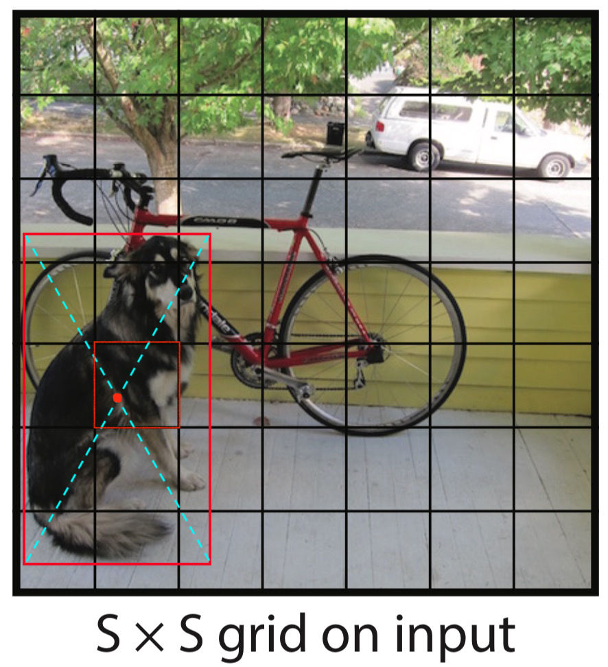

### Backbone

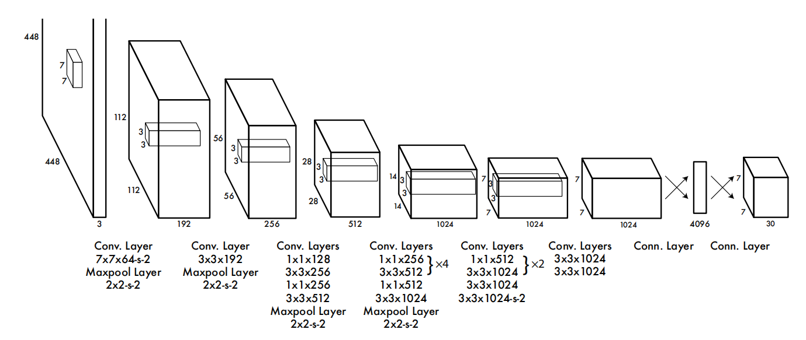

主要是看一下最后FC的部分：

- 7×7×1024（flatten）fc → 4096 reshape → 7×7×30
- **每个grid**预测2个box的4个坐标，每个box还要预测一个confidence值，还有20个类别信息

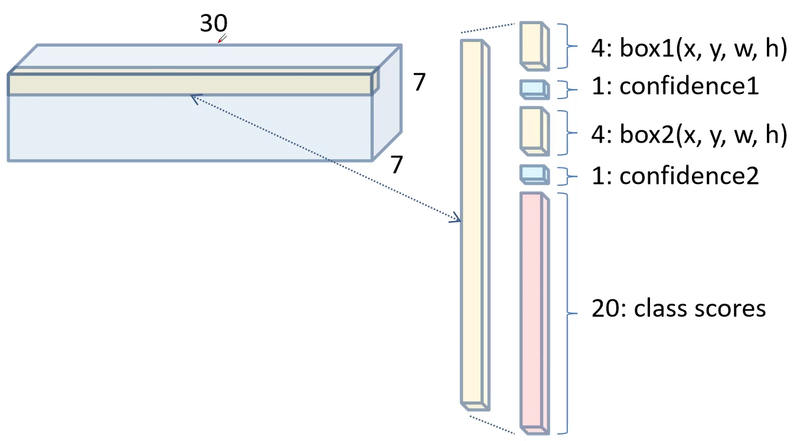


### 预测部分

**① 2个bounding box的位置：**对于每个单元格，YOLOv1会预测出2个bounding box，每个bounding box需要4个数值(x, y, w, h)来表示其位置

**②** **2个bounding box的置信度(confidence)：**对于每个单元格，YOLOv1会预测出2个置信度，分别对应该单元格预测两个bounding box。每一个置信度包含两个方面，一是该边界框含有目标的可能性大小，二是该边界框的准确度。前者记为![[公式]](https://www.zhihu.com/equation?tex=Pr%28object%29)，当该边界框是背景时（即不包含目标），此时![[公式]](https://www.zhihu.com/equation?tex=Pr%28object%29%3D0)；当该边界框包含目标时，![[公式]](https://www.zhihu.com/equation?tex=Pr%28object%29%3D1)。后者即边界框的准确度可以用预测框与实际框（ground truth）的IOU（intersection over union，交并比）来表征，记为![[公式]](https://www.zhihu.com/equation?tex=%5Ctext%7BIOU%7D%5E%7Btruth%7D_%7Bpred%7D)。

因此置信度可以定义为![[公式]](https://www.zhihu.com/equation?tex=Pr%28object%29%2A%5Ctext%7BIOU%7D%5E%7Btruth%7D_%7Bpred%7D)。

**③20类对象分类的概率：** **不管一个单元格预测多少个边界框，该单元格只预测一组类别概率值（YOLOv1的一大缺点）。**

### loss function


- 坐标预测部分w和h开根号是为了避免对于小尺度对象，w和h的微弱变化引起IOU的巨大变化。

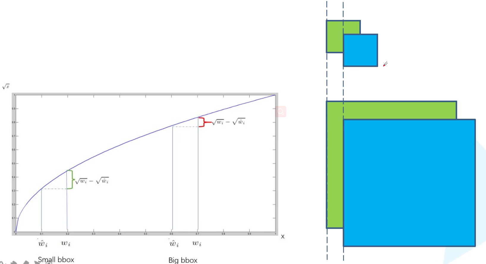

- 为了使得三种误差达到平衡，就需要给不同的误差赋予不同的权重。

### 缺点

- **因为YOLOv1中每个cell只预测两个bbox和一个类别，这就限制了能预测重叠或邻近物体的数量，比如说两个物体的中心点都落在这个cell中，但是这个cell只能预测一个类别。**
- 不像Faster R-CNN一样预测offset，YOLO是直接预测bbox的位置的，这就增加了训练的难度。
- YOLO是根据训练数据来预测bbox的，但是当测试数据中的物体出现了训练数据中的物体没有的长宽比时，YOLO的泛化能力低
- 同时经过多次下采样，使得最终得到的feature的分辨率比较低，就是得到coarse feature，这可能会影响到物体的定位。
- 损失函数的设计存在缺陷，使得物体的定位误差有偏大，尤其在不同尺寸大小的物体的处理上。

## yolov2

文章提出了一种新的**训练方法–联合训练算法** ，基本思路就是：同时在检测数据集和分类数据集上训练物体检测器（Object Detectors ），**用检测数据集的数据学习物体的准确位置，用分类数据集的数据来增加分类的类别量、提升健壮性。**

**相较yolov1的7×7网格，yolov2为13×13 。**

### Better

We focus mainly on improving recall and localization while maintaining classifification accuracy.

我们主要关注于提高召回率和定位率，同时保持分类的准确性。

#### Batch Normalization

mAP提升2.4%。批归一化有助于解决反向传播过程中的梯度消失和梯度爆炸问题，降低对一些超参数（比如学习率、网络参数的大小范围、激活函数的选择）的敏感性，并且每个batch分别进行归一化的时候，起到了一定的正则化效果（YOLO2不再使用dropout），从而能够获得更好的收敛速度和收敛效果。**（具体看之前cs231n的笔记）**

#### High resolution classifier（高分辨率图像分类器）

mAP提升了3.7%。使用分辨率更高的图像进行训练。**YOLO2在采用 224\*224 图像进行分类模型预训练后，再采用 448\*448 的高分辨率样本对分类模型进行微调（10个epoch）**，使网络特征逐渐适应 448*448 的分辨率。然后再使用 448*448 的检测样本进行训练，

#### Convolution with anchor boxes（使用先验框）

- 召回率大幅提升到88%，同时mAP轻微下降了0.2左右。

- 采用了相对anchor的offset的预测。
- YOLOv1只预测每张图像98个bbox，YOLOv2如果每个grid采用9个anchor box，总共有13×13×9=1521个anchor box。
- 作者去掉了网络中一个Pooling层，这让卷积层的输出能有更高的分辨率。收缩网络让其运行在416×416而不是448×448。

- YOLOV2模型预测了一千多个框，由于存在很多无用的框，这就导致了mAP值的下降。但是由于预测的框多了，所以能够预测出来的属于ground truth的框就多了，所以召回率就增加了。

#### Dimension clusters（聚类提取先验框的尺度信息）

之前设定的anchor的尺寸都是手动设定的，网络可以学习适当地调整boxes，但如果我们为网络选择更合适的anchor的size，我们可以使网络更容易地学习预测良好的检测结果。

本文经过对VOC数据集和COCO数据集中bbox的**k-means聚类分析**，将anchor机制中原本惯用的 9 anchor 法则 删减为仅保留最常出现的 5 anchor 。**其中，狭长型的anchor是被保留的主体**： 

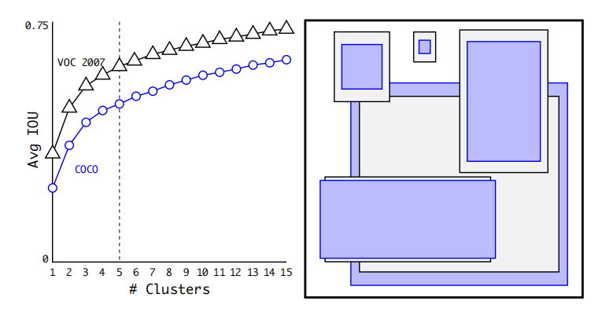

但是k-means使用的不是欧拉距离，而是设定了一种距离： What we really want are priors that lead to good IOU scores,which is independent of the size of the box. 

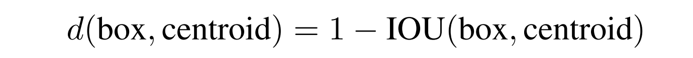

centroid是聚类时被选作中心的边框，box就是其它边框，d就是两者间的“距离”。IOU越大，“距离”越近。

We choose *k* = 5 as a good tradeoff between model complexity and high recall. 

#### Direct location prediction (直接位置预测) 

其位置预测公式为： ![[公式]](https://www.zhihu.com/equation?tex=%5C%5C+x%3D%28t_x%E2%88%97w_a%29%2Bx_a+%5C%5C+y%3D%28t_y%E2%88%97h_a%29%2By_a+)

其中， ![[公式]](https://www.zhihu.com/equation?tex=x%2Cy) 是预测边框的中心， ![[公式]](https://www.zhihu.com/equation?tex=x_a%2Cy_a) 是先验框（anchor）的中心点坐标， ![[公式]](https://www.zhihu.com/equation?tex=w_a%2Ch_a) 是先验框（anchor）的宽和高， ![[公式]](https://www.zhihu.com/equation?tex=t_x%2Ct_y) 是要学习的参数。anchor中心点的初始坐标一般选对应的grid的左上角。

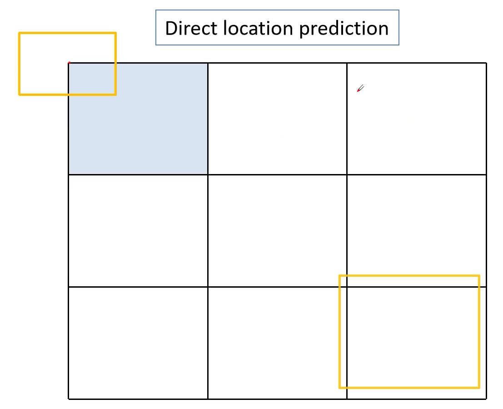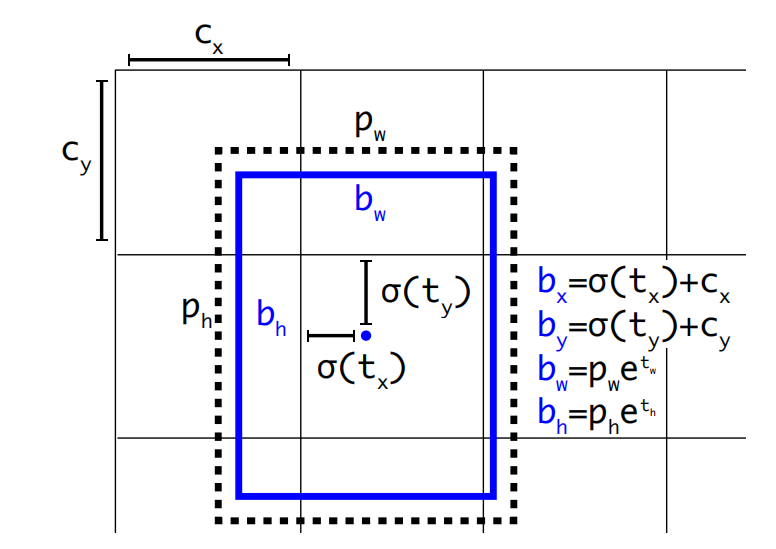

由于 ![[公式]](https://www.zhihu.com/equation?tex=t_x%2Ct_y) 的取值没有任何约束，因此预测边框的中心可能出现在任何位置，训练早期阶段不容易稳定。YOLOv2调整了预测公式，**将预测边框的中心约束在特定gird网格内**。因为每个grid负责预测单独的bbox，所有必须将预测的bbox限制在这个grid之中。对比faster-rcnn是对整张图进行bbox的预测回归，因此无需对offset进行限制，而yolo是划分了grid的。

 ![[公式]](https://www.zhihu.com/equation?tex=%5C%5C+b_x%3D%CF%83%28t_x%29%2Bc_x++%5C%5C+b_y%3D%CF%83%28t_y%29%2Bc_y++%5C%5C+b_w%3Dp_we%5E%7Bt_w%7D++%5C%5C+b_h%3Dp_he%5E%7Bt_h%7D++%5C%5C+Pr%28object%29%E2%88%97IOU%28b%2Cobject%29%3D%CF%83%28t_o%29+)

其中， ![[公式]](https://www.zhihu.com/equation?tex=b_x%2Cb_y%2Cb_w%2Cb_h) 是预测边框的中心和宽高。 ![[公式]](https://www.zhihu.com/equation?tex=Pr%28object%29%E2%88%97IOU%28b%2Cobject%29) 是预测边框的置信度confidence，YOLOv1是直接预测confidence的值，这里对预测参数 ![[公式]](https://www.zhihu.com/equation?tex=t_o) 进行σ变换后作为置信度的值。 ![[公式]](https://www.zhihu.com/equation?tex=c_x%2Cc_y) **是当前网格左上角到图像左上角的距离**，要先将网格大小归一化，即令一个网格的宽=1，高=1。 ![[公式]](https://www.zhihu.com/equation?tex=p_w%2Cp_h) 是先验框的宽和高。 σ是sigmoid函数。 ![[公式]](https://www.zhihu.com/equation?tex=t_x%2Ct_y%2Ct_w%2Ct_h%2Ct_o) 是要学习的参数，分别用于预测边框的中心和宽高，以及置信度。

#### Fine-Grained Features（passthrough层检测细粒度特征）

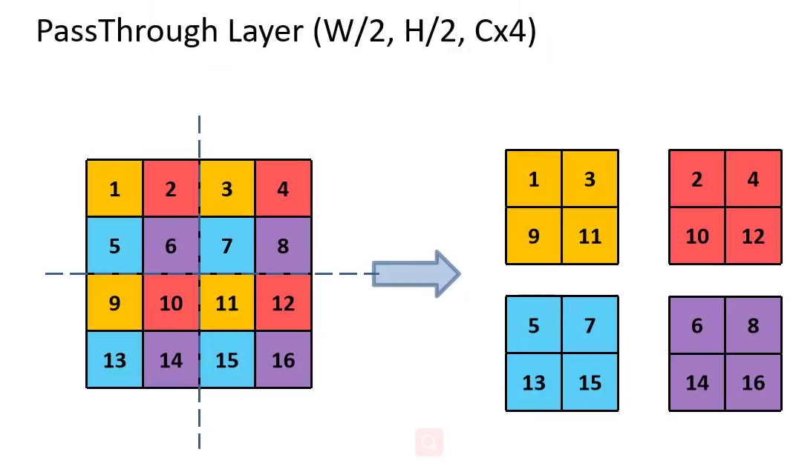

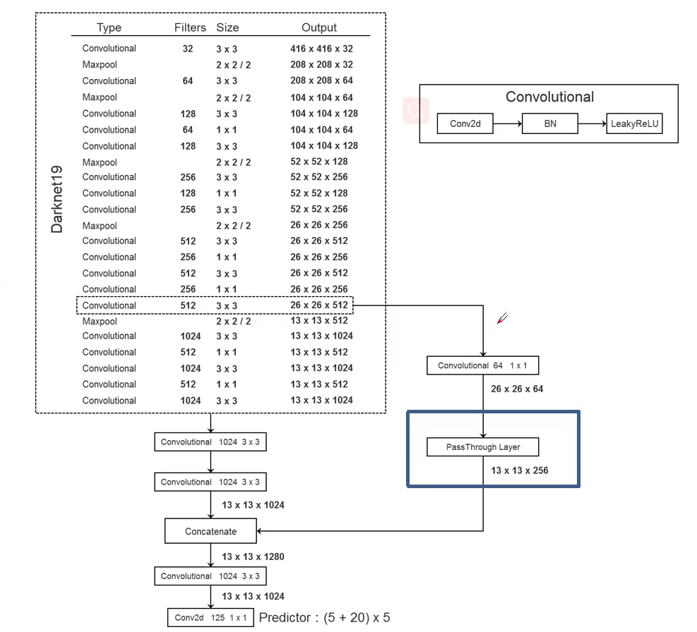

- 每个子模块convolutional，由conv2d、BN、Leaky relu组成
- 26×26×64经过PassThrough Layer，变成13×13×256；

- 13×13×1024和13×13×256进行concatenate拼接得到13×13×1280的输出
- 注意最终的下采样的scale是416/13=32

#### Multi-ScaleTraining（多尺度图像训练）

将网络的输入由448改为416，这样使得得到的feature map只有一个中心点，因为经过32的下采样率，最后得到**13*13的feature map**，是奇数。因为大的物体通常在图片的中间，所以最好使用一个中心点来负责预测这个物体。

作者希望YOLO v2能健壮的运行于不同尺寸的图片之上，YOLO v2每迭代几次都会改变网络参数。每10个Batches，网络会随机地选择一个新的**输入图片尺寸**，由于使用了下采样参数是32，所以不同的尺寸大小也选择为32的倍数{320，352…..608}，最小320×320，最大608×608，网络会自动改变尺寸，并继续训练的过程。

mAP有1.8%的提升。

###  Faster

#### Training for classifification

Darknet-19有19个convolutional和5个maxpooling层，采用全局平均池化的方法进行预测，并采用 ![[公式]](https://www.zhihu.com/equation?tex=1%2A1) 卷积来压缩 ![[公式]](https://www.zhihu.com/equation?tex=3%2A3) 卷积之间的特征表示。使用批处理归一化来稳定训练，加快收敛速度，并对模型进行规范化。

#### Training for detection

为了把分类网络改成检测网络，移除了Darknet-19最后一个卷积层，添加3个3×3的卷积层，再1×1卷积层，输出通道为125。对于VOC数据集，预测5种boxes，**每个box包含5个坐标值和20个类别**，所以总共是5 * （5+20）= 125个输出维度。

注意与yolov1相比，v2中每个box都对应20个类别的概率，而v1中无论有多少box，一个grid中只能预测一组，即最多预测一种物体。

### Stronger

#### Hierarchical classification（分层分类）

作者通过ImageNet训练分类、COCO和VOC数据集来训练检测，这是一个很有价值的思路，可以让我们达到比较优的效果。 通过将两个数据集混合训练，**如果遇到来自分类集的图片则只计算分类的Loss，遇到来自检测集的图片则计算完整的Loss。**

分层树：
