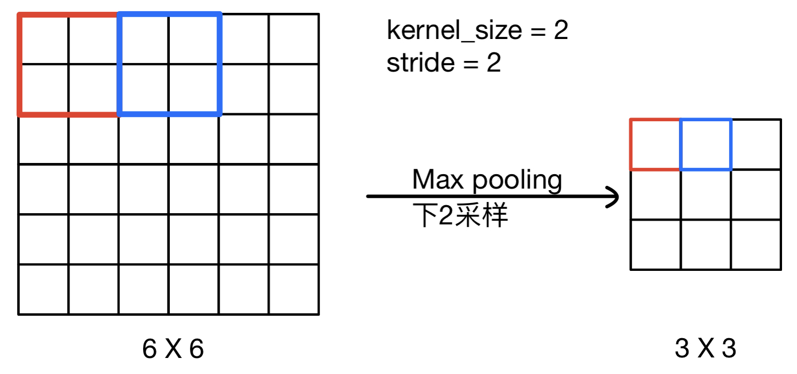
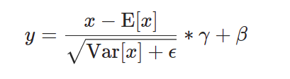
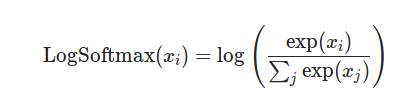
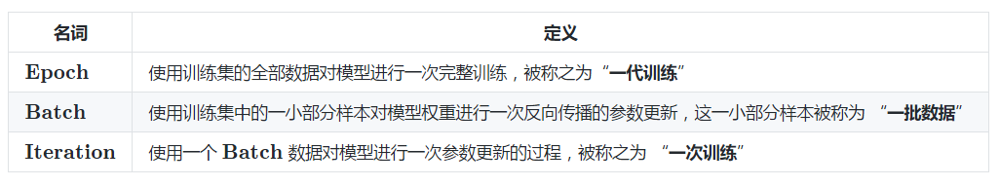
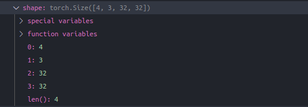
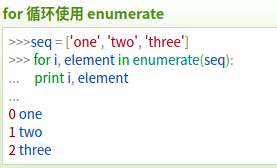

[TOC]

# CNN网络——基于pytorch实现

```python
import torch
import torchvision
import torchvision.transforms as transforms
```

`torchvision`主要包括一下几个包：

- **torchvision.datasets**: 几个常用视觉数据集，可以下载和加载，这里主要的高级用法就是可以看源码如何自己写自己的Dataset的子类
- **torchvision.models** : 例如 AlexNet, VGG, ResNet 和 Densenet 以及与训练好的参数。
- **torchvision.transforms** : 常用的图像操作，例如：随机切割，旋转，数据类型转换，图像到tensor ,numpy 数组到tensor , tensor 到 图像等。
- **torchvision.utils** : 用于把形似 (3 x H x W) 的张量保存到硬盘中，给一个mini-batch的图像可以产生一个图像格网。

## 设定GPU

```python
if torch.cuda.is_available(): #检查到GPU
    device = torch.device("cuda") #创建一个gpu对应的对象
else:
    device = torch.device("cpu")
```

- 先检测GPU，然后设定`device`

- 将后面定义的网络模型放到GPU上训练（其实就是将权重等参数对应的`tensor`转到GPU上）

- 将输入数据`inputs`和标签`labels`转到GPU上

  ```python
  # 定义网络
  net = Net()   
  net = net.to(device)
  # 训练中的某次iteration
  inputs, labels = data
  inputs, labels = inputs.to(device), labels.to(device)
  ```

- 为什么我们没注意到GPU的速度提升很多？那是因为网络非常的小。(跑2个epoch，gpu 65s ，cpu 75s)
- 注意，只有`tensor`有`device`的属性。

## Tensor相关操作

- `torch.unsqueeze(input, dim, out=None)`：扩展维度，对dim位置插入维度1
- `torch.squeeze(input, dim=None, out=None)`：将输入张量形状中的1 去除并返回。 如果输入是形如(A×1×B×1×C×1×D)，那么输出形状就为： (A×B×C×D)。当给定dim时，那么挤压操作只在给定维度上。例如，输入形状为: (A×1×B), `squeeze(input, 0)` 将会保持张量不变，只有用 `squeeze(input, 1)`，形状会变成 (A×B)。
- `Tensor.ndimension()`：返回tensor的维度，为整数。

## 数据集制作与数据预处理

```python
#通过Compose构造transform
transform = transforms.Compose(
    [transforms.ToTensor(),transforms.Normalize((0.5,0.5,0.5),(0.5,0.5,0.5))]
) 

trainset = torchvision.datasets.CIFAR10(
    root='./data',train=True,download=True,transform=transform
)

testset = torchvision.datasets.CIFAR10(
    root='./data',train=False,download=True,transform=transform
)

trainloader = torch.utils.data.DataLoader(
    trainset,batch_size=4,shuffle=True,num_workers=2
)

testloader = torch.utils.data.DataLoader(
    testset,batch_size=4,shuffle=False,num_workers=2
)

classes = ('plane','car','bird','cat','deer','dog','frog','horse','ship','truck')
```

### torchvision.transforms

```python
transform = transforms.Compose(
    [transforms.ToTensor(),transforms.Normalize((0.5,0.5,0.5),(0.5,0.5,0.5))]
) 
```

`torchvision.transforms`是pytorch中的图像预处理包，包含了很多种对图像数据进行变换的函数。

`torchvision.transforms.Compose(transforms) `主要作用是将多个变换组合在一起，可以实现同时变换。即通过 Compose 方法构造 transform 可以同时进行多种不同变换。

`torchvision.transforms.ToTensor()`是将PILImage转变为torch.FloatTensor的数据形式；

`torchvision.transforms.Normalize(mean, std)`是用给定的均值和标准差分别对每个通道的数据进行正则化，每个通道都需要传入（如三通道图片传入(0.5,0.5,0.5)为三个均值）

### torchvision.datasets

使用 `torchvision.datasets` 可以轻易实现对这些数据集的训练集和测试集的下载，只需要使用 `torchvision.datasets` 再加上需要下载的数据集的名称就可以了。

```python
torchvision.datasets.CIFAR10(
    root='./data',train=True,download=True,transform=transform
)
```

其他常用的数据集如 `COCO`、`ImageNet`、`MNIST` 等都可以通过这个方法快速下载和载入。

- `root` 用于指定数据集在下载之后的存放路径，这里存放在根目录下的 `data` 文件夹中；
- `transform` 用于指定导入数据集时需要对数据进行哪种变换操作，见 1.1.2；
- `train` 用于指定在数据集下载完成后需要载入哪部分数据，
  - 如果设置为 `True`，则说明载入的是该数据集的训练集部分；
  - 如果设置为 `False`，则说明载入的是该数据集的测试集部分；

### torch.utils.data.Dataset

`torch.utils.data.Dataset`是代表自定义数据集方法的类，用户可以通过继承该类来自定义自己的数据集类，在继承时要求用户重载`__len__()`和`__getitem__()`这两个方法。

```python
# 预备：所有10000张图片（不区分类别）放在mnist_test文件夹内，并在当前目录下生成了一个mnist_test.txt的文件
# 格式： ./mnist_test/0.jpg label

from PIL import Image

def default_loader(path):
    return Image.open(path).convert('RGB')

class MyDataset(Dataset): #继承Dataset类
    def __init__(self, txt, transform=None, loader=default_loader):
        fh = open(txt, 'r') # 打开数据集txt，通过每行信息获取图片和标签
        imgs = []
        for line in fh: # 每行对应一个数据信息
            line = line.strip('\n') # strip()方法用于移除字符串头尾指定的字符（默认为空格或换行符）
            line = line.rstrip() # rstrip() 删除 string 字符串末尾的指定字符（默认为空格）
            words = line.split() # 通过指定分隔符对字符串进行切片，默认为所有空字符，返回string list
            imgs.append((words[0],int(words[1]))) # 图片保存路径信息和标签共同构成元组
        self.imgs = imgs
        self.transform = transform # 设置transform
        self.loader = loader # 设置loader

    def __getitem__(self, index): # 通过index索引数据
        fn, label = self.imgs[index]
        img = self.loader(fn)
        if self.transform is not None:
            img = self.transform(img)
        return img,label

    def __len__(self):
        return len(self.imgs)
    
    dataset = MyDataset('data.txt')
```

- `__len__()`：**返回的是数据集的大小。**我们构建的数据集是一个对象，`__len__()`的目的就是获取对象的长度。
- `__getitem__()`：实现了能够通过索引的方法获取对象中的任意元素。可以在`__getitem__()`中实现数据预处理。

题外话：本文提供的示例代码，里面的cv2.imread()是在init里进行的，这样的好处是在getitem索引时可以非常快的得到目标元素。但如果数据集特别的大，这样就会非常吃内存，不推荐！！！最好是在得到index以后再进行读取。并且注意在返回结果之前将数据转为tensor

### torch.utils.data.random_split(*dataset*, *lengths*)

按照给定的长度将数据集划分成没有重叠的新数据集组合。

```python
train_size = int(0.8 * len(dataset)) # 划分结果要取整
test_size = len(dataset) - train_size # 根据取整结果，直接减得到
trainset, testset = torch.utils.data.random_split(dataset, [train_size, test_size])
```

### torch.utils.data.DataLoader

```python
trainloader = torch.utils.data.DataLoader(
    trainset,batch_size=4,shuffle=True,num_workers=2
)
testloader = torch.utils.data.DataLoader(
    testset,batch_size=4,shuffle=False,num_workers=2
)
```

- `DataLoader`将`Dataset`对象或自定义数据类的对象封装成一个可迭代对象，可以迭代输出`Dataset`的内容；
- 同时可以实现多进程、shuffle、不同采样策略，数据校对等等处理过程。

`__init__()`中的几个重要的输入：

- `dataset`：前面定义好的数据集（注意提前划分 `trainset` 和 `testset` ）
- `batch_size`：每个batch加载多少个样本(默认: 1)
- `shuffle`：随机打乱顺序，一般在训练数据中会采用。
- `num_workers`：这个参数必须大于等于0，0的话表示数据导入在主进程中进行，其他大于0的数表示通过多个进程来导入数据，可以加快数据导入速度。
- `collate_fn`

注意在dataloader指定batch_size的大小后，就会自动把读入的tensor扩展dim=0，即batch对应的维度，不需要自己unsqueeze。

## 定义网络模型

```python
import torch.nn as nn
import torch.nn.functional as F

class Net(nn.Module):
    def __init__(self):
        super(Net,self).__init__()
        self.conv1 = nn.Conv2d(3,6,5)
        self.bn1 = nn.BatchNorm2d(6)
        self.pool = nn.MaxPool2d(2,2)
        self.conv2 = nn.Conv2d(6,16,5)
        self.bn2 = nn.BatchNorm2d(16)
        self.fc1 = nn.Linear(16*5*5,120)
        self.fc2 = nn.Linear(120,84)
        self.fc3 = nn.Linear(84,10)

    def forward(self,x):
        x = self.pool(F.relu(self.conv1(x)))
        x = self.pool(F.relu(self.conv2(x)))
        x = x.view(-1,16*5*5)
        x = F.relu(self.fc1(x))
        x = F.relu(self.fc2(x))
        x = self.fc3(x)
        return x

net = Net()
```

### torch.nn.Module

所有神经网络模块的基类，自己定义的模型应该继承这个类。

```python
class Net(nn.Module):
    def __init__(self):
        #super(Net,self).__init__() 
        super().__init__() #需要先通过nn.Moudle的__init__()函数初始化，再定义自己的网络
```

- super()函数是用于调用父类(超类)的一个方法。

- Python 3 可以使用直接使用 **super().xxx** 代替 **super(Class, self).xxx** :

### torch.nn.ModuleList

nn.ModuleList,它是一个存储不同module，并自动将每个module的parameters添加到网络之中的容器。你可以把任意nn.Module的子类（如nn.Conv2d，nn.Linear等）加到这个list里面，方法和python自带的list一样，包括extend，append等操作，但不同于一般的list，加入到nn.ModuleList里面的module是会自动注册到整个网络上的，同时module的parameters也会自动添加到整个网络中。

当我们需要之前层的信息的时候，比如 ResNets 中的 shortcut 结构，或者是像 FCN 中用到的 skip architecture 之类的，当前层的结果需要和之前层中的结果进行融合，一般使用 ModuleList 比较方便

```python
class ResidualBlock(nn.Moudle):
    def __init(self, channels, use_residual=True, num_repeats=1):
        super().__init__()
        self.layers = nn.ModuleList()
        for _ in num_repeats:
            self.layers += [
                CNNBlock(channels, channels//2, kernel_size = 1),
                CNNBlock(channels//2, channels, kernel_size=3, padding=1)
            ]
        self.use_residual = use_residual
        self.num_repeats = num_repeats
        
        def foward(self,x):
            for layer in self.layers:
                x = layer(x) + x if self.use_residual else layer(x)
                return x;
```

但是，我们需要注意到，nn.ModuleList**并没有定义一个网络**，它只是将不同的模块储存在一起，这些模块之间并没有什么先后顺序可言。

### torch.nn.Sequential

不同于nn.ModuleList，nn.Sequential已经实现了内部的forward函数，而且里面的模块必须是按照顺序进行排列的，所以我们必须**确保前一个模块的输出大小和下一个模块的输入大小是一致的。**

有的时候网络中有很多相似或者重复的层，我们一般会考虑用 for 循环来创建它们，用Sequential的话在forward函数里的实现更加简洁。

```python
class ScalePrediction(nn.Moudle):
    def __init__(self, in_channels, num_classes):
        super().__init__() 
        self.pred = nn.Sequential(
            CNNBlock(in_channels, 2*in_channels, kernel_size=3,padding=1),
            CNNBlock(2*in_channels,3*(num_classes+5),bn_act=False,kernel_size=1) # [po,x,y,w,h]
        )
    
    def forward(self,x):
        return self.pred(x)
```

一般情况下 nn.Sequential 的用法是来组成卷积块 (block)，然后像拼积木一样把不同的 block 拼成整个网络，让代码更简洁，更加结构化。

另：如何使用定义好的网络模型的一部分？

```python
features = list(vgg.features.children())
# get each stage of the backbone
self.features1 = nn.Sequential(*features[0:6])
self.features2 = nn.Sequential(*features[6:13])
self.features3 = nn.Sequential(*features[13:23])
self.features4 = nn.Sequential(*features[23:33])
self.features5 = nn.Sequential(*features[33:43])
```

### torch.nn.Conv2d(*in_channels*, *out_channels*, *kernel_size*, *stride=1*, *padding=0*, *bias=true*. . . )

- Applies a 2D convolution over an input signal composed of several input planes.

```python
self.conv1 = nn.Conv2d(3,6,5)
```

- 对上例可以理解成对一个三通道的输入图像用6个5*5的卷积核进行操作，因此输出是6通道。
- 对于bias，如果conv2d之后接BN层，一般不设置bias，详见BN部分。
- 其余属性用到再查手册。

### torch.nn.MaxPool2d(*kernel_size*, *stride=None*, *padding=0*, . . .)

```python
self.pool = nn.MaxPool2d(2,2) # kernel_size=2 , stride=2
```

- Applies a 2D convolution over an input signal composed of several input planes.

- 采用的是Maxpooling。

- **stride** – the stride of the window. Default value is `kernel_size`. 非常合理，只有如果kernel_size取2，只有当stride也是2是pooling才能实现下2采样。



### torch.nn.Linear(*in_features*, *out_features*, *bias=True*, *device=None*, *dtype=None*)

```python
self.fc1 = nn.Linear(16*5*5,120)
```

- 用于FC层的搭建，输入FC层前，每个样本的 $C \times H \times  W$ 的特征图被拉直成一维向量

### forward(*self*, *x*)

```python
    def forward(self,x):
        x = self.pool(F.relu(self.conv1(x))) # conv1，relu，pool
        x = self.pool(F.relu(self.conv2(x))) # conv2，relu，pool
        x = x.view(-1,16*5*5)
        x = F.relu(self.fc1(x)) #过FC层也需要relu激活
        x = F.relu(self.fc2(x))
        x = self.fc3(x)
        return x
```

- `forward(self, x)`是定义在 Net 类内部的函数，通过前向传播对网络架构进行定义。

- 很明显，建立了一个两层卷积，两层池化，三层FC，激活函数为relu的CNN网络

- 来分析一下这句：

  ```python
  F.relu(self.conv1(x))
  ```

  具体解释可以参见后面==训练过程——某一次iteration==的介绍，这里`self.conv1(x)`相当于是用`__call()__`机制调用了`nn.Conv2d`的`foward`函数，因此实际返回的是一个`tensor`，再传入到`F.relu`函数中(只接收``tensor`)

- `tensor.view`是一个改变`tensor`形状的方法，类似`reshape`，传入的是待改变成的形状。一般第一个参数给-1，即第一个维度由第二个维度给出的数据决定。对于上例的`x = x.view(-1,16*5*5)`,`16*5*5`是输入FC层的特征图的 $C \times H \times W$，测试可以知道`x.shape`为`torch.Size([4, 120])`。为什么第一维的结果是4呢？这是因为在训练时，x实际传入的是`trainset`，而我们的`trainloader`设定的`batch_size=4`，每次传入神经网络的是一个`batch`的数据，即传入4个数据。由此可知输入FC层前，`feature map`拉直成向量后第一个维度表示的是传入的样本数。

### torch.nn.init

- 在pytorch中，有自己默认初始化参数方式，所以在定义好网络结构以后，不进行参数初始化也是可以的。常见的模块如`Conv2d`、`BatchNorm2d`、`Linear`等采用的都是如下的初始化方式：

```python
def reset_parameters(self) -> None:
    init.kaiming_uniform_(self.weight, a=math.sqrt(5))
    if self.bias is not None:
        fan_in, _ = init._calculate_fan_in_and_fan_out(self.weight)
        bound = 1 / math.sqrt(fan_in)
        init.uniform_(self.bias, -bound, bound)
```

- 用的是kaiming_uniform初始化方法，调用的`torch.nn.init`下的方法，这已经是目前比较好的方法了。

- torch.nn.init下面有许多参数初始化的函数。详见手册吧，这里不表
- 如果想改初始化方法，可以参考以下方法：

```python
#变成kaiming_normal初始化
nn.init.kaiming_normal_(self.conv1.weight)
nn.init.kaiming_normal_(self.fc1.weight)
```

### torch.nn.BatchNorm2d(*num_features*, ...)

```python
class Net(nn.Module):
    def __init__(self):
        super(Net,self).__init__()
        self.conv1 = nn.Conv2d(3,6,5)
        self.bn1 = nn.BatchNorm2d(6)
        #     ...
    def forward(self,x):
        x = self.pool(F.relu(self.bn1(self.conv1(x))))
        #     ...
```

- BN层一般用在conv之后，非线性激活函数之前。
- 对 4D 输入（具有额外通道维度的小批量 2D 输入，$N \times C \times H \times W $）应用 Batch Normalization：



​			是一个自学习参数的标准化过程。

- 这里注意，如果x带偏置bias，即$x_1=x_0*w_0+b_0$，而$E[x_1]=E[x_0]*w_0+b_0$，所以$x_1-E[x_1] = (x_0-E[x_0])*w_0$，与偏置bias无关，因此如果后接BN层的话其实没必要加偏置项。

- **num_features** – $C$ from an expected input of size $(N, C, H, W)$

```python
import torch.optim as optim
#定义损失函数和优化
criterion = nn.CrossEntropyLoss()
optimizer = optim.SGD(net.parameters(),lr=0.001,momentum=0.9)
#训练
for epoch in range(2):
    running_loss = 0.0 #累加2000次的loss作为总的loss
    for i, data in enumerate(trainloader,0): # i是序列脚标，data是具体数据
        inputs, labels = data
        optimizer.zero_grad()
        # 前向传播，计算loss，反向传播，权重更新
        outputs = net(inputs)
        loss = criterion(outputs, labels)
        loss.backward()
        optimizer.step()
        running_loss = running_loss+loss.item()
        if i % 2000 == 1999:
            print('[%d, %5d] loss: %.3f' %(epoch+1,i+1,running_loss/2000))
            running_loss = 0.0
```

### torch.nn.Dropout(*p=0.5*, *inplace=False*)

```python
self.dr = nn.Dropout(0.5)
...
x = self.fc(x)
x = dr(x) #一般在全连接层加dropout
```

- `p`是舍弃的神经元的比例
- 一般来说：`-> CONV/FC -> BN -> Activation-> Dropout -> CONV/FC -> . . .`
- 直观来看`dropout`的结果是将前一层`fc`层的输出`tensor`中的部分权值置为0
- `Dropout` 层一般加在全连接层防止过拟合，提升模型泛化能力。很少见到卷积层后接`Dropout`（原因主要是卷积层参数少，不易过拟合）
- 据说`BN`层和`Dropout`层不要共用，会造成网络性能的下降，同时使用可以将`dropout`放置于`BN`后面。
- 参考论文[Understanding the Disharmony between Dropout and Batch Normalization by Variance Shift](https://arxiv.org/pdf/1801.05134.pdf)  或博客 [Batch Normalization和Dropout如何搭配使用？](https://www.pianshen.com/article/4249780388/)    概括来说，`dropout`加入后产生方差偏移，再连`BN`层会输出不准确。因此只在所有的`BN`层后面加入`dropout`层，或者采用论文中提出的均匀分布`Dropout` ==Uout==，对方差的偏移的敏感度降低了

### torch.nn.AdaptiveAvgPool2d(output_size)

底层是对 `F.adaptive_avg_pool2d(input, self.output_size)` 的封装，output_size是自己设定的输出值的大小，保证每个通道上的大小为output_size

```python
avgp = nn.AdaptiveAvgPool2d((5,1))
output = avgp(input)
```

### model.train(mode = True)和model.eval()

- 如果模型中有`BN`层和`Dropout`，需要在训练时添加`model.train(mode = True)`。
- 在测试时添加`model.eval()`，测试阶段不能启用`BN`和 `Dropout`。

## 训练过程

### torch.nn.MSELoss(*size_average=None*, *reduce=None*, *reduction='mean'*)

- `size_average`:不推荐使用

$$
L = (x_n−y_n)^2
$$


### torch.nn.CrossEntropyLoss(...)

- 在训练之前需要定义损失函数，这里是一个多分类问题，常用到交叉熵损失函数`nn.CrossEntropyLoss`。
- **注意一个很重要的问题，在搭建网络model的时候最后的结果并没有接softmax，需要在loss function这里进行。**
- 该损失函数结合了`nn.LogSoftmax()`和`nn.NLLLoss()`两个函数:
- `nn.LogSoftmax()`是直接给softmax取对数



- `nn.NLLLoss()`是`negative log likelihood loss`，负对数似然损失函数，但Pytorch的实现就是把target（即index）上的数取出来再加个负号。

  

  其中其中 $y_i$ 是`one_hot`编码后的数据标签。这个`nll_loss`的结果就是`CrossEntropyLoss`，即：

  ```python
  CrossEntropyLoss = nll_loss(log_softmax,...)
  ```

- `loss = criterion(outputs, labels)`计算损失

### torch.optim

  - To use `torch.optim`, you have to construct an optimizer object, that will hold the **current state** and will **update the parameters** based on the **computed gradients**.

```python
optimizer = optim.SGD(net.parameters(),lr=0.001,momentum=0.9)
```

- 用的最多的应该还是`SGD+Momentum`,此外Adam用的多。

- 构建好神经网络后，网络的参数都保存在`net.parameter()`函数当中，需要将网络参数送到`optimizer`中。

  - 用`net.named_parameters()`可以同时返回参数名和参数对应的object

  - ```python
    for name,parameters in net.named_parameters():
        print(name,':',parameters.size())
    ```

  - ```cpp
    #output
    conv1.weight : torch.Size([6, 1, 3, 3])
    conv1.bias : torch.Size([6])
    fc1.weight : torch.Size([10, 1350])
    fc1.bias : torch.Size([10])
    ...
    ```

    

- 设置学习率`lr`和动量值`momentum`。根据cs231n所讲，`momentum`即网课中的 $\rho$ 一般为0.9或0.99。

- `Optimizer.zero_grad(set_to_none=False)`  Sets the gradients of all optimized `torch.Tensor`s to zero.每次训练开始之前要用这个函数将之前的训练产生的grid清0。

- `Optimizer.step()`  Performs a single optimization step (parameter update).

### epoch、batch、iteration的区别



```python
for epoch in range(2):
    running_loss = 0.0
    for i, data in enumerate(trainloader,0): # i是序列脚标，data是具体数据
        inputs, labels = data
```

- `epoch`是一次完整的训练，而由`trainloader`迭代的是每一个`batch`。我们可以看一下某次的`inputs`：

  

- 很明显传入了一个`batch`的 4 组数据，每个图是 $3 \times 32 \times 32$。
- `enumerate() `函数用于将一个序列/可迭代对象组合为一个索引序列，同时列出数据和数据下标
- 内层`for`循环每进行一次`batch`的数据更新，称为一次`iteration`。

### 某一次iteration

```python
        inputs, labels = data
        optimizer.zero_grad()
        # 前向传播，计算loss，反向传播，权重更新
        outputs = net(inputs)
        loss = criterion(outputs, labels)
        loss.backward()
        optimizer.step()
        running_loss = running_loss+loss.item()
        if i % 2000 == 1999:
            # 求2000次的平均loss
            print('[%d, %5d] loss: %.3f' %(epoch+1,i+1,running_loss/2000))
            running_loss = 0.0
```

- 为什么`outputs = net(inputs)`呢？因为pytorch在`nn.Module`中，实现了`__call__`方法，而在`__call__`方法中调用了`forward`函数。Python中，只要在创建类型的时候定义了`__call__()`方法，这个类型就是可调用的。
- 所以：`outputs = net(inputs)`与`outputs = net.forward(inputs)` 是等价的。
- `loss = criterion(outputs, labels)`: 用定义好 的损失函数对象计算出`loss`
- `tensor.backward()`: Computes the gradient of current tensor w.r.t. graph leaves.
  - 如果`tensor`是一个标量（`loss`一般是一个确切的值，肯定是标量），则不用给`barckward()`传参数；
  - 如果不是一个标量，需要传入一个和`tensor`同形的权重`tensor`
- `tensor`有一个属性是`requires_grad`，如果处于`false`则该变量无法参与grid的计算；需要`tensor.requires_grad_()`函数将其设为 True  (常常用于冻结+迁移学习使用)
- `backward()`完成后各个`tensor`的梯度计算结果得到，此时可以调用`optimizer.step()`进行网络参数更新。
- Use `torch.Tensor.item()` to get a Python number from a tensor containing a single value

## 模型保存和加载

```python
# 存储训练后的模型
PATH = './cifar_net.pth' # 一般保存成pth文件
torch.save(net.state_dict(), PATH)
# state_dict()仅返回参数
model_dict=net.load_state_dict(torch.load(PATH))
```

### 保存\加载学习到的参数

- 保存：`torch.save(net.state_dict(), PATH)`
- 加载：`model_dict=net.load_state_dict(torch.load(PATH))` （要求事先有model，且与保存的model相同）

### 保存\加载整个model的状态

- 保存：`torch.save(net,PATH)`
- 加载：`model_dict=torch.load(PATH)`

## 测试过程

```python
#这部分是举例，不是测试的重点，可有可无
dataiter = iter(testloader)
#随机得到一组数据
images,labels = dataiter.next()
print('GroundTruch:', ' '.join('%5s' % classes[labels[j]] for j in range(4)))
outputs = net(images)
_, predicted = torch.max(outputs,1)
print('Predicted: ', ' '.join('%5s' % classes[predicted[j]] for j in range(4)))
```
`dataloader`本质上是一个可迭代对象，可以使用`iter()`进行访问，采用`iter(dataloader)`返回的是一个迭代器，然后可以使用`next()`访问。当然也可以像训练时用enumerate(dataloader)的形式访问。


```python
correct = 0
total = 0
with torch.no_grad():
    for data in testloader: # 直接用for循环访问这个迭代器
        images, labels = data
        outputs = net(images)
        _,predicted = torch.max(outputs.data,1)
        total = total+labels.size(0)
        correct = correct + (predicted==labels).sum().item()
print('Accuracy of the network on the 10000 test images: %d %%' % (100*correct/total))
```

- `with`是python中上下文管理器，当要进行固定的进入，返回操作时，可以将对应需要的操作放在`with`所需要的语句中。
- 在进行测试过程时，不希望计算梯度浪费计算资源（因为没必要计算，测试阶段不涉及backward），使用`torch.no_grad()`就可以不计算。在该模块下，所有计算得出的tensor的requires_grad都自动设置为False。
- `torch.max(input, dim) `，输入`outputs.data`是一个`tensor`，`dim`是`max`函数索引的维度，0是**每列**的最大值，1是**每行**的最大值。函数会返回两个`tensor`，第一个`tensor`是每行的最大值；第二个`tensor`是每行最大值的索引。在计算准确率时第一个tensor的`values`是不需要的，所以我们只需提取第二个tensor

# 记录一下训练和测试效果

- GTX 1050 ti

- 2 epoch , loss 1.277,GPU 65s ,CPU 74s，测试 accuracy 57%
- 加大momentum到0.99，loss基本不下降，维持在2.08左右
- 10 epoch，momentum改回0.9，loss 0.833，测试 accuracy 61%
- 20 epoch，loss 0.534，测试 accuracy 61%

分析原因：肯定是过拟合了。

改进：

- 考虑加入dropout和BN试试
- 学习应用kaiming初始化，现在用的还是默认的


10 epoch，3层conv 3-32-64-128，加入BN，loss 0.3左右，测试 accuracy 76%

10 epoch,再加入dropout，loss 1.491 ，测试 accuracy 71%（loss很高，非常难训练）

三个FC层都加dropout，loss很难下降；

我只在参数最多的第一层加了dropout以后，相对好了一些，之后loss 0.746，测试 accuracy 72%

所以BN+dropout确实有点不太好。


不加dropout只加BN，50 epoch loss 0.088 ，accuracy 72%，感觉还是过拟合了。
