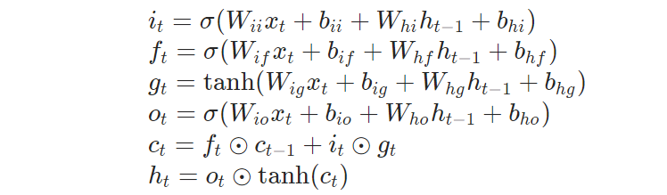

[TOC]

# 2021.8.19

## Fluent python 第一章 Python 数据模型

### 魔术方法

python中特殊方法（魔术方法）是被python解释器调用的，我们自己不需要调用它们，也就是说没有 my_object.`__len__()` 这种写法我们统一使用内置函数来使用。`__len__()`和`__getitem__()`等都是特殊方法。特殊方法`__len__()`实现后，只需使用`len()`方法即可

- `__len__()`

一般返回数量，使用len()方法调用。在`len()`内部也可使用`len()`函数

- `__getitem__()`

此特殊方法一般是根据索引返回数据，也可以替代`__iter_()`和`__next__()`方法，也可支持切片

```python
# collections是Python内建的一个集合模块，提供了许多有用的集合类。
import collections

Card = collections.namedtuple('Card', ['rank', 'suit'])
class FrenchDeck:
    ranks = [str(n) for n in range(2, 11)] + list('JQKA')
    suits = 'spades diamonds clubs hearts'.split()
    def __init__(self):
        self._cards = [Card(rank, suit) for suit in self.suits
                                        for rank in self.ranks]
    def __len__(self):
        return len(self._cards)
    def __getitem__(self, position):
        return self._cards[position]
```

因为 `__getitem__` 方法把 [] 操作交给了 self._cards 列表，所以我们的 deck 类自动支持切片（slicing）操作。

仅仅实现了 `__getitem__` 方法，deck 类就变成可迭代的了（替代了`iter()`）

- `__init__()`

定义`__init__`用于执行类的实例化的过程，`__init__`函数的参数列表会在开头多出一项，它永远指代新建的那个实例对象，习惯上就命为`self`。

- `__call__()`

实现后对象可变成可调用对象，此对象可以像函数一样调用，例如：自定义函数，内置函数，类都是可调用对象，可用callable()判断是否是可调用对象

```python
class Zarten():
    def __init__(self, name, age):
        self.name = name
        self.age = age
    def __call__(self):
        print('name:%s  age:%d' % (self.name, self.age))
z = Zarten('zarten', 18)
z()
>>name:zarten  age:18'
```

### Python sorted() 函数

**sorted()** 函数对所有可迭代的对象进行排序操作。

> **sort 与 sorted 区别：**
>
> sort 是应用在 list 上的方法，sorted 可以对所有可迭代的对象进行排序操作。
>
> list 的 sort 方法返回的是对已经存在的列表进行操作，无返回值，而内建函数 sorted 方法返回的是一个新的 list，而不是在原来的基础上进行的操作。

```python
sorted(iterable, cmp=None, key=None, reverse=False)
```

> - iterable -- 可迭代对象。
> - cmp -- 比较的函数，这个具有两个参数，参数的值都是从可迭代对象中取出，此函数必须遵守的规则为，大于则返回1，小于则返回-1，等于则返回0。
> - key -- 主要是用来进行比较的元素，只有一个参数，具体的函数的参数就是取自于可迭代对象中，指定可迭代对象中的一个元素来进行排序。
> - reverse -- 排序规则，reverse = True 降序 ， reverse = False 升序（默认）。

```python
>>> L=[('b',2),('a',1),('c',3),('d',4)]
>>> sorted(L, cmp=lambda x,y:cmp(x[1],y[1]))   # 利用cmp函数
[('a', 1), ('b', 2), ('c', 3), ('d', 4)]
>>> sorted(L, key=lambda x:x[1])               # 利用key
[('a', 1), ('b', 2), ('c', 3), ('d', 4)]
```

### Python List index()方法

index() 函数用于从列表中找出某个值第一个匹配项的索引位置。

```
list.index(x, start, end)
```

> - x-- 查找的对象。
> - start-- 可选，查找的起始位置。
> - end-- 可选，查找的结束位置。

```python
>>> aList = [123, 'xyz', 'runoob', 'abc']
>>> aList.index( 'xyz' )
1
>>> aList.index( 'runoob', 1, 3 )
2
```

- list的其他常用方法

| 序号 | 方法                                                         |
| :--: | :----------------------------------------------------------- |
|  1   | list.append(obj) 在列表末尾添加新的对象                      |
|  2   | list.count(obj) 统计某个元素在列表中出现的次数               |
|  3   | list.extend(seq) 在列表末尾一次性追加另一个序列中的多个值（用新列表扩展原来的列表） |
|  4   | list.index(obj) 从列表中找出某个值第一个匹配项的索引位置     |
|  5   | list.insert(index, obj) 将对象插入列表                       |
|  6   | list.pop(index=-1\]) 移除列表中的一个元素（默认最后一个元素），并且返回该元素的值 |
|  7   | list.remove(obj) 移除列表中某个值的第一个匹配项              |
|  8   | list.reverse() 反向列表中元素                                |
|  9   | list.sort(cmp=None, key=None, reverse=False) 对原列表进行排序 |

### 小结

通过实现特殊方法，自定义数据类型可以表现得跟内置类型一样，从而让我们写出更具表达力的代码——或者说，更具 Python 风格的代码。

# 2021.8.20

## RNN

RNN适用于序列数据，广泛应用于NLP领域。

用于图像分类领域，就要将处理序列数据的方法用于非序列数据。


- $W$​ 权重是共享的（$W_{hh}$​ $W_{xh}$​ $W_{hy}$​​ 均相同）。
- 输入和输出序列必须要是等长的。

**局限：长期依赖（Long-TermDependencies）问题**


- RNN 会受到短时记忆的影响。如果一条序列足够长，那它们将很难将信息从较早的时间步传送到后面的时间步。

- 如果你正在尝试处理一段文本进行预测，RNN 可能从一开始就会遗漏重要信息，会面临梯度消失的问题。

- 梯度爆炸则是因为计算的难度越来越复杂导致。
- RNN是想把所有信息都记住，不管是有用还是没用的信息。

## LSTM

**长短期记忆（Long Short Term Memory，LSTM）网络**是一种特殊的RNN模型，其特殊的结构设计使得它可以避免长期依赖问题。即可以记住比较早之前出现的信息。

普通的RNN模型中，其重复神经网络模块的链式模型如下图所示，这个重复的模块只有一个非常简单的结构，一个单一的神经网络层（例如tanh层），这样就会导致信息的处理能力比较低。


而LSTM在此基础上将这个结构进行了改进：


LSTM的关键是细胞状态（直译：cell state），表示为 $C_t$ ，用来保存当前LSTM的状态信息并传递到下一时刻的LSTM中。当前的LSTM接收来自上一个时刻的细胞状态  $C_{t-1}$  ，并与当前LSTM接收的信号输入 $x_t$ 共同作用产生当前LSTM的细胞状态 $C_t$。细胞状态 $C_t$ 就代表着长期记忆。


在LSTM中，采用专门设计的“门”来引入或者去除细胞状态  $C_t$ 中的信息。这里所采用的门包含一个sigmoid神经网络层和一个按位的乘法操作： 。0 表示“不允许任何量通过”，1 表示“允许所有量通过”。

LSTM主要包括三个不同的门结构：遗忘门、记忆门和输出门。

### 遗忘门


遗忘门决定了细胞状态 $C_{t-1}$ 中的哪些信息将被遗忘。

### 记忆门


记忆门的作用与遗忘门相反，它将决定新输入的信息 $x_t$ 和 $h_{t-1}$中哪些信息将被保留。

### 更新细胞状态


利用遗忘门和记忆门，更新细胞状态 $C_t$。

### 输出门


在 $t$ 时刻输入信号 $x_t$ 以后，计算对应的输出信号。

## BLSTM（双向LSTM）

BLSTM是LSTM的另一种变型他的来源是因为，LSTM只能实现单向的传递。当我们语句是承前启后的情况时，自然能完成。但是当语句顺序倒过来，关键次在后面了，LSTM就无能为力了。因此有人提出了BLSTM双向网络。


## `torch.nn.LSTM(*args, **kwargs)`



参数列表

- input_size：x的特征维度
- hidden_size：隐藏层的特征维度
- num_layers：lstm隐层的层数，默认为1
- bias：False则bih=0和bhh=0. 默认为True
- batch_first：True则输入输出的数据格式为 (batch, seq, feature)
- dropout：除最后一层，每一层的输出都进行dropout，默认为: 0
- bidirectional：True则为双向lstm，num_directions=2；默认为False，num_directions=1
- 输入：`input, (h0, c0)`
- 输出：`output, (hn,cn)`

**输入数据格式：**

- **input** (seq_len, batch_size, input_size)
- **h_0** (num_layers * num_directions, batch_size, hidden_size)
- **c_0** (num_layers * num_directions, batch_size, hidden_size)

**输出数据格式：**

- **output** (seq_len, batch_size, num_directions * hidden_size)
- **h_n** (num_layers * num_directions, batch_size, hidden_size)
- **c_n** (num_layers * num_directions, batch_size, hidden_size)

Pytorch里的LSTM单元接受的输入都必须是3维的张量(Tensors).

```python
>>> rnn = nn.LSTM(10, 20, 2) # input_size=10, hidden_size=20, num_layers=2
>>> input = torch.randn(5, 3, 10) # seq_len=5，batch_size=3,input_size=10
>>> h0 = torch.randn(2, 3, 20) # num_layers * num_directions=2*1=2
>>> c0 = torch.randn(2, 3, 20)
>>> output, (hn, cn) = rnn(input, (h0, c0))
```


对于应用于cv的输入`(N,C,H,W)`，一般取`W`作为时序方向，所以`seq_len=W, batch_size=N*H, input_size=C`

## Fluent python 第二章 序列构成的数组

### 推导式

推导式comprehensions（又称解析式），是Python的一种独有特性。推导式是可以从一个数据序列构建另一个新的数据序列的结构体，共有三种推导式。**原则上推导式尽量保持简短。**

#### 列表(list)推导式

```python
variable = [out_exp_res for out_exp in input_list if out_exp == 2]
```

- out_exp_res：列表生成元素表达式，可以是有返回值的函数。
- for out_exp in input_list：迭代input_list将out_exp传入out_exp_res表达式中。
- if out_exp == 2：根据条件过滤哪些值可以。

#### 字典(dict)推导式

```python
dictory = {key_expr: value_expr for value in collection if condition}
```

a.g.

```python
mcase_frequency = {v: k for k, v in mcase.items()}
```

#### 集合(set)推导式

```python
set = { expr for value in collection if condition }
```

a.g. 

```python
squared = {x**2 for x in [1, 1, 2]}
```

### 生成器表达式

- 生成器表达式（generator expression）则称为 genexps。

- 生成器表达式背后遵守了迭代器协议，可以逐个地产出元素，而不是先建立一个完整的列表，然后再把这个列表传递到某个构造函数里。前面那种方式显然能够节省内存。

- 生成器表达式的语法跟列表推导差不多，只不过把方括号换成圆括号而已。

a.g.

```python
>>> gen_exp = (x ** 2 for x in range(10) if x % 2 == 0) // 生成一个迭代器
>>> for x in gen_exp: // 用for循环进行迭代
...     print(x)
```

### 元组和记录

元组其实是对数据的记录：元组中的每个元素都存放了记录中一个字段的数据，外加这个字段的位置。

```python
>>> lax_coordinates = (33.9425, -118.408056) 
>>> city, year, pop, chg, area = ('Tokyo', 2003, 32450, 0.66, 8014) 
>>> traveler_ids = [('USA', '31195855'), ('BRA', 'CE342567'), 
... ('ESP', 'XDA205856')]
>>> for passport in sorted(traveler_ids): 
... print('%s/%s' % passport) ➎
...
BRA/CE342567
ESP/XDA205856
USA/31195855
```

如果在任何的表达式里我们在元组内对元素排序，元素所携带的信息就会丢失，这些信息是跟它们位置有关的。

### 元组拆包

- 元组拆包可以应用到任何**可迭代对象**上，唯一的硬性要求是，**被可迭代对象中的元素数量**必须要跟接受这些元素的元组的空档数一致。

```python
>>> import os
>>> _, filename = os.path.split('/home/luciano/.ssh/idrsa.pub')
>>> filename
'idrsa.pub'
```

- 在进行拆包的时候，我们不总是对元组里所有的数据都感兴趣，_ 占位符能帮助处理这种情况。

- 用 * 来处理剩下的元素。比如可能并不能确切地知道元组的长度，用*进行处理。

```python
>>> a, b, *rest = range(5) #前两个元素赋给a,b,剩余元素都赋给rest
>>> a, b, rest
(0, 1, [2, 3, 4])
```

### 切片

- 在切片和区间操作里不包含区间范围的最后一个元素是 Python 的风格，这个习惯符合Python、C 和其他语言里以 0 作为起始下标的传统。

- 当只有最后一个位置信息时，我们也可以快速看出切片和区间里有几个元素：`range(3)`和 `my_list[:3]` 都返回 3 个元素。

- 当起止位置信息都可见时，我们可以快速计算出切片和区间的长度，用后一个数减去第一个下标（stop - start）即可。

- 可以利用任意一个下标来把序列分割成不重叠的两部分，写成 `my_list[:x]` 和 `my_list[x:]` 就可以了

```python
>>> l = [10, 20, 30, 40, 50, 60] 
>>> l[:2] # 在下标2的地方分割
[10, 20] 
>>> l[2:] 
[30, 40, 50, 60] 
>>> l[:3] # 在下标3
```

一个众所周知的秘密是，我们还可以用 `s[a:b:c]` 的形式对 s 在 a 和 b 之间以 c 为间隔取值。c 的值还可以为负，负值意味着反向取值。

```python
>>> s = 'bicycle' 
>>> s[::3] #这种其实就是s[a:b:c]的变式
'bye' 
>>> s[::-1] 
'elcycib' 
>>> s[::-2] 
'eccb'
```

### 对序列使用+和*

```python
>>> l = [1, 2, 3]
>>> l + l
[1, 2, 3, 1, 2, 3]
>>> l * 5
[1, 2, 3, 1, 2, 3, 1, 2, 3, 1, 2, 3, 1, 2, 3]
```

\+ 和 * 都遵循这个规律，不修改原有的操作对象，而是构建一个全新的序列。

# 2021.8.21

## CTPN（Detecting Text in Natural Image with Connectionist Text Proposal Network）


- 很难将通用目标检测系统（如faster-rcnn）直接应用于场景文本检测
- 在通用目标检测中，每个目标都有一个明确的封闭边界，而在文本中可能不存在这样一个明确定义的边界，因为文本行或单词是由许多单独的字符或笔划组成的。
- 对于目标检测，典型的正确检测是松散定义的，例如bbox和GT的IOU大于阈值
- 综合阅读文本则是一个细粒度的识别任务，需要正确的检测，覆盖文本行或字的整个区域。文本检测通常需要更准确的定义，导致不同的评估标准，例如文本基准中常用的Wolf标准

- 本文：
  - **垂直锚点机制(vertical anchor mechanism)**：联合预测每个文本 Proposal 的垂直位置和文本/非文本分数，从而获得出色的定位精度。
  - **网内循环架构(in-network recurrent architecture)**：用于按顺序连接这些细粒度的文本 Proposal，从而允许它们编码丰富的上下文信息。

### Detecting Text in Fine-scale Proposals

- CTPN本质上是一个全卷积网络，允许任意大小的输入图像。
- 它通过在卷积特征映射中密集地滑动小窗口来检测文本行，并且输出一系列细粒度的text proposal。

以VGG-16为例，取VGG-16经过conv5的输出feature map（一共经过4个maxpooling，因此total stride是16）。conv5特征映射的大小由输入图像的大小决定，而感受野固定为16个和228个像素。

- 文本检测是在单词或文本行级别中定义的，因此通过将其定义为单个目标（例如检测单词的一部分）可能很容易进行错误的检测。因此，直接预测文本行或单词的位置可能很难或不可靠，


左：RPN提议。右：细粒度的文本提议。

- **文本行是一个序列，它是文本和通用目标之间的主要区别。**将文本行视为一系列细粒度的文本提议是很自然的，其中每个提议通常代表文本行的一小部分
- 我们认为，通过**固定每个提议的水平位置**来**预测其垂直位置**会更准确，水平位置更难预测。与预测目标4个坐标的RPN相比，这减少了搜索空间。

在Conv5的feature map的每个位置上取3 ∗ 3 ∗ C 的窗口的特征，这些特征将用于预测该位置k个anchor对应的类别信息，位置信息。

> anchor定义：(卷积网络生成特征图之后，用这些特征图进行3 * 3的卷积，当3 * 3的卷积核滑动到特征图的某一个位置时，以当前滑动窗口中心为中心映射到原图的一个区域，以原图上的的这个区域为中心去画框，这个框就称为anchor。

设计$k$个垂直锚点来预测每个提议的$y$坐标。$k$个锚点具有相同的水平位置，固定宽度为16个像素，但其垂直位置在$k$个不同的高度变化。在我们的实验中，我们对每个提议使用十个锚点，k=10，其高度在输入图像中从11个像素变化到273个像素（每次÷0.7）。明确的垂直坐标是通过提议边界框的高度和y轴中心来度量的。我们计算相对于锚点的边界框位置的相对预测的垂直坐标（v）


其中，$v=(v_c, v_h)$和$v^∗ = (v_c^∗ , v_h^∗ )$ 分别是预测的坐标和ground truth 坐标。$c^a_y$和$h^a$是anchor box的y轴中心坐标和高度，从原图像中计算得来的。$c_y$和$h$是预测的y轴坐标，$c_y^*$ 和 $h^*$是ground truth 坐标。每个预测文本propoasl都有一个大小为$h×16$ 的边界框（在输入图像中）。一般来说，文本proposal在很大程度上要比它的有效感受野 228×228 要小。


> 处理ground truth
>
> 一般数据库给的都是整个文本行或者单词级别的标注，因为我们选择的方式是用固定宽度的anchor进行回归，因此在数据预处理时需要将ground truth处理成一系列固定宽度的box
>
>  	
>
> - GT处理前后对比

**结论：**通过设计的垂直anchor和细粒度的检测策略，可以通过使用**单尺度图像处理各种尺度和长宽比的文本行**。

### Recurrent Connectionist Text Proposals

上一步将文本行分成一系列细粒度的文本proposal，因为文本具有序列特征，上下文信息很重要，所以应用 RNN(BLSTM) 编码上下文信息来进行文本识别。

- RNN类型：BLSTM，每个LSTM有128个隐藏层
- RNN输入：每个 `3*3*C` 的卷积特征（可以拉成一列），同一行的窗口的特征形成一个序列
- RNN输出：每个窗口对应256维特征

> 对一张输入图片而言，BLSTM提取的只是文本水平方向的关联性，行与行之间相互独立，batch之间自然也相互独立，因此`N*H`可以当做输入BLSTM的`batch_size`；
>
> 将feature map的每一行作为一个时间序列输入BLSTM，BLSTM中时间序列`seq_len`对应W；
>
> 每个时间序列特征数对应feature map通道数C
>
> 因此[seq_len, batch_size, input_size]＝[W,N*H,C]。


在BLSTM的隐藏层中循环更新其内部状态：$H_t$
$$
H_{t}=\varphi(H_{t-1}, X_t),  \qquad t=1,2,…,W \tag{3}
$$
使用双向LSTM来进一步扩展RNN层，这使得它能够在两个方向上对递归上下文进行编码，以便连接感受野能够覆盖整个图像宽度。

*$H_t$*中的内部状态被映射到后面的FC层，并且输出层用于计算第 t 个proposal的预测，大大减少了错误检测，同时还能够恢复很多包含非常弱的文本信息的遗漏文本proposal。

### Side-refinement（边缘细化）

**文本行的构建：**

每两个相近的proposal组成一个pair，合并不同的pair直到无法再合并为止（没有公共元素）


**边缘细化：**
$$
o=(x_{side}-c_x^a)/w^a, \quad o^*=(x^*_{side}-c_x^a)/w^a
$$

### 模型输出与损失函数

**输出结果：**CTPN有三个输出共同连接到最后的FC层，包括了2K的得分(前景背景分别的得分)，2K回归(边框宽度和中心点y方向坐标)，1K的边界调整(调整位于边界的框的x值，使得框住的更好)
$$
L(\textbf{s}_i, \textbf{v}_j, \textbf{o}_k) =\frac1{N_{s}}\sum_iL^{cl}_{s}(\textbf{s}_i, \textbf{s}_i^*) +\frac{\lambda_1}{N_v}\sum_j L^{re}_v(\textbf{v}_j, \textbf{v}_j^*) +\frac{\lambda_2}{N_o}\sum_k L^{re}_o(\textbf{o}_k, \textbf{o}_k^*) \tag{5}
$$
引入了三种损失函数：$L^{cl}_s$，$L^{re}_v$和$L^{re}_o$，其分别计算文本/非文本分数，坐标和边缘细化。

$L^{cl}_s$ 是softmax损失；$L^{re}_v$和$L^{re}_o$是回归损失，用smooth-L1。

### 训练标签与训练数据

**训练标签：**IOU>0.7或由最大IOU，正样本；IOU<0.5负样本

**训练数据：**每个小批量数据的锚点数量固定为128，正负样本的比例为1：1。如果正样本小于64用负样本扩充。

# 2021.8.22

